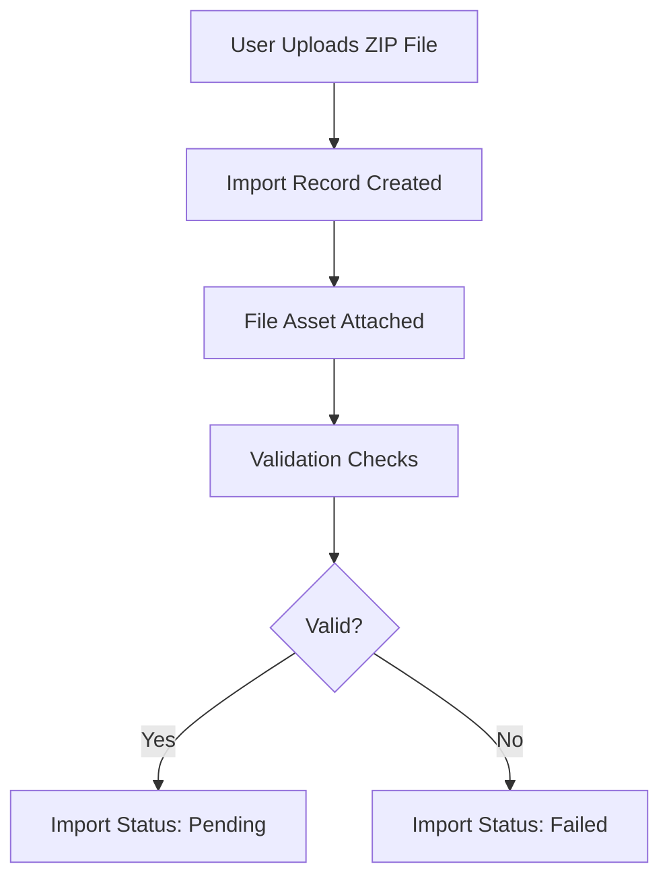
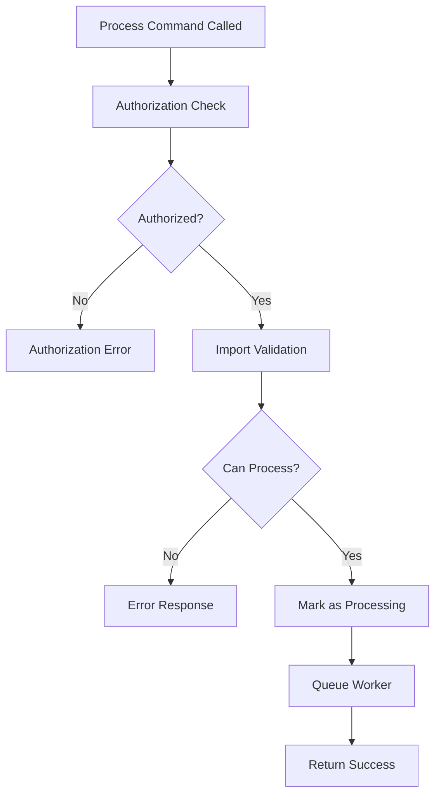
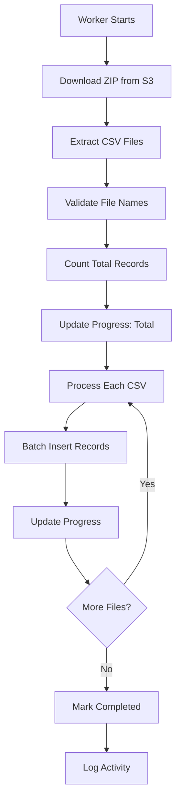
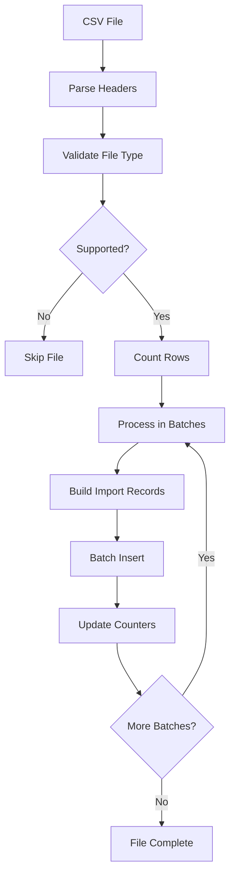

# Data Import Process

This document outlines the complete data import process flow, from file upload to final data processing in the MGR platform.

## 🎯 Process Overview

The data import process is designed to handle large CSV datasets efficiently while providing real-time feedback and comprehensive error handling.

## 📋 Process Flow

### Phase 1: Import Creation & Upload



**Steps:**
1. User selects ZIP file containing CSV data
2. Import record created with metadata
3. File uploaded to S3 and Asset record created
4. Basic validation (file type, size, format)
5. Import marked as `pending` if valid

**Validation Criteria:**
- File must be ZIP format
- File size within limits (< 100MB recommended)
- ZIP must contain at least one CSV file
- User must have `manage_client` permission

### Phase 2: Processing Initiation



**Command: `Imports::Process`**
```ruby
# API Call
POST /api/imports/:id/process

# Command Execution
cmd = Imports::Process.new({ id: import.id }, environment)
success, result = cmd.run
```

**Validation Checks:**
- Import status is `pending`
- File asset is attached and accessible
- User has required permissions

### Phase 3: Background Processing



**Worker: `ImportProcessorWorker`**
- Runs asynchronously in Sidekiq
- Processes files in order
- Updates progress in real-time
- Handles errors gracefully

### Phase 4: CSV File Processing



**Batch Processing:**
- Default batch size: 1000 records
- Memory-efficient streaming
- Individual row error handling
- Progress updates per batch

## 📊 Data Transformation

### CSV to ThirdPartyImportedDatum

Each CSV row is transformed into a standardized record:

```ruby
{
  data_json: {
    # Original CSV row data as JSON
    "id" => "123",
    "name" => "John Doe",
    "email" => "john@example.com"
  },
  data_type: "UserProfile",        # Mapped from file name
  import_source: "csv",            # Always "csv" for this process
  business_account_id: "uuid",     # Current business account
  source_id: "import_uuid",        # Reference to import record
  status: "pending",               # Ready for further processing
  created_at: timestamp,
  updated_at: timestamp
}
```

### File Name Mapping

| CSV File | Data Type | Purpose |
|----------|-----------|---------|
| `Clients.csv` | `UserProfile` | Customer/client data |
| `Products.csv` | `Product` | Product catalog |
| `AccountBalances.csv` | `UserAccountBalance` | Account balances |
| `Locations.csv` | `Location` | Business locations |
| `Trainers.csv` | `BusinessStaff` | Staff information |
| `Payments.csv` | `UserTransaction` | Payment records |
| `Orders.csv` | `Order` | Sales/order data |

## 📈 Progress Tracking

### Progress States

```ruby
# Import Model Fields
total_records: 0,        # Total rows across all CSV files
processed_records: 0,    # Rows processed so far
successful_records: 0,   # Successfully imported rows
failed_records: 0,       # Failed row imports

# Calculated Fields
progress_percentage: (processed_records / total_records * 100)
success_rate: (successful_records / processed_records * 100)
```

### Real-time Updates

Progress is updated at multiple points:

1. **Initial Count**: After extracting all CSV files
2. **Batch Updates**: After each batch insertion
3. **File Completion**: After each CSV file is processed
4. **Final Update**: When all processing is complete

```ruby
# Progress update examples
import.update_progress!(total: 5000)
import.update_progress!(processed: 1000, successful: 995, failed: 5)
```

## 🚨 Error Handling

### Error Categories

1. **File-level Errors**
   - No file attached
   - Invalid ZIP format
   - No valid CSV files found
   - File download failures

2. **Processing Errors**
   - CSV parsing errors
   - Database insertion failures
   - Memory/timeout issues

3. **Row-level Errors**
   - Invalid data format
   - Missing required fields
   - Data validation failures

### Error Recovery

```ruby
# File-level errors: Import marked as failed
import.mark_as_failed!("No valid CSV files found in ZIP")

# Row-level errors: Continue processing, track failures
{
  processed: 1000,
  successful: 995,
  failed: 5,
  errors: [
    { row: {...}, error: "Invalid email format" },
    { row: {...}, error: "Missing required field: name" }
  ]
}
```

## 🔍 Monitoring & Observability

### Key Metrics

1. **Processing Time**
   - Average time per record
   - Total import duration
   - Batch processing efficiency

2. **Success Rates**
   - Overall import success rate
   - File-specific success rates
   - Error pattern analysis

3. **Resource Usage**
   - Memory consumption
   - Database load
   - Worker queue depth

### Logging

```ruby
# Activity Log Entry
Activity.create!(
  business_account: business_account,
  name: Activity::ProcessImport,
  trackable: import,
  admin: business_staff,
  action: 'CSV Import Processed',
  params: {
    import_id: import.id,
    total_files: 5,
    total_records: 5000,
    successful_records: 4995,
    failed_records: 5,
    processing_time: "2.5 minutes"
  }
)
```

## 🔧 Configuration

### Environment Variables

```ruby
# File size limits
MAX_ZIP_SIZE = ENV.fetch('MAX_ZIP_SIZE', 100.megabytes)
MAX_CSV_ROWS = ENV.fetch('MAX_CSV_ROWS', 50_000)

# Processing configuration
BATCH_SIZE = ENV.fetch('IMPORT_BATCH_SIZE', 1000)
WORKER_TIMEOUT = ENV.fetch('IMPORT_WORKER_TIMEOUT', 30.minutes)

# S3 configuration
AWS_BUCKET = ENV['AWS_BUCKET_NAME']
AWS_REGION = ENV['AWS_REGION']
```

### Performance Tuning

```ruby
# Database optimization
- Use bulk insert operations
- Minimize individual queries
- Optimize batch sizes for memory usage

# Worker configuration
- Set appropriate timeout values
- Monitor queue depth
- Scale workers based on load
```

## 🧪 Testing Strategy

### Test Coverage Areas

1. **Unit Tests**
   - Command logic
   - File processing methods
   - Error handling scenarios

2. **Integration Tests**
   - End-to-end import flow
   - Worker processing
   - Database operations

3. **Performance Tests**
   - Large file processing
   - Memory usage validation
   - Concurrent import handling

### Test Data

```ruby
# Test ZIP files
spec/support/data/import_test_data_clean.zip    # Small dataset (14 records)
spec/support/data/import_test_data_large.zip    # Large dataset (1500+ records)

# Test scenarios
- Valid multi-file ZIP
- Invalid file formats
- Empty ZIP files
- Malformed CSV data
```

## 🚀 Future Enhancements

### Planned Improvements

1. **Real-time Progress Updates**
   - WebSocket integration
   - Live progress bars
   - Real-time error notifications

2. **Advanced Validation**
   - Schema validation
   - Data type checking
   - Business rule validation

3. **Data Transformation**
   - Custom mapping rules
   - Data cleansing pipelines
   - Automatic data enrichment

4. **Scheduling & Automation**
   - Recurring imports
   - API-triggered imports
   - Integration with external systems

## 📚 Related Documentation

- [Import System Feature](../features/import-system.md)
- [Command Pattern](../architecture/command-pattern.md)
- [Worker Pattern](../architecture/worker-pattern.md)
- [API Endpoints](../api/endpoints.md)

## 🔗 Quick Links

- [Import API Reference](../api/endpoints.md#imports)
- [Error Codes](../api/error-handling.md#import-errors)
- [Testing Guide](../development/testing.md#import-testing)
- [Deployment Notes](../development/deployment.md#import-workers)
