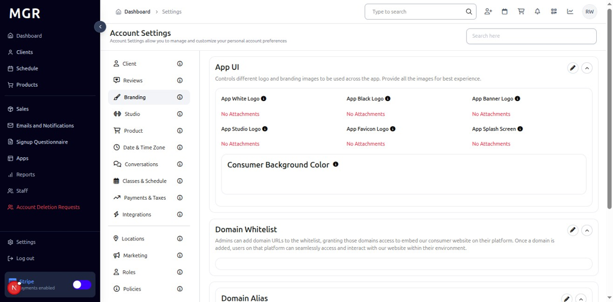
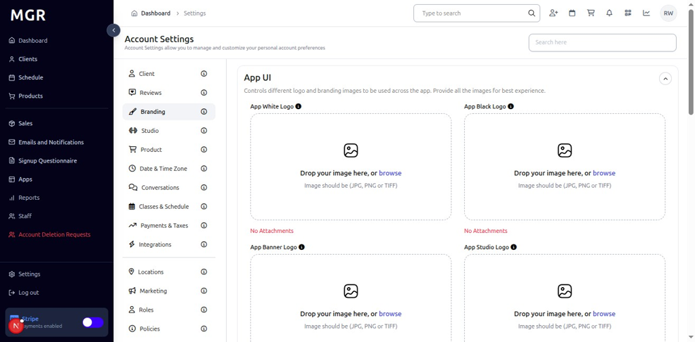
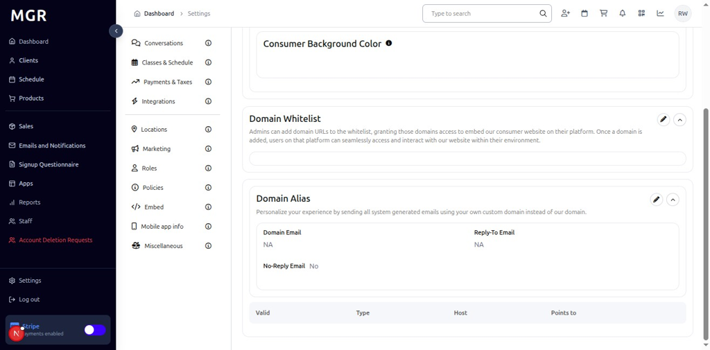
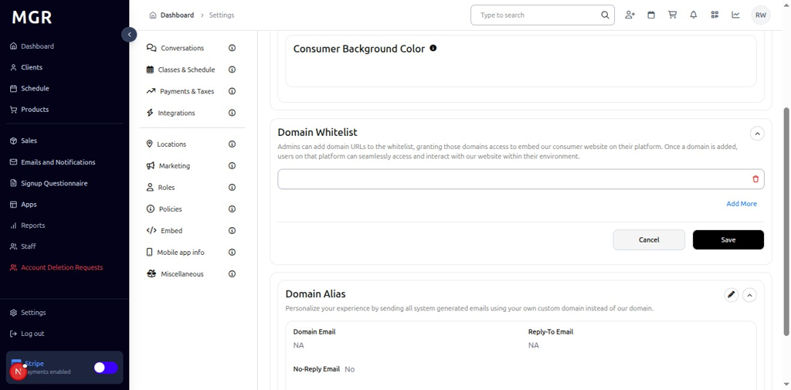
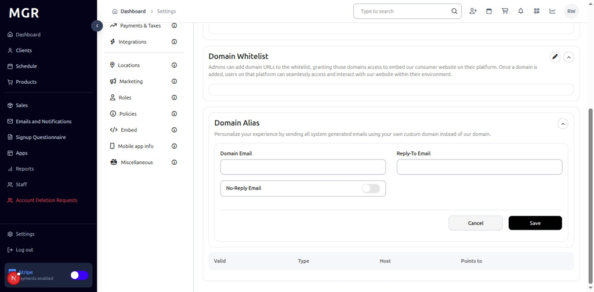

# Branding Settings Management Guide

This guide provides step-by-step instructions for managing branding settings in the admin dashboard, including App UI customization, domain whitelist management, and domain alias configuration.

## Overview

The Branding Settings section allows administrators to customize the application's visual appearance, manage domain access controls, and configure domain aliases for email communications. These settings help maintain brand consistency and control access to the system.

## Accessing Branding Settings

### 1. Navigate to Dashboard

a. Go to the admin dashboard

**URL:** `https://coreology.staging.mgrapp.com/next/admin`

### 2. Open Settings Section

a. In the left sidebar, click **"Settings"** to open the settings area

### 3. View Branding Settings

The Branding Settings section displays App UI with a top-right pencil button for editing the application's visual branding.

### 4. Edit App UI Settings

#### 4.1 Access Edit Mode

a. Click the **pencil icon** (✏️) in the top-right of the App UI section

b. The "Edit App UI" dialog opens

#### 4.2 Configure App UI Settings
The dialog contains various branding configuration options with:
- **App Logo:** Upload a new logo for the app
- **App Name:** Change the name of the app
- **App Description:** Change the description of the app
- **App Theme:** Change the theme of the app
- **App Language:** Change the language of the app
- **Cancel/Save buttons** to apply or discard changes

## Managing Domain Whitelist

### 5. View Domain Whitelist

The Domain Whitelist section displays with a top-right pencil button for editing the allowed domains.

a. Click the **pencil icon** (✏️) in the top-right of the Domain Whitelist section

b. The "Edit Domain Whitelist" dialog opens

#### 5.1 Configure Domain Whitelist
The dialog contains:
- **Add Whitelist Field:** Input field to add new domains to the whitelist
- **Add More Option:** Button to add additional domain fields
- **Cancel** button to discard changes
- **Save** button to apply the new domain whitelist

### 6. View Domain Alias

The Domain Alias section displays with a top-right pencil button for editing the domain alias configuration.

a. Click the **pencil icon** (✏️) in the top-right of the Domain Alias section

b. The "Edit Domain Alias" dialog opens

#### 6.1 Configure Domain Alias
The dialog contains:
- **Add Email Field:** Input field to add new email addresses
- **No-Reply Email Toggle:** Toggle button to enable/disable no-reply email functionality
- **Cancel/Save buttons** to apply or discard changes

## Troubleshooting

**Common Issues:**
- **Settings Not Saving:** Verify all required fields are filled and click Save
- **Changes Not Applying:** Refresh the page and verify settings were saved
- **Edit Dialog Not Opening:** Check if you have sufficient permissions
- **Domain Issues:** Verify domain format and ensure proper DNS configuration

**Need Help?** Contact system administrator or technical support for assistance with branding settings management or configuration issues.
