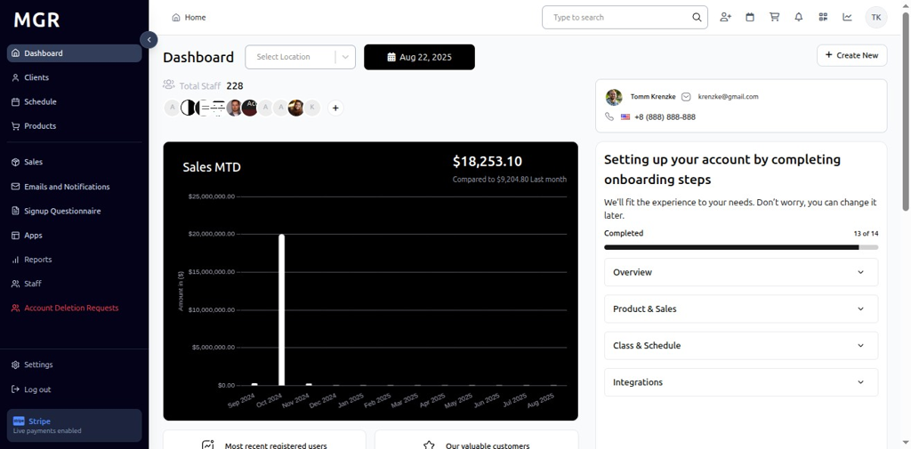

# Classes and Schedule Settings Management Guide

This guide provides step-by-step instructions for managing classes and schedule settings in the admin dashboard, including resource reservations, slot properties, and various scheduling configurations.

## Overview

The Classes and Schedule Settings section allows administrators to configure class scheduling, resource reservations, slot properties, and various scheduling-related policies. These settings help control how classes are scheduled, managed, and accessed within the system.

## Accessing Classes and Schedule Settings

### 1. Navigate to Dashboard

a. Go to the admin dashboard

**URL:** `https://coreology.staging.mgrapp.com/next/admin`

### 2. Open Settings Section

a. In the left sidebar, click **"Settings"** to open the settings area

## Managing Resource Reservation Settings

### 3. View Resource Reservation Details

The Resource Reservation Details section displays with a top-right pencil button for editing the reservation configuration.

a. Click the **pencil icon** (✏️) in the top-right of the Resource Reservation Details section

b. The "Edit Resource Reservation Settings" screen opens

#### 3.1 Configure Reservation Settings
The screen contains various reservation configuration options with:
- **Cancel** button to discard changes
- **Save** button to apply the new reservation settings

## Managing Slot Properties

### 4. Add New Slot Property

#### 4.1 Access Add Dialog

a. Click the **"+"** icon in the Slot Properties section

b. The "Add New Slot Property" popup opens

#### 4.2 Configure Slot Property
The popup contains:
- **Name:** Input field to enter the slot property name
- **Icon Group:** Select the icon group from dropdown
- **Icon Name:** Select the specific icon name from dropdown
- **Cancel/Save buttons** to apply or discard changes

### 5. Edit Slot Property

#### 5.1 Access Edit Options

a. Locate the desired slot in the Slot Properties table

b. Click the **three-dots menu** (⋮) on the slot row

c. Select **"Edit"** from the actions menu

#### 5.2 Modify Slot Property
The "Update Slot Property" window displays with:
- **Name:** Modify the slot property name
- **Icon Group:** Change the icon group selection
- **Icon Name:** Update the icon name selection
- **Cancel/Save buttons** to apply or discard changes

### 6. Delete Slot Property

#### 6.1 Initiate Deletion

a. Locate the desired slot in the Slot Properties table

b. Click the **three-dots menu** (⋮) on the slot row

c. Select **"Delete"** from the actions menu

#### 6.2 Confirm Deletion
The "Delete Confirmation" dialog appears with:
- Warning text about the deletion
- **"Cancel"** button to abort the operation
- **"Delete"** button to confirm removal

## Managing Last Minute Reservation

### 7. Edit Last Minute Reservation

#### 7.1 Access Edit Mode

a. Click the **pencil icon** (✏️) in the Last Minute Reservation section

b. The "Update Last Minute Reservation" dialog opens

#### 7.2 Configure Last Minute Reservation
The dialog contains various last minute reservation settings with:
- **Cancel/Save buttons** to apply or discard changes

## Managing Class Image

### 8. Edit Class Image

#### 8.1 Access Edit Mode

a. Click the **pencil icon** (✏️) in the Class Image section

b. The "Class Status" dialog opens

#### 8.2 Configure Class Status
The dialog contains class status configuration options with:
- **Cancel/Save buttons** to apply or discard changes

## Managing Resource Offering

### 9. Edit Resource Offering

#### 9.1 Access Edit Mode

a. Click the **pencil icon** (✏️) in the Resource Offering section

b. The "Edit Resource Offering Details" dialog opens

#### 9.2 Configure Resource Offering
The dialog contains resource offering configuration options with:
- **Cancel/Save buttons** to apply or discard changes

## Managing Free Class Penalty

### 10. Edit Free Class Penalty

#### 10.1 Access Edit Mode

a. Click the **pencil icon** (✏️) in the Free Class Penalty section

b. The "Edit Penalty for Free Class" dialog opens

#### 10.2 Configure Penalty Settings
The dialog contains penalty configuration options:
- **Edit Penalty:** Input field to modify the penalty for free classes
- **Save** button to update changes

## Managing Class Requirements

### 11. Delete Class Requirement

#### 11.1 Initiate Deletion

a. Locate the desired class requirement in the Class Requirements table

b. Click the **three-dots menu** (⋮) on the class requirement row

c. Select **"Delete"** from the actions menu

#### 11.2 Confirm Deletion
The "Delete Confirmation" dialog appears with:
- Warning text about the deletion
- **"Cancel"** button to abort the operation
- **"Delete"** button to confirm removal

## Managing Schedule Release

### 12. Edit Schedule Release

#### 12.1 Access Edit Mode

a. Click the **pencil icon** (✏️) in the Schedule Release section

b. The "Update Schedule Release" dialog opens

#### 12.2 Configure Schedule Release
The dialog contains schedule release configuration options with:
- **Cancel/Save buttons** to apply or discard changes

## Managing Allow Check In

### 13. Edit Allow Check In

#### 13.1 Access Edit Mode

a. Click the **pencil icon** (✏️) in the Allow Check In section

b. The "Edit Check In" dialog opens

#### 13.2 Configure Check In Settings
The dialog contains check in configuration options:
- **Save** button to update changes

## Troubleshooting

**Common Issues:**
- **Settings Not Saving:** Verify all required fields are filled and click Save
- **Changes Not Applying:** Refresh the page and verify settings were saved
- **Edit Dialog Not Opening:** Check if you have sufficient permissions
- **Slot Property Issues:** Verify property configuration and ensure proper setup

**Need Help?** Contact system administrator or technical support for assistance with classes and schedule settings management or configuration issues.
