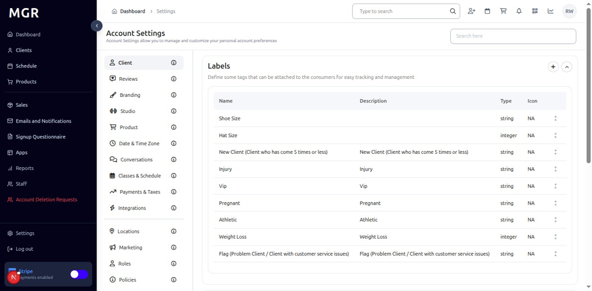
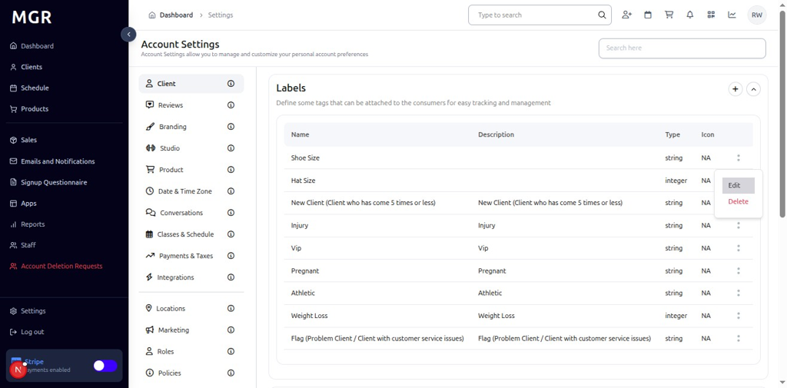
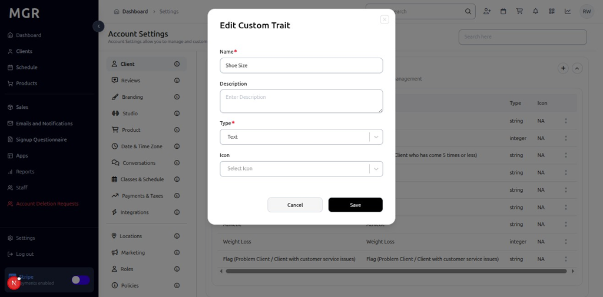
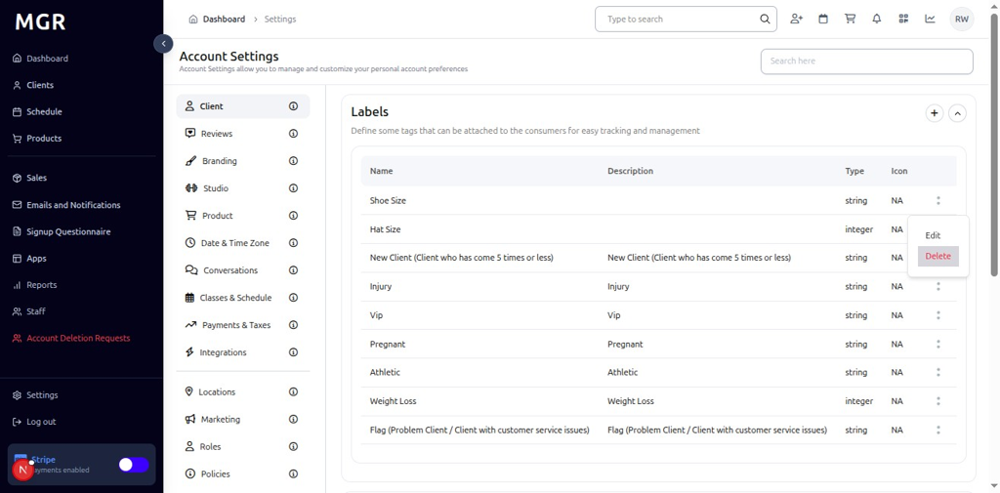
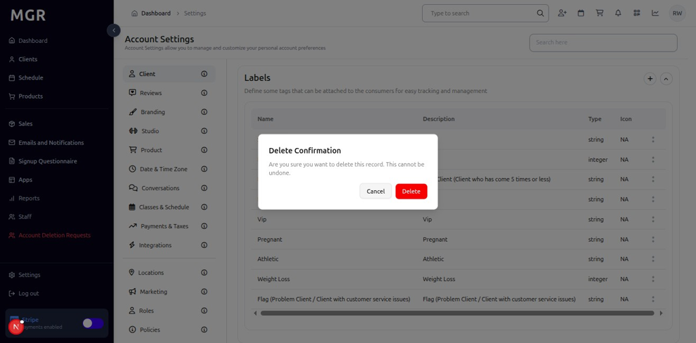
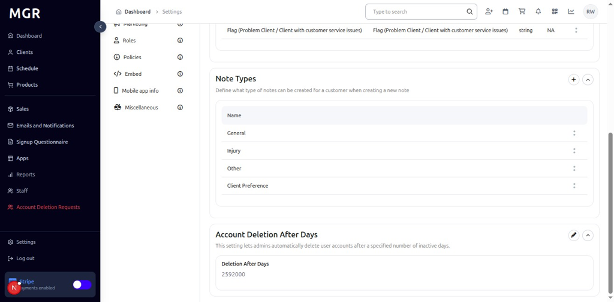
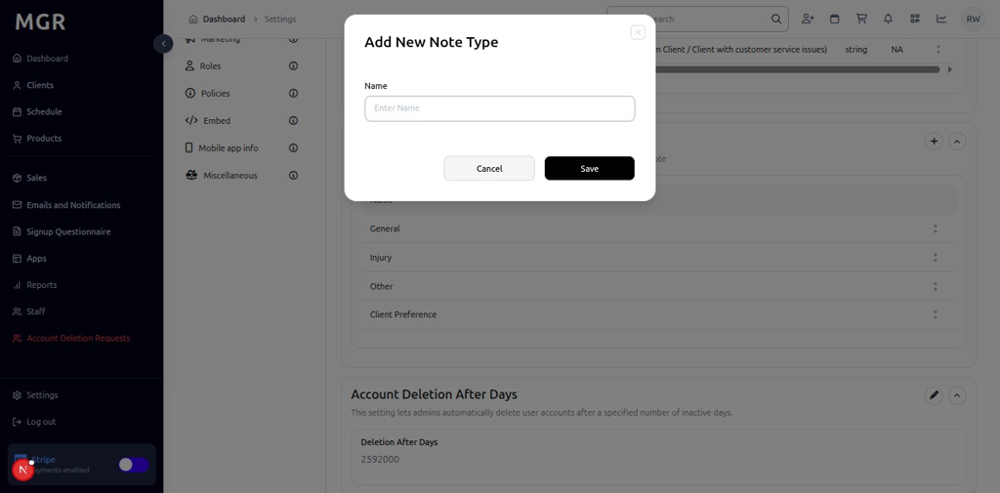
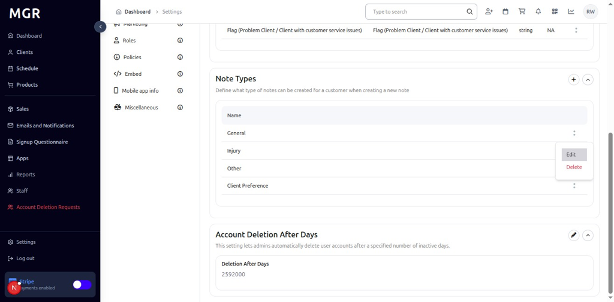
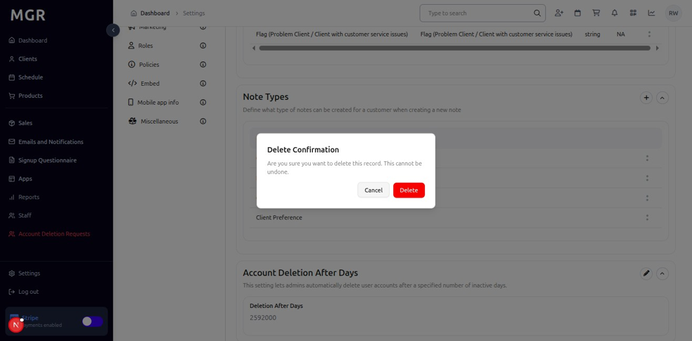
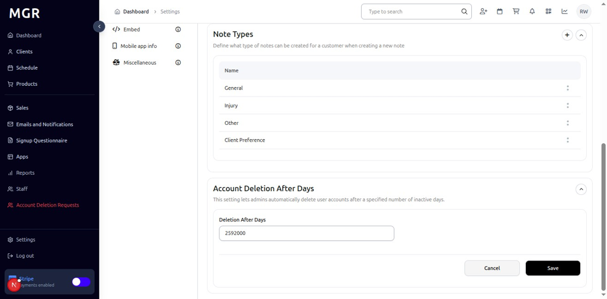

# Client Settings Management Guide

This guide provides step-by-step instructions for managing client settings in the admin dashboard, including custom traits, note types, and account deletion policies.

## Overview

The Client Settings section allows administrators to manage custom traits (labels), note types, and account deletion policies. These settings help customize the client management experience and maintain data organization across the system.

## Accessing Client Settings

### 1. Navigate to Dashboard

a. Go to the admin dashboard

**URL:** `https://coreology.staging.mgrapp.com/next/admin`

  

### 2. Open Settings Section

a. In the left sidebar, click **"Settings"** to open the settings area

## Managing Custom Traits (Labels)

### 3. View Labels List

The Labels table displays existing labels with a top-right plus button for adding new labels.

### 4. Add New Custom Trait

#### 4.1 Open Add Dialog

a. Click the **"+"** button in the top-right of the Labels section

b. The "Add New Custom Trait" modal opens

#### 4.2 Fill Trait Details
The modal contains the following fields:
- **Name:** Enter the trait name
- **Description:** Provide a description for the trait
- **Type:** Select the trait type from dropdown
- **Icon:** Choose an appropriate icon from dropdown

#### 4.3 Save or Cancel
- Click **"Cancel"** to close without saving
- Click **"Save"** to create the new custom trait

### 5. Edit Custom Trait

#### 5.1 Access Edit Options

a. Locate the desired label in the Labels table

b. Click the **three-dots menu** (⋮) on the label row

c. Select **"Edit"** from the actions menu

#### 5.2 Modify Trait Details
The "Edit Custom Trait" window displays with fields for:
- **Name:** Modify the trait name
- **Description:** Update the trait description
- **Type:** Change the trait type from dropdown
- **Icon:** Select a different icon from dropdown

#### 5.3 Save Changes
- Click **"Cancel"** to discard changes
- Click **"Save"** to update the custom trait

### 6. Delete Custom Trait

#### 6.1 Initiate Deletion

a. Locate the desired label in the Labels table

b. Click the **three-dots menu** (⋮) on the label row

c. Select **"Delete"** from the actions menu

#### 6.2 Confirm Deletion
The "Delete Confirmation" dialog appears with:
- Warning text about the deletion
- **"Cancel"** button to abort the operation
- **"Delete"** button to confirm removal

## Managing Note Types

### 7. Add New Note Type

#### 7.1 Open Add Dialog

a. Click the **"+"** icon in the Note Types section

b. The "Add New Note Type" popup opens

#### 7.2 Enter Note Type Details
The popup contains:
- **Name:** Enter the note type name
- Click **"Cancel"** to close without saving
- Click **"Save"** to create the new note type

### 8. Edit Note Type

#### 8.1 Access Edit Options

a. Locate the desired note type in the Note Types table

b. Click the **three-dots menu** (⋮) on the note type row

c. Select **"Edit"** from the actions menu

#### 8.2 Modify Note Type
The "Edit Note Type" window opens with:
- **Name:** Modify the note type name
- Click **"Cancel"** to discard changes
- Click **"Save"** to update the note type

### 9. Delete Note Type

#### 9.1 Initiate Deletion

a. Locate the desired note type in the Note Types table

b. Click the **three-dots menu** (⋮) on the note type row

c. Select **"Delete"** from the actions menu

#### 9.2 Confirm Deletion
The "Delete Confirmation" dialog appears with:
- Warning text about the deletion
- **"Cancel"** button to abort the operation
- **"Delete"** button to confirm removal

### 10. Modify Account Deletion After Days

#### 10.1 Access Edit Mode

a. Locate the **"Account Deletion After Days"** section header

b. Click the **pencil icon** (✏️) in the section header

#### 10.2 Enter Deletion Days

a. Enter the desired number of days in the input field

b. Click **"Save"** to apply the new deletion policy

## Troubleshooting

**Common Issues:**
- **Trait Not Saving:** Verify all required fields are filled
- **Delete Operation Fails:** Check if the trait/note type is in use by existing clients
- **Settings Not Updating:** Refresh the page and verify changes were saved

**Need Help?** Contact system administrator or technical support for assistance with settings management or configuration issues.
