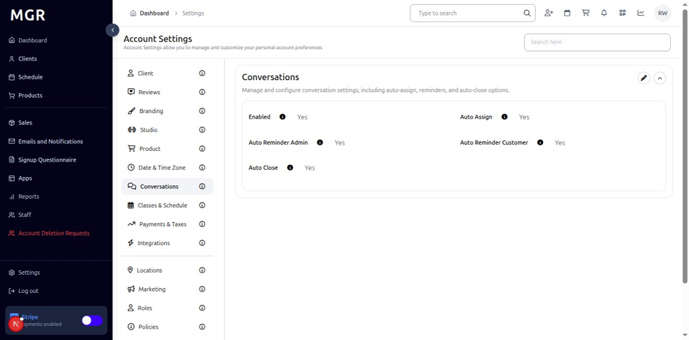
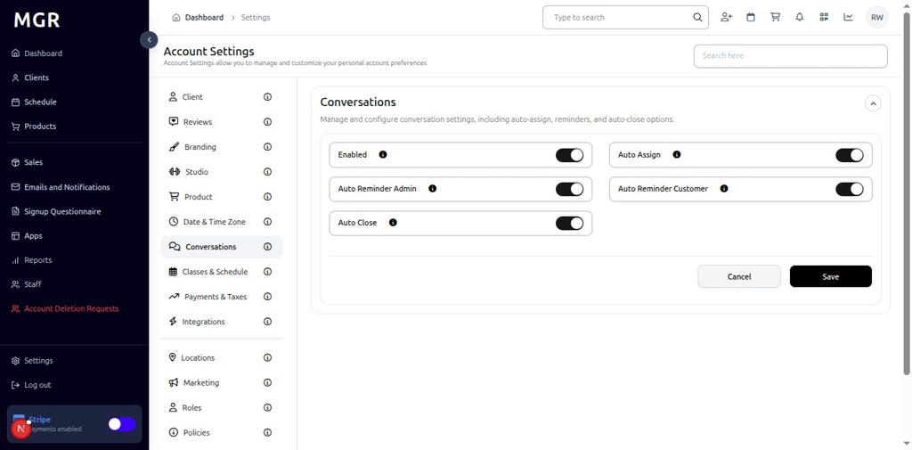

# Conversation Settings Management Guide

This guide provides step-by-step instructions for managing conversation settings in the admin dashboard, including conversation configuration and communication preferences.

## Overview

The Conversation Settings section allows administrators to configure conversation-related settings and communication preferences. These settings help control how conversations are managed and displayed within the system.

## Accessing Conversation Settings

### 1. Navigate to Dashboard

a. Go to the admin dashboard

**URL:** `https://coreology.staging.mgrapp.com/next/admin`

### 2. Open Settings Section

a. In the left sidebar, click **"Settings"** to open the settings area

### 3. View Conversations Details

The Conversations Details section displays with a top-right pencil button for editing the conversation configuration.

a. Click the **pencil icon** (✏️) in the top-right of the Conversations Details section

b. The "Edit Conversation Settings" screen opens

#### 3.1 Configure Conversation Settings
The screen contains various conversation configuration options with:
- **Conversation Type:** Select the desired conversation type from the dropdown
- **Conversation Display:** Select the appropriate conversation display from the dropdown
- **Cancel/Save buttons** to apply or discard changes

## Troubleshooting

**Common Issues:**
- **Settings Not Saving:** Verify all required fields are filled and click Save
- **Changes Not Applying:** Refresh the page and verify settings were saved
- **Edit Screen Not Opening:** Check if you have sufficient permissions
- **Conversation Issues:** Verify conversation configuration and ensure proper setup

**Need Help?** Contact system administrator or technical support for assistance with conversation settings management or configuration issues.
