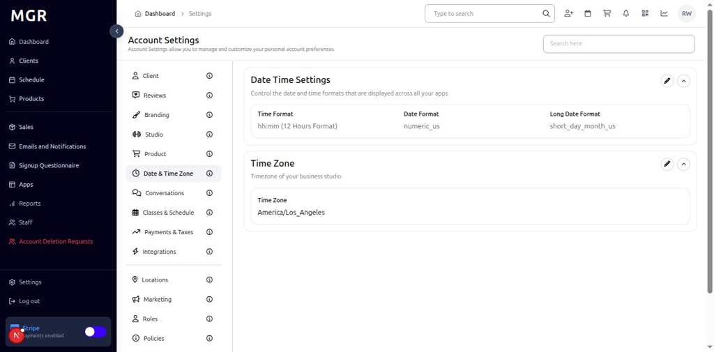
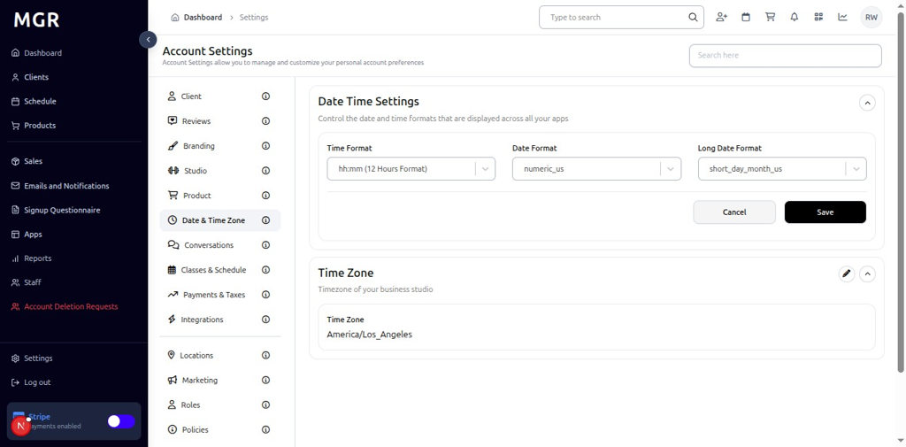
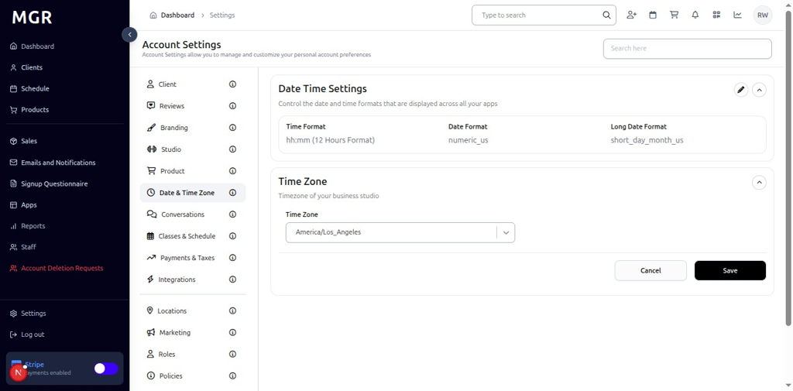

# Date and Time Settings Management Guide

This guide provides step-by-step instructions for managing date and time settings in the admin dashboard, including date format configuration and time zone settings.

## Overview

The Date and Time Settings section allows administrators to configure date formats, time zones, and other temporal settings. These settings help ensure consistent date and time display across the system and align with business operational hours.

## Accessing Date and Time Settings

### 1. Navigate to Dashboard

a. Go to the admin dashboard

**URL:** `https://coreology.staging.mgrapp.com/next/admin`

### 2. Open Settings Section

a. In the left sidebar, click **"Settings"** to open the settings area

## Managing Date & Time Zone Settings

### 3. View Date & Time Zone Details

The Date & Time Zone Details section displays with a top-right pencil button for editing the date and time configuration.

a. Click the **pencil icon** (✏️) in the top-right of the Date & Time Zone Details section

b. The "Edit Date Time Settings" dialog opens

#### 3.1 Configure Date & Time Settings
The dialog contains various date and time configuration options with:
- **Date Format:** Select the desired date format from the dropdown
- **Time Zone:** Select the appropriate time zone from the dropdown
- **Cancel/Save buttons** to apply or discard changes

### 4. View Time Zone

The Time Zone section displays with a top-right pencil button for editing the time zone configuration.

a. Click the **pencil icon** (✏️) in the top-right of the Time Zone section

b. The "Edit Time Zone" dialog opens

#### 4.1 Configure Time Zone Settings
The dialog contains:
- **Time Zone Select Field:** Dropdown to select the appropriate time zone
- **Cancel** button to discard changes
- **Save** button to apply the new time zone setting

## Troubleshooting

**Common Issues:**
- **Settings Not Saving:** Verify all required fields are filled and click Save
- **Changes Not Applying:** Refresh the page and verify settings were saved
- **Edit Dialog Not Opening:** Check if you have sufficient permissions
- **Time Zone Issues:** Verify time zone selection and ensure proper daylight saving time handling

**Need Help?** Contact system administrator or technical support for assistance with date and time settings management or configuration issues.
