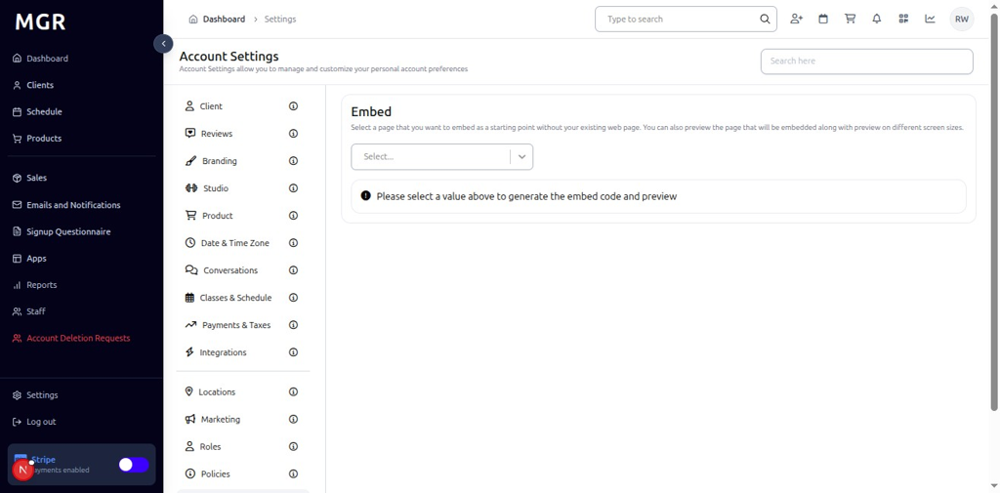
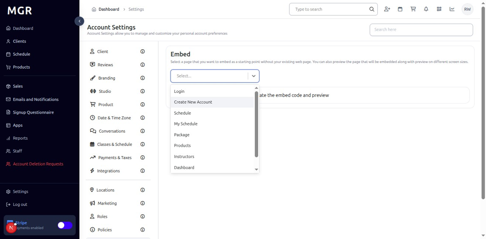
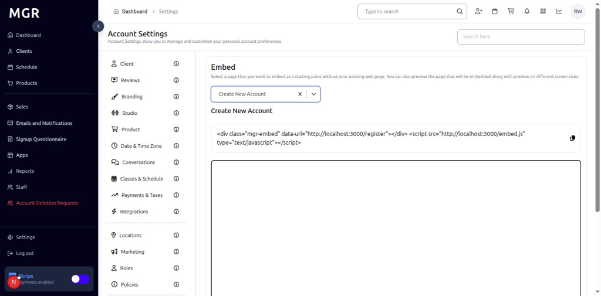

# Embed Settings Management Guide

This guide provides step-by-step instructions for managing embed settings in the admin dashboard, including module selection and embed code generation for integrating MGR functionality into external websites.

## Overview

The Embed Settings section allows administrators to generate embed codes for various MGR modules, enabling integration of booking, scheduling, and other functionality into external websites and applications.

## Accessing Embed Settings

### 1. Navigate to Dashboard

a. Go to the admin dashboard

**URL:** `https://coreology.staging.mgrapp.com/next/admin`

### 2. Open Settings Section

a. In the left sidebar, click **"Settings"** to open the settings area

## Managing Embed Settings

### 3. Switch to Embed Section

a. Navigate to the **"Embed"** tab within the Settings area

### 4. View Embed Section

The Embed section displays embed configuration options.

### 5. Select Module for Embed

#### 5.1 Access Module Selection

a. Click the **Dropdown** to view available modules

b. Select the desired **module** for embedding

#### 5.2 View Embed Code
After selecting a module, the system displays:
- **Embed Code:** Generated HTML/JavaScript code for the selected field
- **Integration Instructions:** Details on how to use the embed code

## Troubleshooting

**Common Issues:**
- **Embed Not Working:** Verify embed code is properly implemented
- **Module Not Available:** Check if the selected module is enabled
- **Code Generation Issues:** Refresh the page and try selecting the module again
- **Integration Problems:** Verify website compatibility and JavaScript requirements

**Need Help?** Contact system administrator or technical support for assistance with embed settings management or configuration issues.
