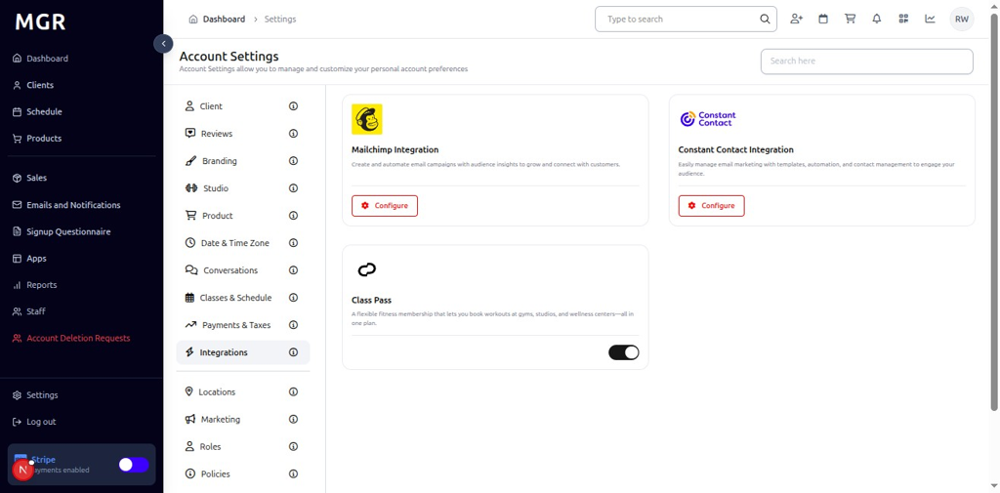
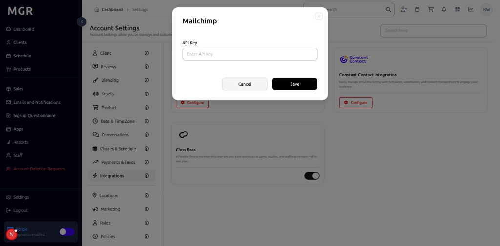
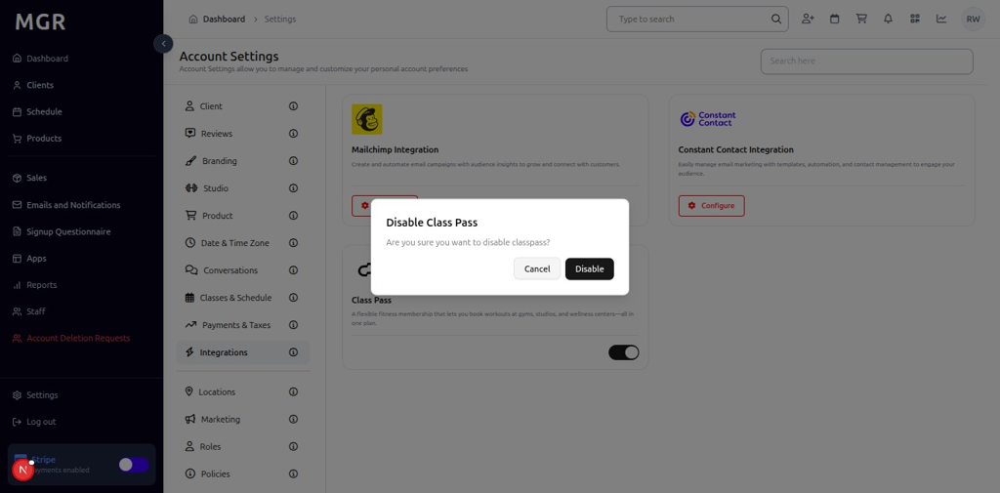

# Integrations Settings Management Guide

This guide provides step-by-step instructions for managing integrations settings in the admin dashboard, including Mailchimp, Constant Contact, Class Pass, and other third-party service integrations.

## Overview

The Integrations Settings section allows administrators to configure and manage various third-party service integrations such as email marketing platforms, booking services, and other external tools. These settings help extend the functionality of the MGR system and streamline business operations.

## Accessing Integrations Settings

### 1. Navigate to Dashboard

a. Go to the admin dashboard

**URL:** `https://coreology.staging.mgrapp.com/next/admin`

### 2. Open Settings Section

a. In the left sidebar, click **"Settings"** to open the settings area

## Managing Integrations

### 3. View Integrations

The Integrations section displays different integration methods including:
- **Mailchimp:** Email marketing platform integration
- **Constant Contact:** Email marketing service integration
- **Class Pass:** Fitness class booking platform integration

### 4. Configure Mailchimp Integration

#### 4.1 Access Configuration

a. Click the **"Configure"** button for Mailchimp integration

b. The "Configure Mailchimp" popup opens

#### 4.2 Configure Mailchimp Settings
The popup contains:
- **API Key:** Input field to enter the Mailchimp API key
- **Save** button to configure the integration

## Managing Class Pass Integration

### 5. Toggle Class Pass Integration

#### 5.1 Access Toggle
a. Click the **Class Pass Toggle Button** to enable or disable the integration

#### 5.2 Disable Class Pass
When disabling Class Pass, a confirmation popup appears:
- **Warning Message:** Information about disabling the integration
- **Cancel** button to keep the integration enabled
- **Disable** button to confirm disabling the integration

## Troubleshooting

**Common Issues:**
- **Integration Not Working:** Verify API keys are correct and active
- **Configuration Not Saving:** Check if all required fields are filled
- **Toggle Not Responding:** Refresh the page and try again
- **API Errors:** Verify service status and API key permissions

**Need Help?** Contact system administrator or technical support for assistance with integrations settings management or configuration issues.
