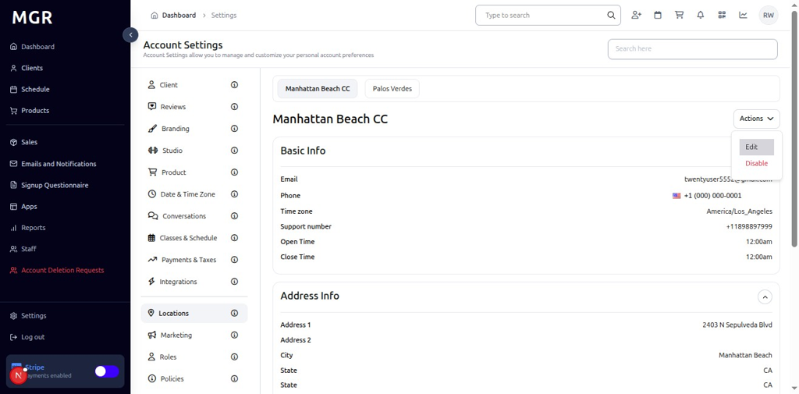
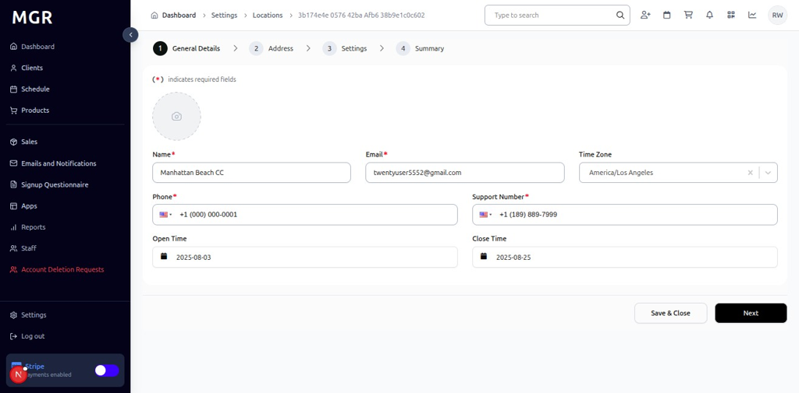
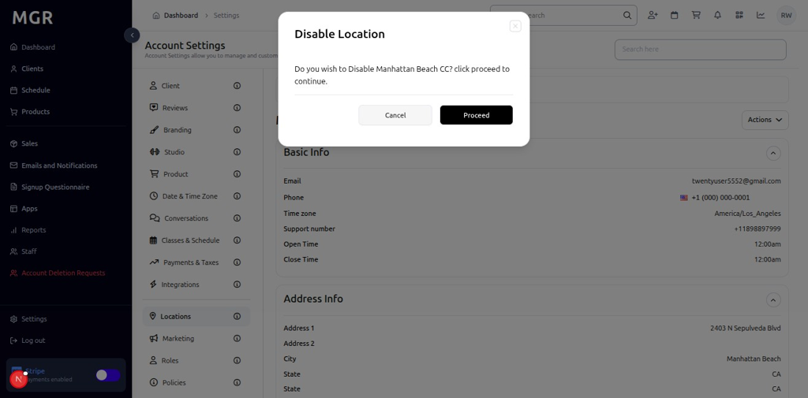

# Locations Settings Management Guide

This guide provides step-by-step instructions for managing locations settings in the admin dashboard, including location details editing, enabling/disabling locations, and location configuration management.

## Overview

The Locations Settings section allows administrators to manage multiple business locations, edit location details, and control location availability. These settings help maintain accurate location information and control which locations are active within the system.

## Accessing Locations Settings

### 1. Navigate to Dashboard

a. Go to the admin dashboard

**URL:** `https://coreology.staging.mgrapp.com/next/admin`

### 2. Open Settings Section

a. In the left sidebar, click **"Settings"** to open the settings area

## Managing Location Details

### 3. View Location Details

The Locations section displays location information, such as "Manhattan Beach CC Details" with a top-right Action button for editing the location details.

### 4. Edit Location Details

#### 4.1 Access Edit Options

a. Click the **Action Button** in the top-right of the location details section

b. Select **"Edit"** from the action menu

#### 4.2 Modify Location Details
The "Edit Details" dialog opens with various location configuration options:
- **Location Information:** Modify location details as needed
- **Save & Close** button to update the changes and close the dialog

## Managing Location Status

### 5. Disable Location

#### 5.1 Initiate Disable
a. Click the **"Disable"** button in the location management options

#### 5.2 Confirm Location Disable
The "Confirm Disable Location" popup appears with:
- **Warning Message:** Information about disabling the location
- **Proceed** button to confirm and disable the location

## Troubleshooting

**Common Issues:**
- **Settings Not Saving:** Verify all required fields are filled and click Save & Close
- **Changes Not Applying:** Refresh the page and verify settings were saved
- **Action Button Not Working:** Check if you have sufficient permissions
- **Location Issues:** Verify location configuration and ensure proper setup

**Need Help?** Contact system administrator or technical support for assistance with locations settings management or configuration issues.
