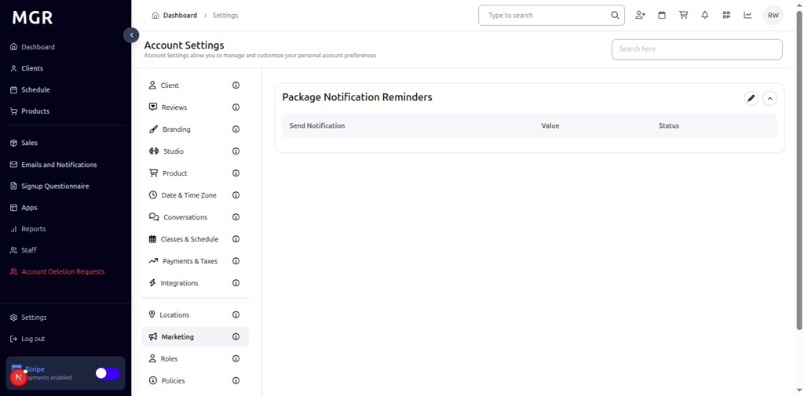
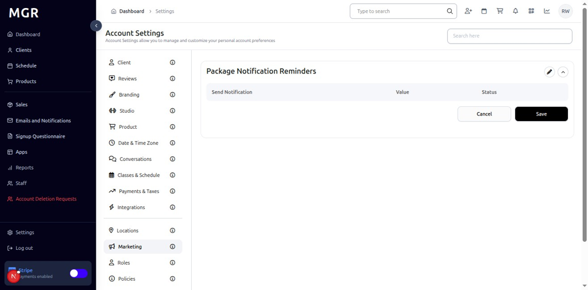

# Marketing Settings Management Guide

This guide provides step-by-step instructions for managing marketing settings in the admin dashboard, including package notification reminders and marketing automation configurations.

## Overview

The Marketing Settings section allows administrators to configure marketing automation, package notification reminders, and other promotional features. These settings help manage customer communication and marketing campaigns within the system.

## Accessing Marketing Settings

### 1. Navigate to Dashboard

a. Go to the admin dashboard

**URL:** `https://coreology.staging.mgrapp.com/next/admin`

### 2. Open Settings Section

a. In the left sidebar, click **"Settings"** to open the settings area

## Managing Package Notification Reminders

### 3. View Package Notification Reminders

The Marketing section displays Package Notification Reminders Details with a top-right pencil button for editing the reminders configuration.

a. Click the **pencil icon** (✏️) in the top-right of the Package Notification Reminders section

b. The "Edit Package Notification Reminders" dialog opens

#### 3.1 Configure Reminders
The dialog contains various reminder configuration options:
- **Add Reminders:** Input fields to add new notification reminders
- **Save** button to apply the new reminder settings

## Troubleshooting

**Common Issues:**
- **Settings Not Saving:** Verify all required fields are filled and click Save
- **Changes Not Applying:** Refresh the page and verify settings were saved
- **Edit Dialog Not Opening:** Check if you have sufficient permissions
- **Reminder Issues:** Verify reminder configuration and ensure proper setup

**Need Help?** Contact system administrator or technical support for assistance with marketing settings management or configuration issues.
