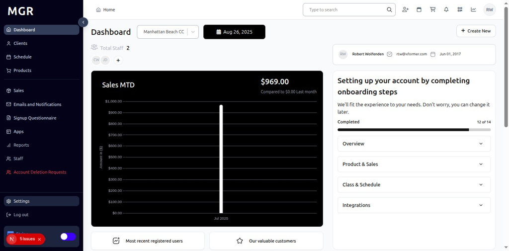

# Miscellaneous Settings Management Guide

This guide provides step-by-step instructions for managing miscellaneous settings in the admin dashboard, including questionnaire configurations and other general system settings.

## Overview

The Miscellaneous Settings section allows administrators to configure various general system settings, questionnaire configurations, and other miscellaneous options that don't fit into specific categories. These settings help fine-tune system behavior and manage additional functionality.

## Accessing Miscellaneous Settings

### 1. Navigate to Dashboard

a. Go to the admin dashboard

**URL:** `https://coreology.staging.mgrapp.com/next/admin`

### 2. Open Settings Section

a. In the left sidebar, click **"Settings"** to open the settings area

## Managing Miscellaneous Settings

### 3. Switch to Miscellaneous Section

a. Navigate to the **"Miscellaneous"** tab within the Settings area

### 4. View Questionnaire Details

The Miscellaneous section displays Questionnaire Details with a top-right pencil button for editing the questionnaire configuration.

a. Click the **pencil icon** (✏️) in the top-right of the Questionnaire Details section

b. The "Edit Questionnaire" dialog opens

#### 4.1 Configure Questionnaire Settings
The dialog contains:
- **Update Status:** Modify questionnaire status and configuration options
- **Save** button to apply the new questionnaire settings

## Troubleshooting

**Common Issues:**
- **Settings Not Saving:** Verify all required fields are filled and click Save
- **Changes Not Applying:** Refresh the page and verify settings were saved
- **Edit Dialog Not Opening:** Check if you have sufficient permissions
- **Configuration Issues:** Verify miscellaneous settings and ensure proper setup

**Need Help?** Contact system administrator or technical support for assistance with miscellaneous settings management or configuration issues.
