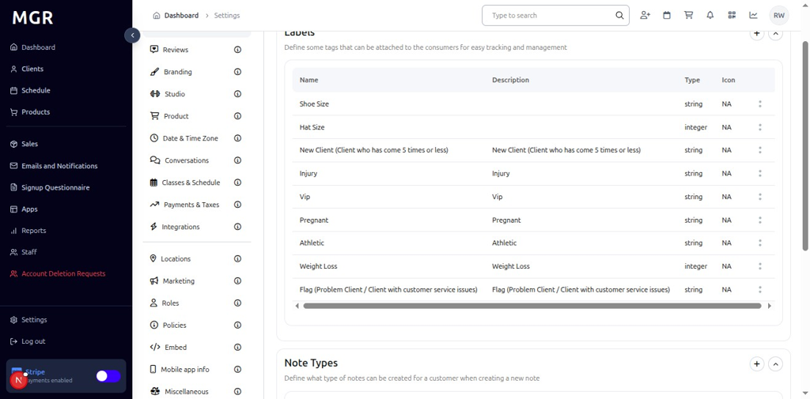
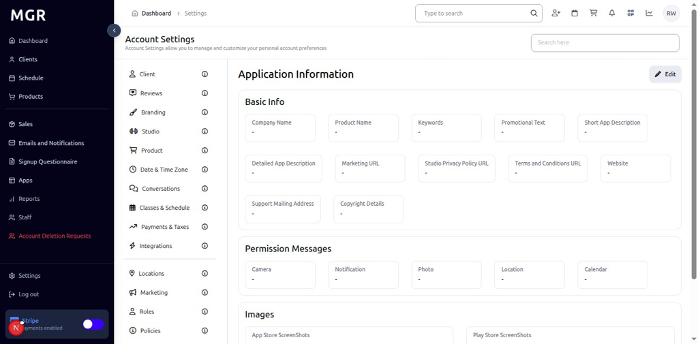
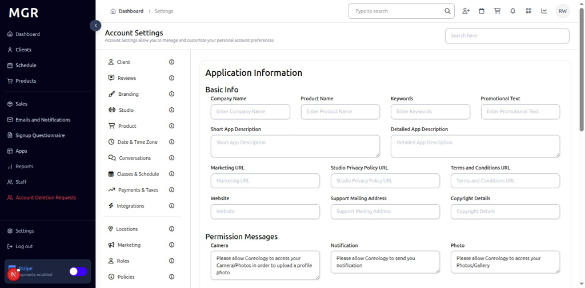

# Mobile App Info Settings Management Guide

This guide provides step-by-step instructions for managing mobile app information settings in the admin dashboard, including application details, version information, and mobile app configuration.

## Overview

The Mobile App Info Settings section allows administrators to configure and manage mobile application information, including app details, version updates, and mobile-specific configurations. These settings help maintain accurate mobile app information and ensure proper mobile app functionality.

## Accessing Mobile App Info Settings

### 1. Navigate to Dashboard

a. Go to the admin dashboard

**URL:** `https://coreology.staging.mgrapp.com/next/admin`

### 2. Open Settings Section

a. In the left sidebar, click **"Settings"** to open the settings area

## Managing Mobile App Info Settings

### 3. Switch to Mobile App Info Section

a. Navigate to the **"Mobile App Info"** tab within the Settings area

### 4. View Application Information

The Mobile App Info section displays Application Information with configuration options.

### 5. Edit Application Information

#### 5.1 Access Edit Mode

a. Click the **Edit Button** in the Application Information Section

b. The "Edit Application Information" dialog opens

#### 5.2 Configure Application Information
The dialog contains:
- **Add Information For Application:** Input fields to modify mobile app details
- **Save** button to update information for the application

## Troubleshooting

**Common Issues:**
- **Settings Not Saving:** Verify all required fields are filled and click Save
- **Changes Not Applying:** Refresh the page and verify settings were saved
- **Edit Dialog Not Opening:** Check if you have sufficient permissions
- **App Info Issues:** Verify app configuration and ensure proper setup

**Need Help?** Contact system administrator or technical support for assistance with mobile app info settings management or configuration issues.
