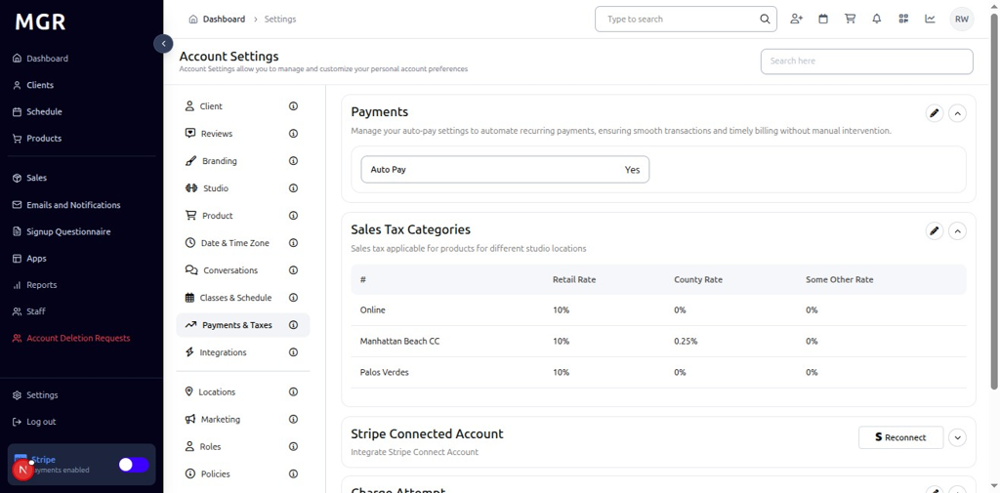
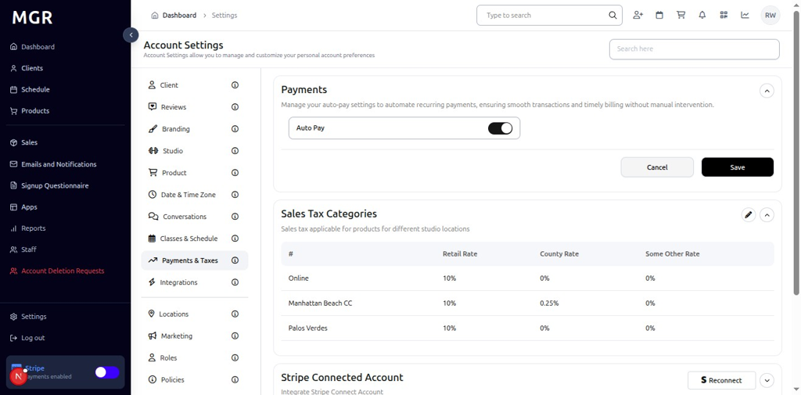
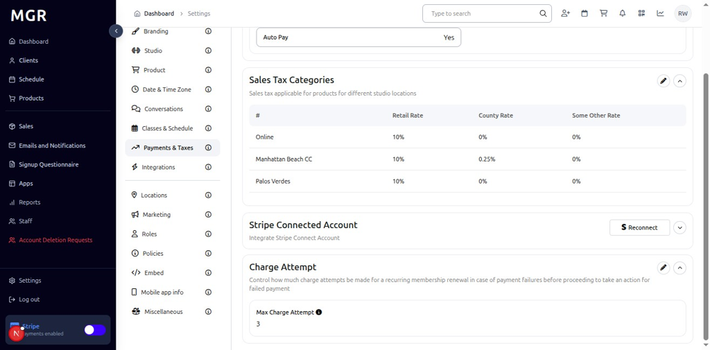
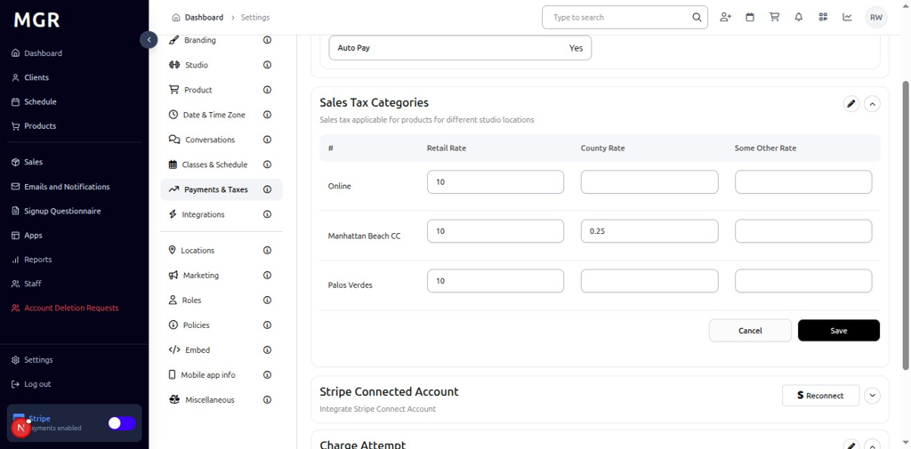
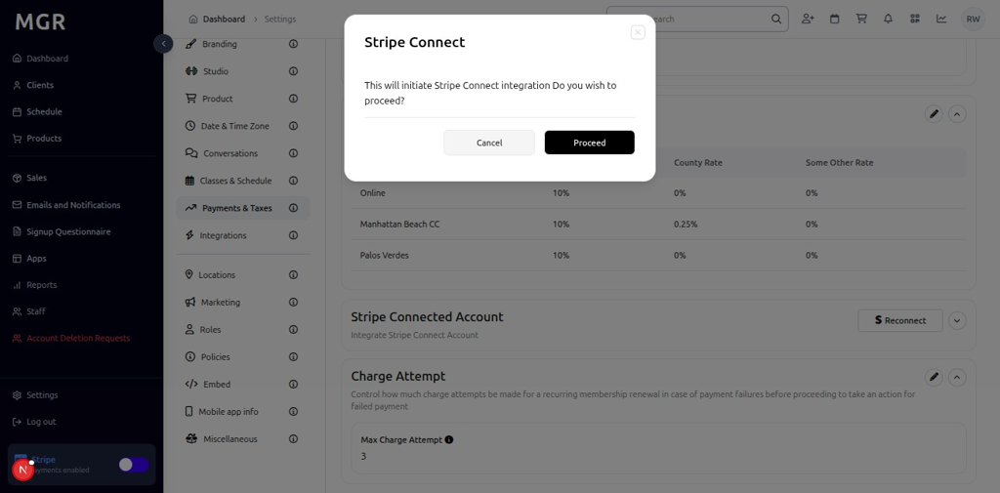
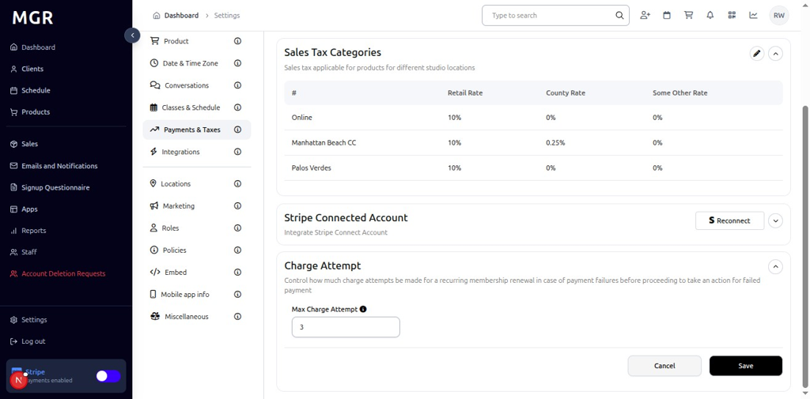

# Payment and Taxes Settings Management Guide

This guide provides step-by-step instructions for managing payment and taxes settings in the admin dashboard, including payment configuration, sales tax categories, Stripe integration, and charge attempt settings.

## Overview

The Payment and Taxes Settings section allows administrators to configure payment processing, manage sales tax categories, integrate with Stripe, and control charge attempt policies. These settings help ensure proper payment handling and tax compliance within the system.

## Accessing Payment and Taxes Settings

### 1. Navigate to Dashboard

a. Go to the admin dashboard

**URL:** `https://coreology.staging.mgrapp.com/next/admin`

### 2. Open Settings Section

a. In the left sidebar, click **"Settings"** to open the settings area

## Managing Payment Settings

### 3. View Payments Details

The Payments Details section displays with a top-right pencil button for editing the payment configuration.
a. Click the **pencil icon** (✏️) in the top-right of the Payments Details section
b. The "Edit Payment with Auto Pay" dialog opens

#### 3.1 Configure Payment Settings
The dialog contains various payment configuration options with:
- **Auto Pay:** Toggle to enable or disable automatic payment processing
- **Cancel/Save buttons** to apply or discard changes

## Managing Sales Tax Categories

### 4. Edit Sales Tax Categories

#### 4.1 Access Edit Mode

a. Click the **pencil icon** (✏️) in the Sales Tax Categories section

b. The "Sales Tax Categories" window opens

#### 4.2 Configure Sales Tax Rates
The window displays:
- **Edit Rates:** Input fields to modify tax rates for different categories
- **Sales Tax Section:** Various tax category configurations
- **Save** button to update changes

## Managing Stripe Connected Account

### 5. Reconnect Stripe Account

#### 5.1 Access Reconnect

a. Click the **"Reconnect"** button in the Stripe Connected Account section

b. The "Stripe Connect" popup opens

#### 5.2 Complete Stripe Connection

The popup contains:
- **Connect Message:** Information about connecting to Stripe
- **Cancel** button to abort the connection
- **Proceed** button to continue with Stripe connection

## Managing Charge Attempt Settings

### 6. Edit Charge Attempt Section

#### 6.1 Access Edit Mode

a. Click the **pencil icon** (✏️) in the Charge Attempt Section

b. The "Edit Max Charge Attempt" dialog opens

#### 6.2 Configure Charge Attempt Settings

The dialog contains:
- **Max Charge Attempt:** Input field to modify the maximum number of charge attempts
- **Save** button to update changes

## Troubleshooting

**Common Issues:**
- **Settings Not Saving:** Verify all required fields are filled and click Save
- **Changes Not Applying:** Refresh the page and verify settings were saved
- **Edit Dialog Not Opening:** Check if you have sufficient permissions
- **Stripe Connection Issues:** Verify Stripe account status and API keys
- **Tax Calculation Errors:** Check sales tax rate configurations

**Need Help?** Contact system administrator or technical support for assistance with payment and taxes settings management or configuration issues.
