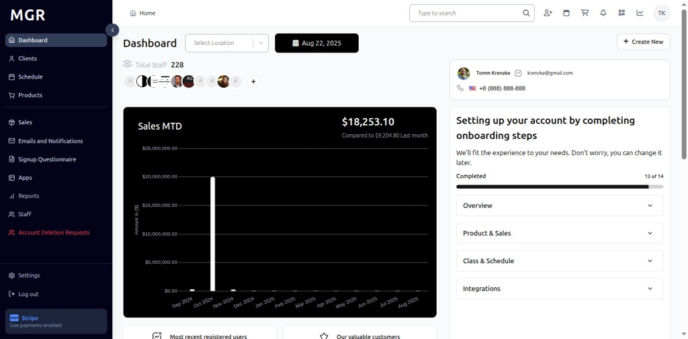
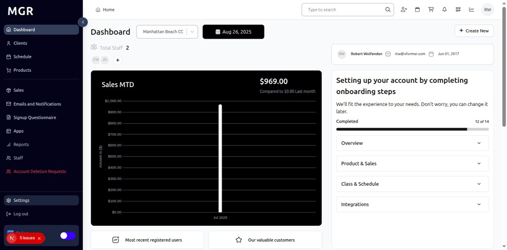
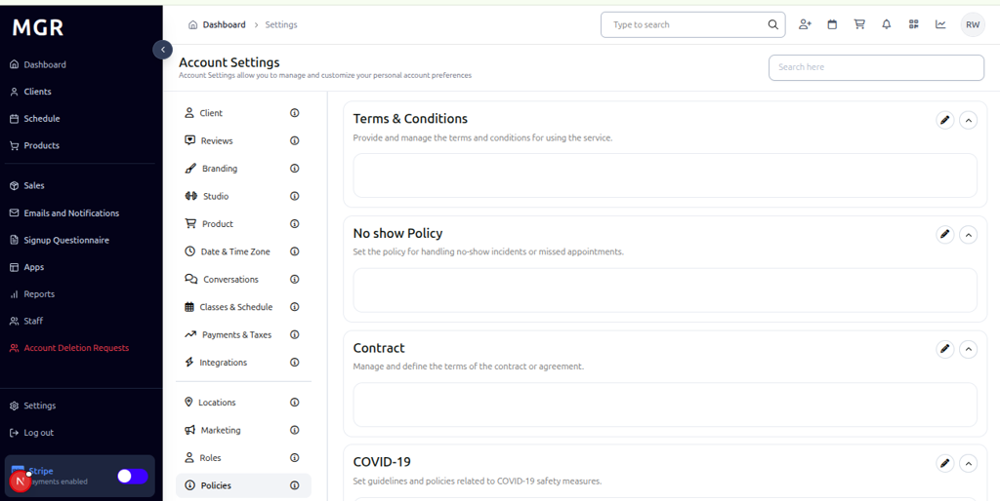
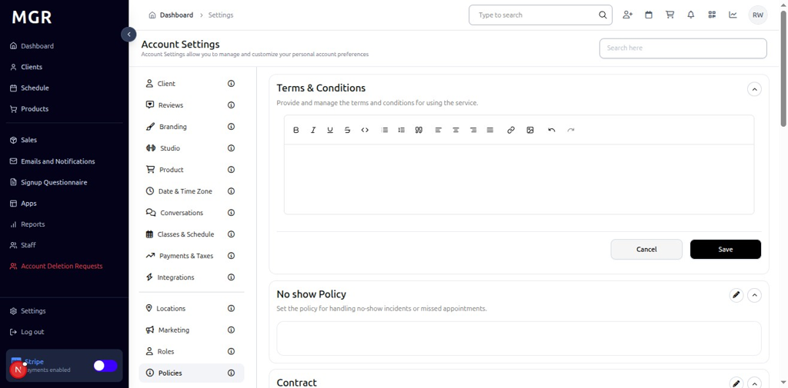
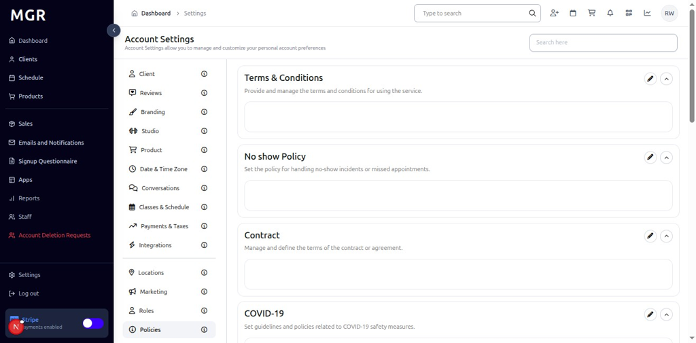
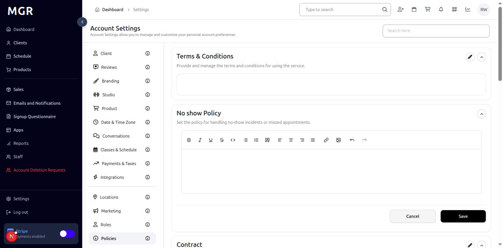
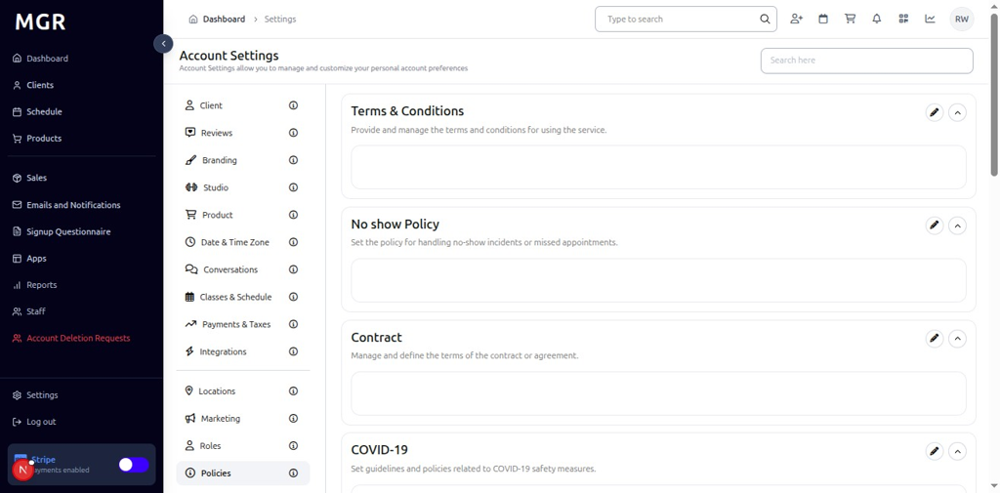
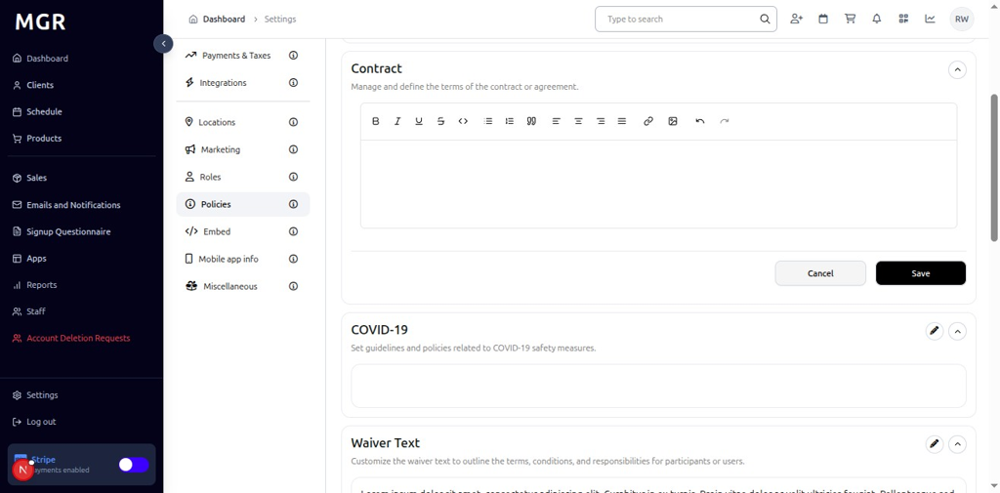
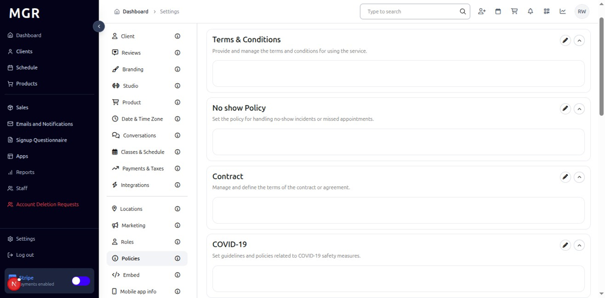
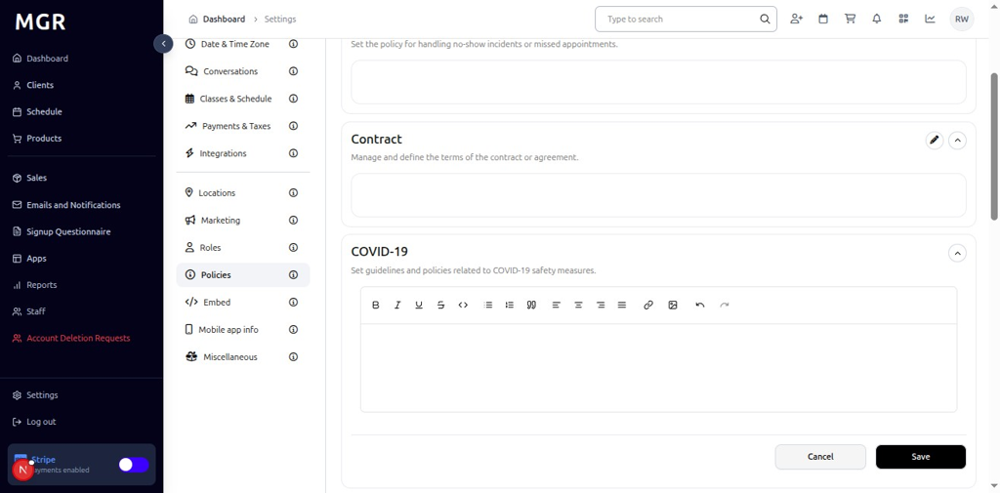

# Policies Settings Management Guide

This guide provides step-by-step instructions for managing policies settings in the admin dashboard, including terms & conditions, no-show policies, contracts, and COVID-19 policies.

## Overview

The Policies Settings section allows administrators to configure and manage various business policies, terms & conditions, and operational guidelines. These settings help establish clear business rules and ensure compliance with company policies.

## Accessing Policies Settings

### 1. Navigate to Dashboard

a. Go to the admin dashboard

**URL:** `https://coreology.staging.mgrapp.com/next/admin`

### 2. Open Settings Section

a. In the left sidebar, click **"Settings"** to open the settings area

## Managing Terms & Conditions

### 3. View Terms & Conditions

The Policies section displays Terms & Conditions with a top-right pencil button for editing the policies.

a. Click the **pencil icon** (✏️) in the top-right of the Terms & Conditions section

b. The "Edit Terms & Conditions" dialog opens

#### 3.1 Configure Terms & Conditions
The dialog contains:
- **Add Term & Conditions:** Input field to add new terms and conditions
- **Save** button to apply the new policy settings

## Managing No Show Policy

### 4. View No Show Policy

The No Show Policy section displays with a top-right pencil button for editing the policy.

a. Click the **pencil icon** (✏️) in the top-right of the No Show Policy section

b. The "Edit No Show Policy" dialog opens

#### 4.1 Configure No Show Policy

The dialog contains:
- **Add No Show Policy:** Input field to add new no-show policy details
- **Save** button to apply the new policy settings

## Managing Contract Policy

### 5. View Contract Policy

The Contract section displays contract policy information.

a. Click the **pencil icon** (✏️) in the top-right of the Contract section

b. The "Edit Contract Policy" dialog opens

#### 5.1 Configure Contract Policy

The dialog contains:
- **Add Contract Policy:** Input field to add new contract policy details
- **Save** button to apply the new policy settings

## Managing COVID-19 Policy

### 6. View COVID-19 Policy

The COVID-19 Policy section displays COVID-19 related policy information.

a. Click the **pencil icon** (✏️) in the top-right of the COVID-19 Policy section

b. The "Edit COVID-19 Policy" dialog opens

#### 6.1 Configure COVID-19 Policy

The dialog contains:
- **Add COVID-19 Policies:** Input field to add new COVID-19 policy details
- **Save** button to apply the new policy settings

## Troubleshooting

**Common Issues:**
- **Settings Not Saving:** Verify all required fields are filled and click Save
- **Changes Not Applying:** Refresh the page and verify settings were saved
- **Edit Dialog Not Opening:** Check if you have sufficient permissions
- **Policy Issues:** Verify policy configuration and ensure proper setup

**Need Help?** Contact system administrator or technical support for assistance with policies settings management or configuration issues.
