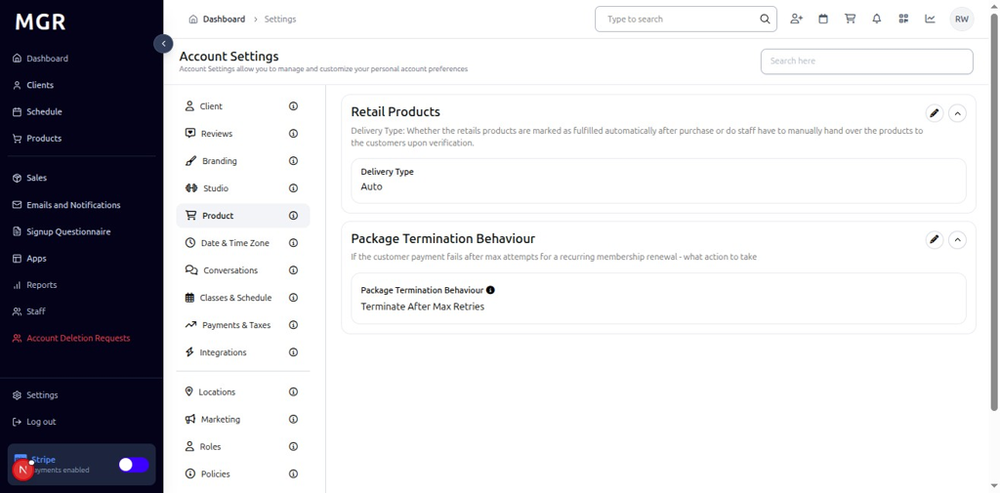
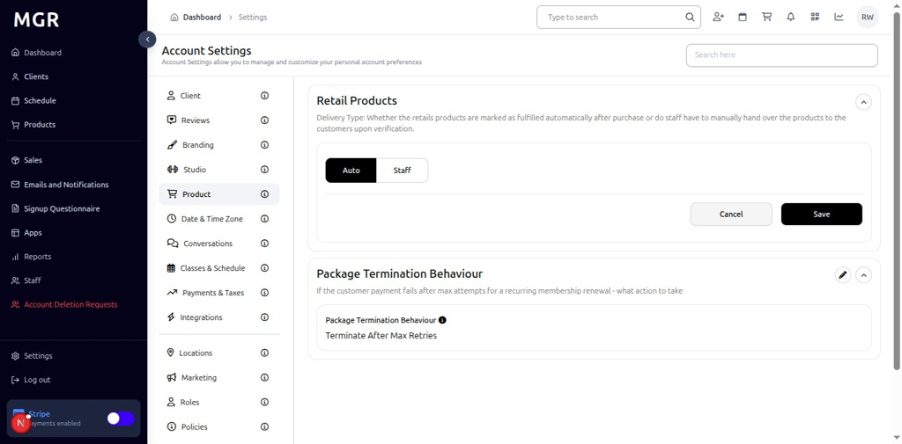
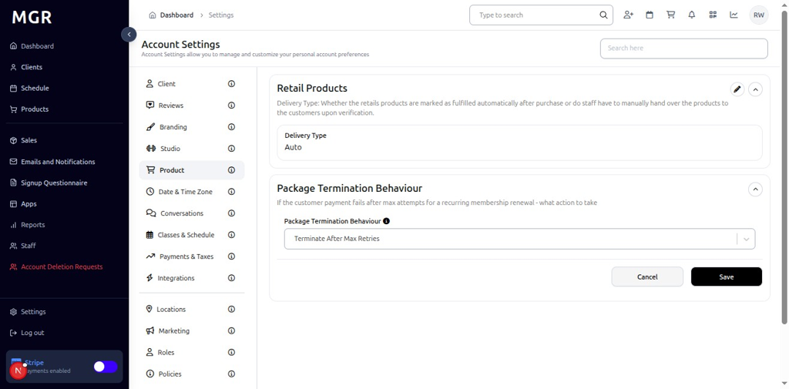

# Product Settings Management Guide

This guide provides step-by-step instructions for managing product settings in the admin dashboard, including retail products configuration and package termination behavior.

## Overview

The Product Settings section allows administrators to configure retail product details and manage package termination behavior policies. These settings help control product offerings and customer package management within the system.

## Accessing Product Settings

### 1. Navigate to Dashboard

a. Go to the admin dashboard

**URL:** `https://coreology.staging.mgrapp.com/next/admin`

### 2. Open Settings Section

a. In the left sidebar, click **"Settings"** to open the settings area

## Managing Retail Products

### 3. View Retail Products Details

The Retail Products Details section displays with a top-right pencil button for editing the product configuration.

a. Click the **pencil icon** (✏️) in the top-right of the Retail Products Details section

b. The "Edit Product" dialog opens

#### 3.1 Configure Product Settings

The dialog contains various product configuration options with:
- **Delivery Type:** Toggle control with two options:
  - **Auto:** Automatically mark retail products as fulfilled after purchase
  - **Staff:** Require staff to manually hand over products to customers upon verification
- **Cancel/Save buttons** to apply or discard changes

### 4. View Package Termination Behaviour

The Package Termination Behaviour section displays with a top-right pencil button for editing the termination policies.

a. Click the **pencil icon** (✏️) in the top-right of the Package Termination Behaviour section

b. The "Edit Package Termination Behaviour" dialog opens

#### 4.1 Configure Termination Settings

The dialog contains:
- **Package Termination Behaviour:** Setting for customer payment failure after max attempts for recurring membership renewal
- **Current Setting:** "Terminate After Max Retries" (configurable)
- **Edit and Collapse Icons:** Pencil icon for editing and up-arrow icon for collapsing the section
- **Cancel/Save buttons** to apply or discard changes

## Troubleshooting

**Common Issues:**
- **Settings Not Saving:** Verify all required fields are filled and click Save
- **Changes Not Applying:** Refresh the page and verify settings were saved
- **Edit Dialog Not Opening:** Check if you have sufficient permissions
- **Product Issues:** Verify product configuration and ensure proper setup

**Need Help?** Contact system administrator or technical support for assistance with product settings management or configuration issues.
