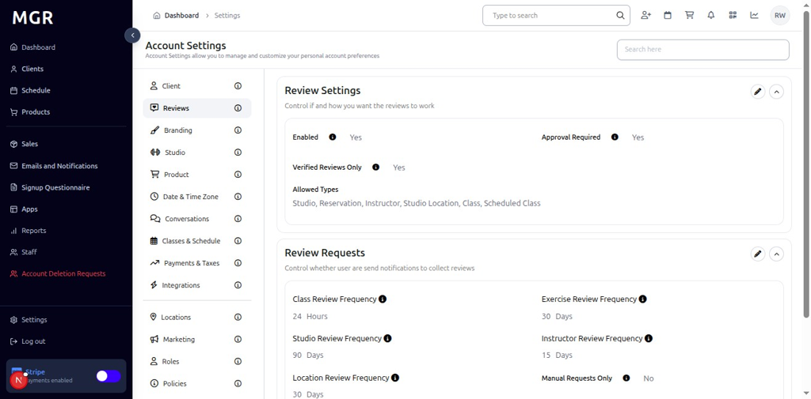
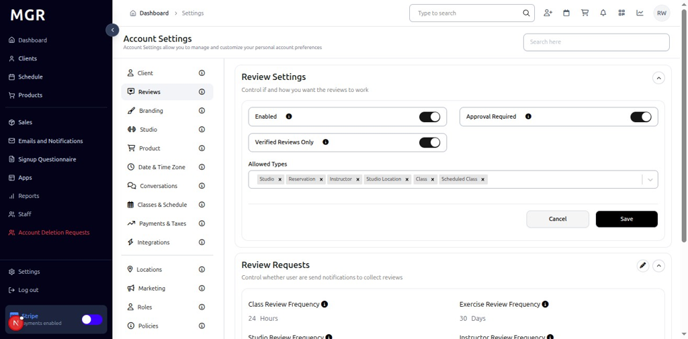
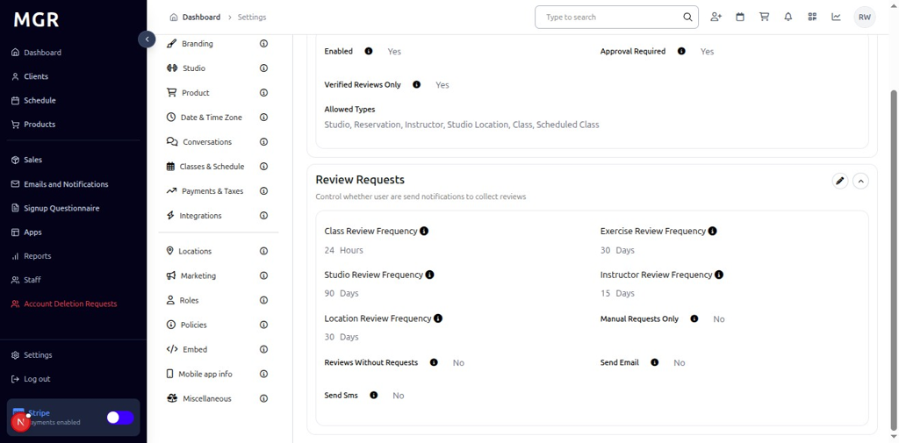
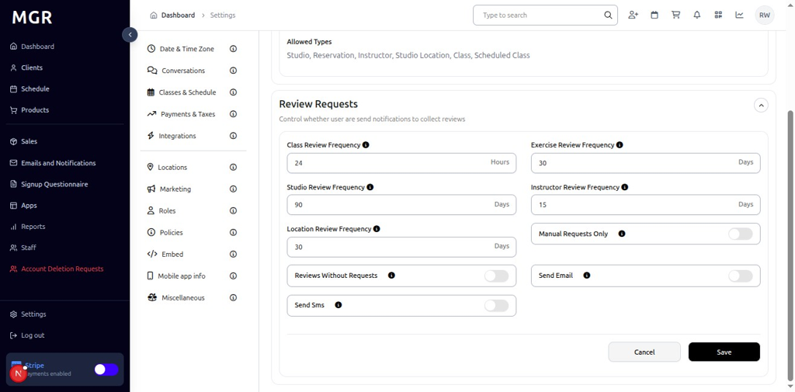

# Reviews Settings Management Guide

This guide provides step-by-step instructions for managing reviews settings in the admin dashboard, including review settings configuration and review requests management.

## Overview

The Reviews Settings section allows administrators to configure review-related settings and manage review request policies. These settings help control how reviews are displayed, collected, and managed within the system.

## Accessing Reviews Settings

### 1. Navigate to Dashboard

a. Go to the admin dashboard

**URL:** `https://coreology.staging.mgrapp.com/next/admin`

### 2. Open Settings Section

a. In the left sidebar, click **"Settings"** to open the settings area

### 3. View Review Settings

The Review Settings section displays with a top-right pencil button for editing the review configuration.

### 4. Edit Review Settings

#### 4.1 Access Edit Mode

a. Click the **pencil icon** (✏️) in the top-right of the Review Settings section

b. The "Edit Review Settings" dialog opens

#### 4.2 Configure Review Settings

The dialog contains various review configuration options with:
- **Enabled:** Toggle to enable or disable reviews functionality
- **Approval Required:** Toggle to require approval before reviews are published
- **Verified Reviews Only:** Toggle to only allow verified user reviews
- **Allowed Types:** Multi-select field for review types including Studio, Reservation, Instructor, Studio Location, Class, and Scheduled Class
- **Cancel/Save buttons** to apply or discard changes

### 5. View Review Requests

The Review Requests section displays with a top-right pencil button for editing the review request policies.

### 6. Edit Review Requests

#### 6.1 Access Edit Mode

a. Click the **pencil icon** (✏️) in the top-right of the Review Requests section

b. The "Edit Review Requests" dialog opens

#### 6.2 Configure Review Request Settings

The dialog contains various review request configuration options with:
- **Class Review Frequency:** Set to "24 Hours" (how often to request class reviews)
- **Studio Review Frequency:** Set to "90 Days" (how often to request studio reviews)
- **Location Review Frequency:** Set to "30 Days" (how often to request location reviews)
- **Exercise Review Frequency:** Set to "30 Days" (how often to request exercise reviews)
- **Instructor Review Frequency:** Set to "15 Days" (how often to request instructor reviews)
- **Manual Requests Only:** Toggle to only send review requests manually
- **Reviews Without Requests:** Toggle to allow reviews without sending requests
- **Send Email:** Toggle to send review requests via email
- **Send SMS:** Toggle to send review requests via SMS
- **Cancel/Save buttons** to apply or discard changes

## Troubleshooting

**Common Issues:**
- **Settings Not Saving:** Verify all required fields are filled and click Save
- **Changes Not Applying:** Refresh the page and verify settings were saved
- **Edit Dialog Not Opening:** Check if you have sufficient permissions

**Need Help?** Contact system administrator or technical support for assistance with reviews settings management or configuration issues.
