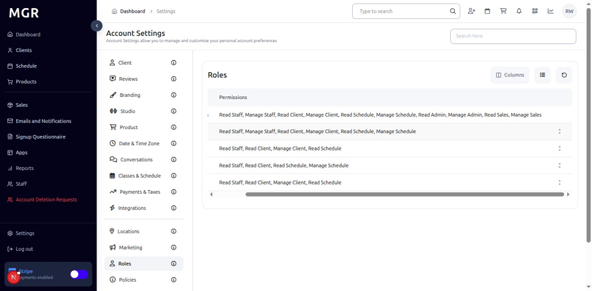
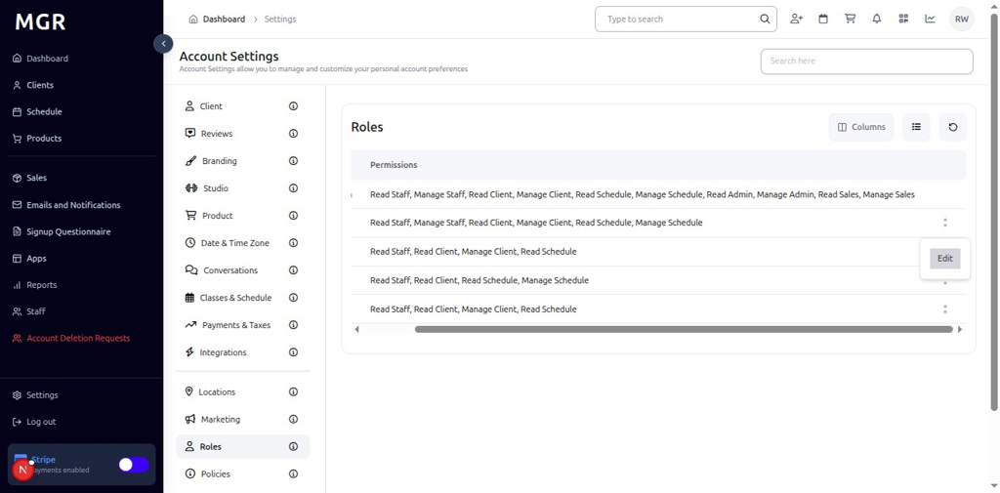
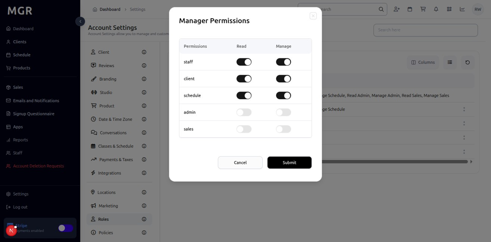

# Roles Settings Management Guide

This guide provides step-by-step instructions for managing roles settings in the admin dashboard, including role permissions, access control, and user role management.

## Overview

The Roles Settings section allows administrators to manage user roles, configure permissions, and control access levels within the system. These settings help ensure proper security and access control for different user types and responsibilities.

## Accessing Roles Settings

### 1. Navigate to Dashboard

a. Go to the admin dashboard

**URL:** `https://coreology.staging.mgrapp.com/next/admin`

### 2. Open Settings Section

a. In the left sidebar, click **"Settings"** to open the settings area

## Managing Roles

### 3. View Roles List

The Roles section displays a list of available roles in the system.

### 4. Edit Role Permissions

#### 4.1 Access Edit Options

a. Locate the desired role in the Roles List

b. Click the **three-dots menu** (⋮) on the role row

c. Select **"Edit"** from the actions menu

#### 4.2 Manage Permissions

The "Manage Permissions" dialog opens with:
- **Permission Settings:** Add or remove permissions for the specific role
- **Submit** button to update the changes

## Troubleshooting

**Common Issues:**
- **Settings Not Saving:** Verify all required fields are filled and click Submit
- **Changes Not Applying:** Refresh the page and verify settings were saved
- **Edit Dialog Not Opening:** Check if you have sufficient permissions
- **Permission Issues:** Verify role configuration and ensure proper setup

**Need Help?** Contact system administrator or technical support for assistance with roles settings management or configuration issues.
