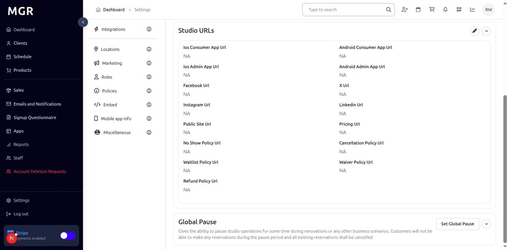

# Studio Settings Management Guide

This guide provides step-by-step instructions for managing studio settings in the admin dashboard, including studio details, contact information, URLs, and global pause functionality.

## Overview

The Studio Settings section allows administrators to configure studio-specific information, contact details, URLs, and manage global pause periods. These settings help maintain accurate studio information and control operational status.

## Accessing Studio Settings

### 1. Navigate to Dashboard

a. Go to the admin dashboard

**URL:** `https://coreology.staging.mgrapp.com/next/admin`

### 2. Open Settings Section

a. In the left sidebar, click **"Settings"** to open the settings area

## Managing Studio Details

### 3. View Studio Details

The Studio Details section displays with a top-right pencil button for editing the studio information.

a. Click the **pencil icon** (✏️) in the top-right of the Studio Details section

b. The "Edit Studio Details" dialog opens

#### 3.1 Configure Studio Details

The dialog contains:
- **Business Name:** Input field to modify the studio's business name
- **URL:** Input field to update the studio's website URL
- **Cancel/Save buttons** to apply or discard changes

### 4. View Studio Contact Info

The Studio Contact Info section displays with a top-right pencil button for editing the contact information.

a. Click the **pencil icon** (✏️) in the top-right of the Studio Contact Info section

b. The "Edit Studio Contact Info" dialog opens

#### 4.1 Configure Contact Information

The dialog contains:
- **Support Email:** Input field to update the support email address
- **Phone Number:** Input field to modify the studio's phone number
- **Cancel/Save buttons** to apply or discard changes

### 5. View Studio URLs

The Studio URLs section displays with a top-right pencil button for editing the studio URLs.

a. Click the **pencil icon** (✏️) in the top-right of the Studio URLs section

b. The "Edit Studio URLs" dialog opens

#### 5.1 Configure Studio URLs

The dialog contains:
- **Add URL Field:** Input field to add new URLs for the studio
- **Cancel/Save buttons** to apply or discard changes

### 6. View Global Pause

The Global Pause section displays with a top-right "Set Global Pause" button for managing pause periods.

a. Click the **"Set Global Pause"** button in the top-right of the Global Pause section

b. The "Set Global Pause" dialog opens

#### 6.1 Configure Pause Period

The dialog contains:
- **Add Pause Period Field:** Input field to set the global pause period
- **Cancel/Save buttons** to apply or discard changes

## Troubleshooting

**Common Issues:**
- **Settings Not Saving:** Verify all required fields are filled and click Save
- **Changes Not Applying:** Refresh the page and verify settings were saved
- **Edit Dialog Not Opening:** Check if you have sufficient permissions
- **URL Issues:** Verify URL format and ensure proper domain configuration

**Need Help?** Contact system administrator or technical support for assistance with studio settings management or configuration issues.
