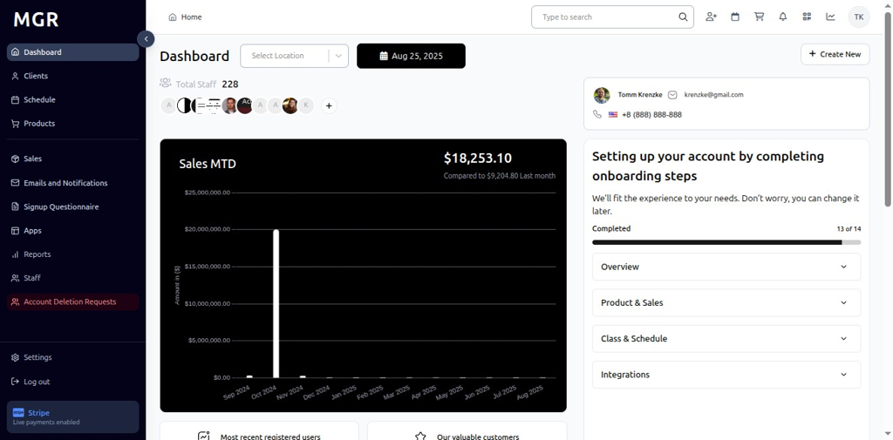
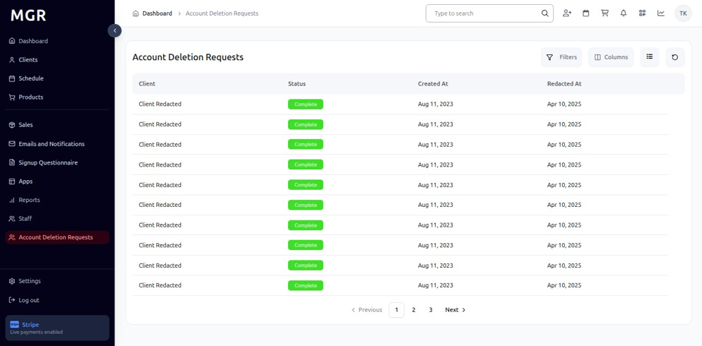
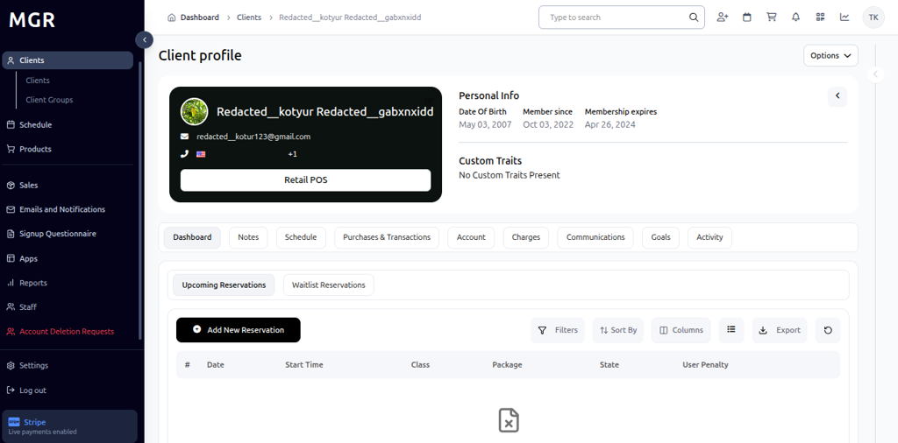

# Account Deletion Requests Guide

This guide provides step-by-step instructions for accessing and managing Account Deletion Requests in the admin dashboard.

## Overview

The Account Deletion Requests section displays a comprehensive list of clients who have requested account deletion. This feature allows administrators to review, process, and manage account deletion requests while maintaining proper oversight of client data removal processes.

## Accessing Account Deletion Requests

### 1. Navigate to Dashboard

a. Go to the admin dashboard

**URL:** `https://coreology.staging.mgrapp.com/next/admin`

### 2. Open Account Deletion Requests Section

a. In the left sidebar, click **"Account Deletion Requests"** to open the management area

**URL:** `https://coreology.staging.mgrapp.com/admin/account-deletion-requests`

## Managing Account Deletion Requests

### 3. View Account Deletion Requests

The page displays a comprehensive list of clients who have requested account deletion, including:

- **Client Information:** Name and basic details
- **Request Status:** Current status of the deletion request
- **Created Date:** When the deletion request was submitted
- **Redacted Date:** When the account data was redacted

### 4. Open Client Profile from Request

a. Click on a specific deletion request to view the client's detailed profile
b. The profile page opens showing comprehensive client information

## Troubleshooting

**Common Issues:**
- **Profile Not Loading:** Check internet connection and refresh the page
- **Request List Empty:** Verify there are active deletion requests in the system
- **Access Denied:** Ensure sufficient permissions to view deletion requests

**Need Help?** Contact system administrator or technical support for assistance with account deletion request management.
