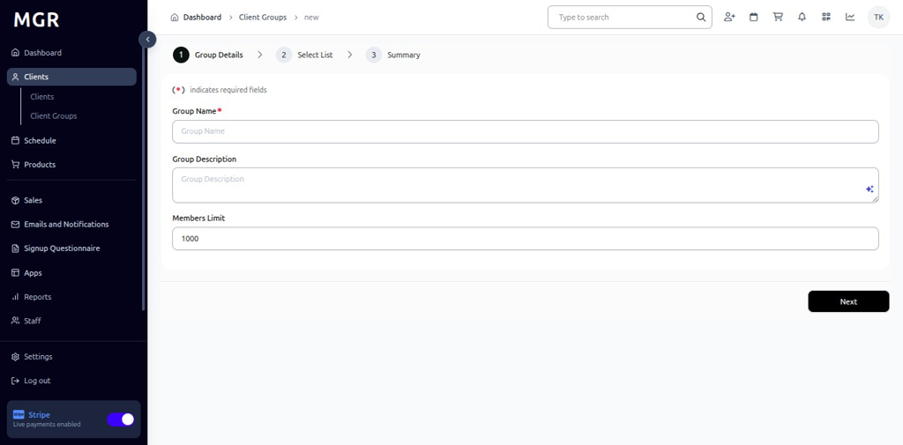
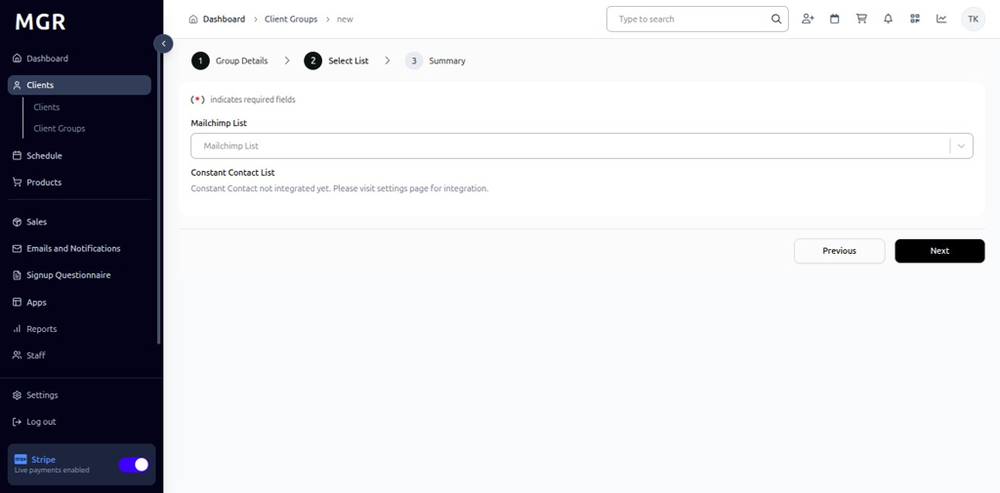
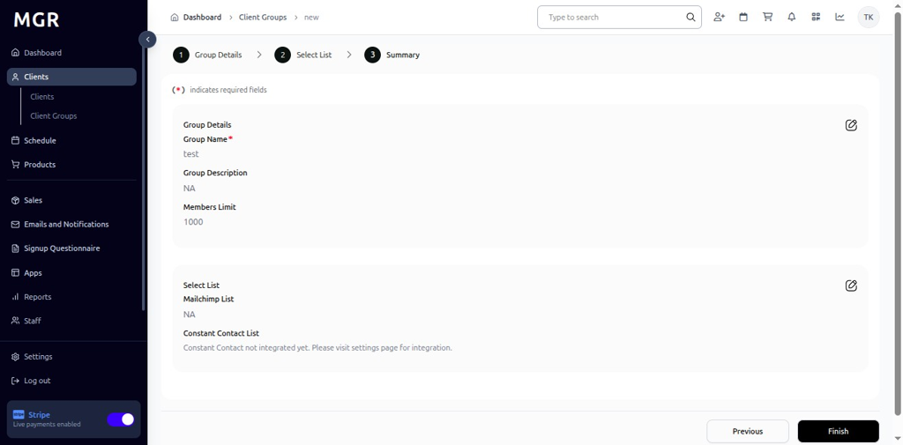

# Add New User Group Guide

This guide provides step-by-step instructions for creating new user groups within the admin dashboard.

## Steps to Add New User Group

### 1. Access Admin Dashboard

a. Log into the admin dashboard

b. Navigate to **Dashboard**

**URL:** `https://coreology.staging.mgrapp.com/next/admin`

### 2. Navigate to the Client Groups Section

a. Click on **"Client Groups"** in the sidebar or top menu

**URL:** `https://coreology.staging.mgrapp.com/next/admin/user_groups`

### 3. Start Adding a New User Group

a. Click the **"Add New User Group"** button

**URL:** `https://coreology.staging.mgrapp.com/next/admin/user_groups/new?initialParams=%257B%257D`

### 4. Enter Group Details

Complete the basic information for the new user group:

**Required Fields:**
- Group Name *
- Description
- members limit

Click **"Next"** when complete.

### 5. Select List for User Group

Choose which clients to include in the user group:

**Selection Methods:**

**Manual Selection:**
- mailchimp list

Click **"Next"** to continue.

### 6. Review Summary and Finish

a. Review all entered information:
   - Group details and configuration
   - Selected client list
   - Group settings and permissions
   - Access and visibility settings

b. Use **"Previous"** to make corrections if needed

c. Verify all details are accurate:
   - Group name and description
   - Member count and list
   - Settings and permissions
   - Administrator assignments

d. Click **"Finish"** to create the user group

The system will create the user group and add all selected clients to the group.

## Troubleshooting

**Common Issues:**
- **Duplicate Group Names:** Choose unique group names to avoid conflicts
- **Large Member Lists:** System may timeout with very large selections
- **Permission Errors:** Ensure you have rights to create groups and access client data
- **Missing Clients:** Verify client search criteria and permissions

**Selection Problems:**
- **Clients Not Found:** Check spelling and search filters
- **Import Failures:** Verify file format and column headers
- **Duplicate Members:** System will automatically detect and handle duplicates
- **Access Restrictions:** Some clients may have privacy settings preventing group inclusion

**Configuration Issues:**
- **Invalid Settings:** Check that all required fields are completed
- **Permission Conflicts:** Ensure group permissions don't conflict with system settings
- **Size Limits:** Verify group size doesn't exceed system limits
- **Administrator Rights:** Confirm group administrators have appropriate permissions

**Performance Considerations:**
- **Large Groups:** May require additional processing time
- **Complex Filters:** Avoid overly complex selection criteria
- **System Load:** Create groups during off-peak hours for best performance
- **Database Limits:** Very large groups may impact system performance

**Need Help?** Contact system administrator or technical support.
