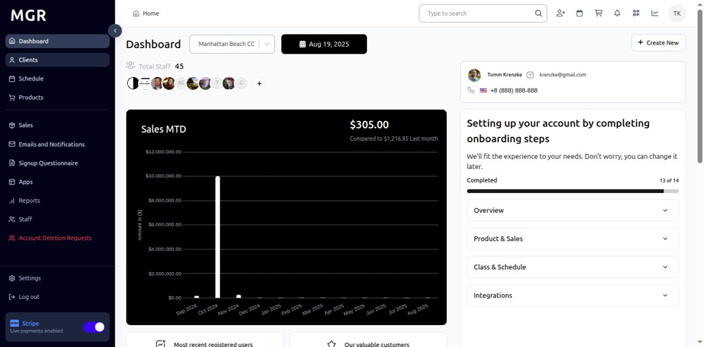
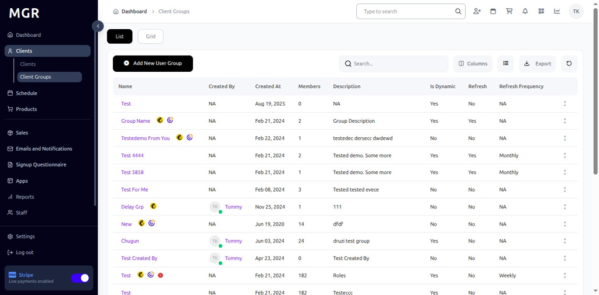

# Client Group Display Guide

This guide provides comprehensive instructions for viewing and managing detailed client group information within the admin dashboard, including member management, group editing, and activity tracking.

## Accessing Client Group Display

### 1. Navigate to Admin Dashboard

a. Log into the admin dashboard

b. Navigate to **Dashboard**

**URL:** `https://coreology.staging.mgrapp.com/next/admin`

### 2. Navigate to the Client Groups Section

a. Click on **"Client Groups"** in the sidebar or top menu

**URL:** `https://coreology.staging.mgrapp.com/next/admin/user_groups`

### 3. Select Client Group

a. From the Client Groups list, click on a group row to open the detailed Client Group view

**URL:** `https://coreology.staging.mgrapp.com/admin/user_groups/43d55429-d9bd-4ec6-a6b8-114b1b6962bb`

### 4. User Group Members Tab

**Available Actions:**
- Add New Client
- Refresh List
- Remove All Members
- Edit
- Sync

**Member Information Columns:**
- Name
- Email
- Phone
- Date of Birth (DOB)
- Registration Date
- Signed Waiver
- Additional member details

### 5. Add New Client

**Access:** Click **"Add New Client"** button

**Features:**
- Full client directory access
- Advanced search functionality
- Multiple filter options
- Sortable columns
- Comprehensive client information display

### 6. Select Clients to Add

**Selection Tips:**
- Use search to find specific clients quickly
- Apply filters to narrow down the candidate list
- Verify client identity before selection
- Select multiple clients for efficient group building

### 7. Submit Client Selection

**Result:**
- Selected clients are added to the user group
- Member count increases accordingly
- Group membership is immediately updated
- Success confirmation is displayed

### 8. Remove All Members

**Access:** Click **"Remove All Members"** button

**Important Notes:**
- This action affects ALL group members
- Cannot be undone once confirmed
- Use with extreme caution
- Consider backing up member list before proceeding

### 9. Edit Group Functionality

### Access Edit Group

**Access:** Click **"Edit Group"** button

**URL:** `https://coreology.staging.mgrapp.com/admin/user_groups/43d55429-d9bd-4ec6-a6b8-114b1b6962bb/edit?initialParams=%257B%257D`

**Features:**
- Group Name editing
- Group Description updates
- Members Limit configuration
- Additional group settings

### 10. Save and Close

**Process:**
1. **Click "Save and close"** to apply changes
2. **System processes** the entered modifications
3. **Changes are applied** to group settings
4. **Returns to User Group Members view**

**Result:**
- Group settings are updated
- Changes are immediately visible
- Group configuration is saved
- User returns to member management view

### 11. Activity Tab

### Access Activity Tab

**Access:** Click **"Activity"** tab

**URL:** `https://coreology.staging.mgrapp.com/admin/user_groups/43d55429-d9bd-4ec6-a6b8-114b1b6962bb?t=activity`

**Features:**
- Chronological timeline of group events
- Detailed activity tracking
- Timestamp information
- Change history

### 12. Display Activity

## Troubleshooting

**Common Issues:**
- **Group Not Loading:** Check group ID in URL and permissions
- **Member List Not Updating:** Refresh the page or check sync status
- **Edit Permissions Denied:** Verify admin rights for group modification
- **Activity Not Displaying:** Check activity tab access and data availability

**Permission Requirements:**
- Admin access to view client groups
- Appropriate permissions for group editing
- Access rights for member management
- Activity viewing permissions

**Data Validation:**
- Ensure group IDs are valid and accessible
- Verify member data integrity
- Check activity log completeness
- Confirm group settings consistency

**Performance Considerations:**
- Large groups may load slower
- Activity logs for active groups can be extensive
- Member operations may take time with large groups
- Consider pagination for very large member lists

**Need Help?** Contact system administrator or technical support for assistance with client group management. 