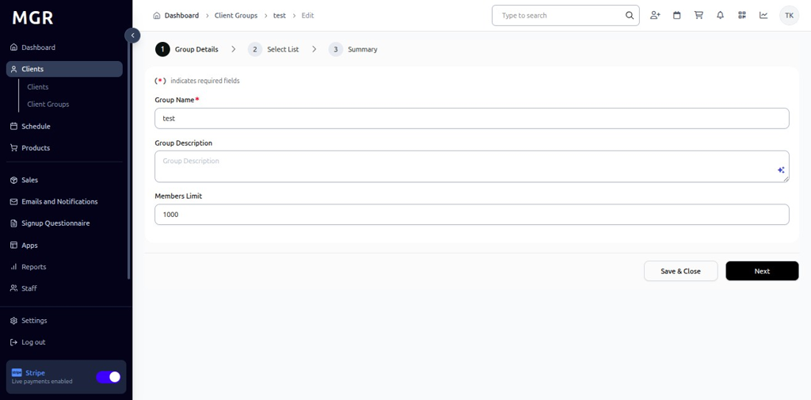

# Manage Existing Client Group Guide

This guide provides step-by-step instructions for managing, editing, and deleting existing client groups within the admin dashboard.

## Steps to Manage Existing Client Group

### 1. Access Admin Dashboard

a. Log into the admin dashboard

b. Navigate to **Dashboard**

**URL:** `https://coreology.staging.mgrapp.com/next/admin`

### 2. Navigate to the Client Groups Section

a. Click on **"Client Groups"** in the sidebar or top menu

**URL:** `https://coreology.staging.mgrapp.com/next/admin/user_groups`

### 3. Select the Client Group

a. Browse the list of existing client groups

b. Click the designated button to access the group you want to modify

**Group List Features:**
- View group name and description
- See member count
- Check group status
- View creation date
- See last activity

### 4. Edit the Group Details

a. Click **"Edit Group"** to modify group settings

**Example URL:** `https://coreology.staging.mgrapp.com/next/admin/user_groups/9207e69b-5155-4f60-adb2-f42c7ef40b19/edit`

**Editable Group Information:**

**Basic Details:**
- Group Name *
- Description
- members limit

**Membership Management:**
- Add/Remove individual members
- Bulk member operations
- View member list and details
- Export member information

### 5. Save and Close the Edit Screen

a. Review all changes made to the group

b. Click **"Save & Close"** to apply any preliminary edits

**Before Saving:**
- Verify all required fields are completed
- Check member list changes
- Confirm permission updates
- Review notification settings

The system will save your changes and return to the group management view.

### 6. Delete Client Group (Optional)

a. If you want to delete the client group, click **"Delete Group"**

**Important Considerations Before Deletion:**
- Group deletion is permanent and cannot be undone
- All group history and communications will be lost
- Members will be removed from the group
- Associated reports and analytics will be affected

### 7. Submit Your Delete Request

a. Click **"Submit"** to confirm the Delete Group request

**Deletion Confirmation:**
- Review group name and member count
- Confirm understanding of permanent deletion
- Consider archiving instead of deleting
- Verify you have permission to delete groups

The system will permanently delete the group and all associated data.

## Troubleshooting

**Common Issues:**

**Edit Problems:**
- **Permission Denied:** Ensure you have group management rights
- **Changes Not Saving:** Check required fields and network connection
- **Member Addition Fails:** Verify client permissions and group limits
- **Settings Conflicts:** Review permission and access level conflicts

**Deletion Issues:**
- **Cannot Delete Group:** Check if group has dependencies or restrictions
- **Deletion Fails:** Ensure you have delete permissions
- **Accidental Deletion:** Contact administrator immediately for recovery options
- **Partial Deletion:** Check system logs and contact support

**Member Management Problems:**
- **Members Not Found:** Verify client search criteria and filters
- **Bulk Operations Fail:** Check file format and size limits
- **Permission Errors:** Ensure members consent to group membership
- **Duplicate Members:** System should handle automatically

**Performance Issues:**
- **Slow Loading:** Large groups may take time to load
- **Timeout Errors:** Break large operations into smaller batches
- **System Lag:** Perform operations during off-peak hours
- **Memory Issues:** Close other applications and browser tabs

**Need Help?** Contact system administrator or technical support.
