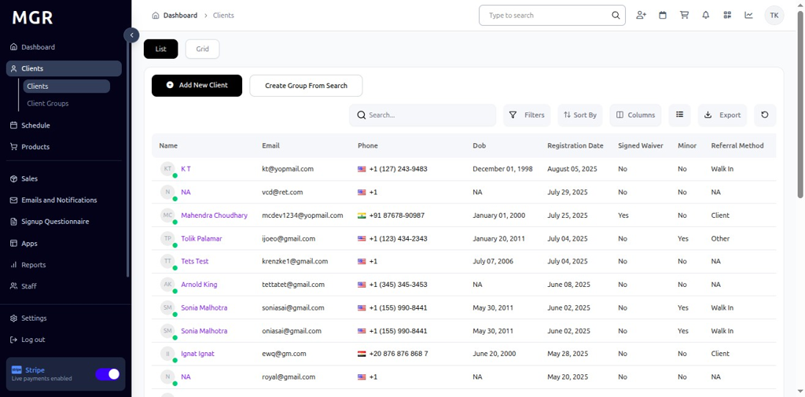

# Add Charges for Client Guide

This guide provides step-by-step instructions for adding charges to existing client accounts within the admin dashboard.

## Steps to Add Charges

### 1. Access Admin Dashboard

a. Log into the admin dashboard

b. Navigate to **Dashboard**

**URL:** `https://coreology.staging.mgrapp.com/next/admin`

### 2. Navigate to the Clients Section

a. Click on **"Clients"** in the sidebar or top menu

**URL:** `https://coreology.staging.mgrapp.com/next/admin/users`

### 3. Open the Relevant Client Entry

a. Browse the list of existing clients

b. Use search or filters to locate specific client

c. Click the designated button to access the client you want to modify

**Client List Features:**
- View client name and contact information
- See membership status
- Check last activity date
- View client ID
- See registration date

### 4. Access Charges Section

a. Click **"Charges"** to open the charges management system for the selected client

**Charges Features:**
- View existing charges
- Add new charges
- Modify charge details
- Track payment status
- Manage billing history
- Generate charge reports

### 5. Add New Charges

a. Click **"Add New Charges"** to create a new charge entry for the client

**New Charge Options:**
- Service charges
- Membership fees
- Late payment fees
- Equipment rental charges
- Special service fees
- Administrative charges

### 6. Fill Charge Details

a. Complete the charge information form

b. Click **"Save"** to create the charge for the client

**Charge Details Fields:**
- Charge description
- Amount to charge
- Charge date
- Due date
- Charge category
- Payment terms
- Notes or comments

### 7. View Client Charges

a. After creating charges, view the complete charges list for the client

**Charges Overview:**
- All active charges
- Payment status
- Due dates
- Charge amounts
- Charge history
- Outstanding balances

## Troubleshooting

**Common Charge Issues:**

**Charge Creation Problems:**
- **Cannot Add Charges:** Check admin permissions and client status
- **Charge Not Saving:** Verify required fields and system connection
- **Invalid Amount:** Check charge amount format and limits
- **Date Errors:** Verify charge and due dates are valid

**Payment Processing Issues:**
- **Payment Not Recording:** Check payment gateway status
- **Incorrect Payment Amount:** Verify payment matches charge amount
- **Payment Method Errors:** Confirm payment method selection
- **Transaction Failures:** Check network and system status

**Client Access Issues:**
- **Client Not Found:** Verify client ID and profile status
- **Permission Denied:** Ensure admin access rights for charges
- **Data Not Loading:** Check system connection and permissions
- **Charge History Missing:** Allow time for system updates

**System Issues:**
- **Charges Not Displaying:** Refresh page and check permissions
- **Save Button Not Working:** Verify form completion and try again
- **Data Sync Problems:** Allow time for information propagation
- **System Errors:** Contact technical support for system issues

**Performance Issues:**
- **Slow Loading:** Check network connection and system resources
- **System Freezing:** Close and restart charge application
- **Timeout Errors:** Try refreshing page and re-entering data
- **Data Lag:** Allow time for system updates and synchronization

**Need Help?** Contact system administrator or technical support for charge-related issues. 