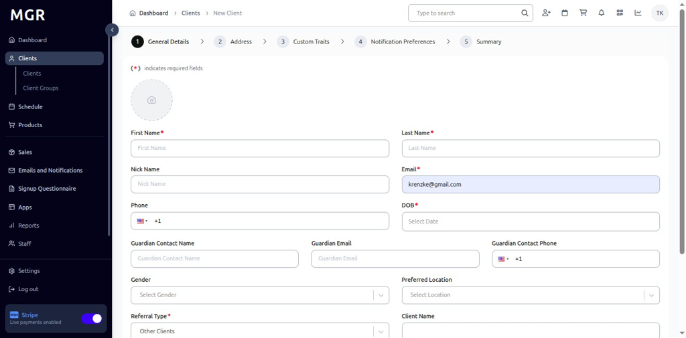
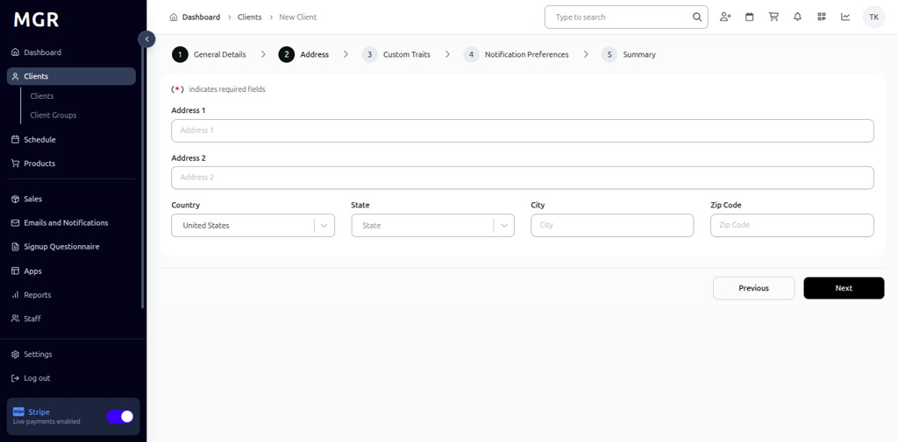
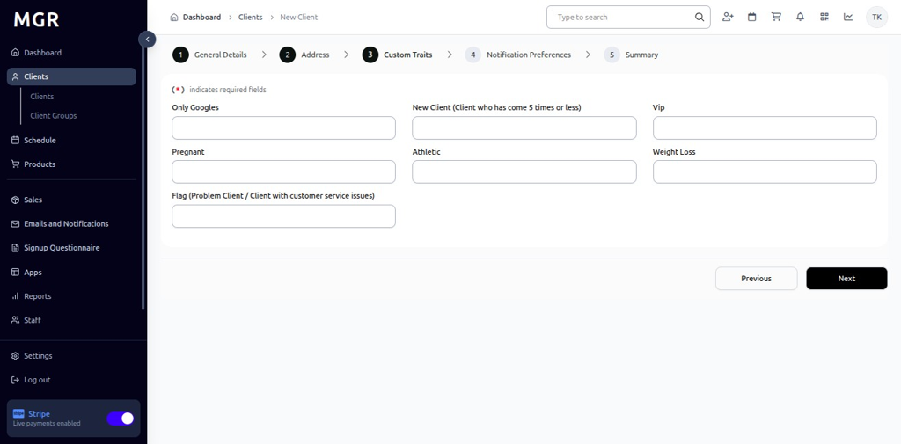
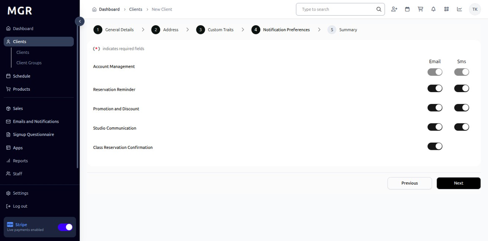
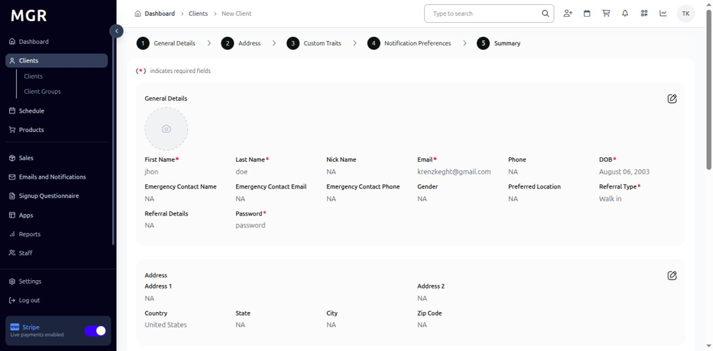

# Add New Client Guide

This guide provides step-by-step instructions for creating new client profiles within the admin dashboard.

## Steps to Add New Client

### 1. Access Admin Dashboard

a. Log into the admin dashboard

b. Navigate to **Dashboard**

**URL:** `https://coreology.staging.mgrapp.com/next/admin`

### 2. Navigate to the Clients Section

a. Click on **"Clients"** in the sidebar or top menu

**URL:** `https://coreology.staging.mgrapp.com/next/admin/users`

### 3. Start Adding a New Client

a. Click the **"Add New Client"** button

**URL:** `https://coreology.staging.mgrapp.com/next/admin/users/new?initialParams=%257B%257D`

### 4. Enter General Details

Complete the general information for the client:

**Required Fields:**
- First Name *
- Last Name *
- Email *
- Date of Birth *

**Optional Fields:**
- Gender
- Phone
- Referred Type
- Photo
- client name
- location

Click **"Next"** when complete.

### 5. Provide Address

Enter the client's address information:

**Address Fields:**
- Address Line 1 
- Address Line 2
- City 
- State/Province 
- Postal Code 
- Country 

Click **"Next"** to continue.

### 6. Set Custom Traits

Configure custom attributes and characteristics for the client:

**Available Custom Traits:**
- Weight Loss
- Vip
- Flag
- Pregnant
- Athletic
- New Client

**Trait Configuration:**
- Select from predefined options
- Add custom values
- Set multiple traits per client
- Update traits anytime after creation

Click **"Next"** when traits are configured.

### 7. Set Notification Preferences

Configure how the client wants to receive communications:

**Communication Preferences:**
- Class and Appointment Reminders
- Booking Confirmations and Changes
- Payment and Billing Notifications
- Promotional and Marketing Communications
- Account Updates and Announcements

Click **"Next"** to continue.

### 8. Review Summary and Finish

a. Review all entered information:
   - General details (name, contact info)
   - Address information
   - Custom traits and attributes
   - Notification preferences

b. Use **"Previous"** to make corrections if needed

c. Verify all details are accurate

d. Click **"Finish"** to create the client profile

The system will save the client profile and add them to the client database.

## Troubleshooting

**Common Issues:**
- **Duplicate Email:** Email address may already exist in the system
- **Invalid Phone Format:** Ensure phone number follows required format
- **Required Fields Missing:** Check all mandatory fields are completed
- **Address Validation:** Verify postal codes and address formats

**Validation Errors:**
- Check email format is valid
- Ensure phone number contains only numbers and allowed characters
- Verify required fields are not left blank
- Confirm date formats are correct

**Data Privacy:**
- Ensure client consent for data collection
- Verify marketing communication permissions
- Follow GDPR/privacy compliance requirements

**Need Help?** Contact system administrator or technical support.
