# Client Profile Detail View Guide

This guide provides comprehensive instructions for viewing and managing detailed client profiles within the admin dashboard, including all available tabs and functionality.

## Accessing Client Profile

### 1. Navigate to Admin Dashboard

a. Log into the admin dashboard

b. Navigate to **Dashboard**

**URL:** `https://coreology.staging.mgrapp.com/next/admin`

### 2. Navigate to Clients Section

a. Click on **"Clients"** in the sidebar or top menu

**URL:** `https://coreology.staging.mgrapp.com/admin/users`

### 3. Select Client

a. From the Clients list, click on a client row to open the detailed Client profile

**URL:** `https://coreology.staging.mgrapp.com/admin/users/UP28303196`

### 4. Profile Dashboard Overview

The main profile view displays a summary card containing:

**Client Information:**
- Name
- Email
- Phone
- Membership since/expiry dates
- Upcoming reservations with status
- Payment state

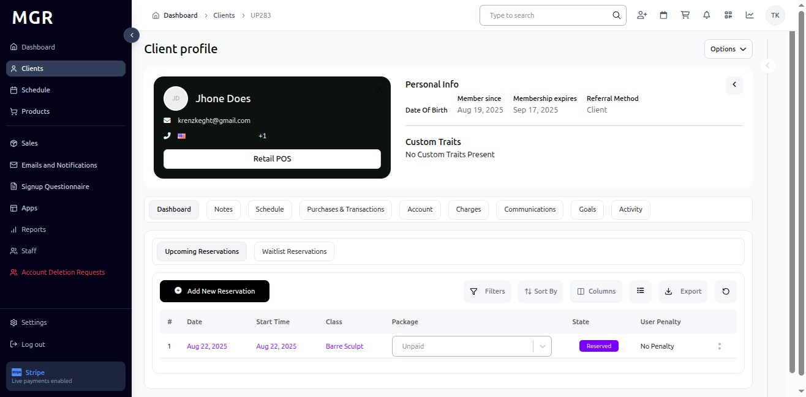

### 5. Notes Tab

**Access:** Click **"Notes"** tab

**URL:** `https://coreology.staging.mgrapp.com/admin/users/UP28303196?t=notes`

**Functionality:**
- Add and manage user notes
- Filter notes by various criteria
- Toggle active/inactive notes
- Customize visible columns
- Search and sort note entries

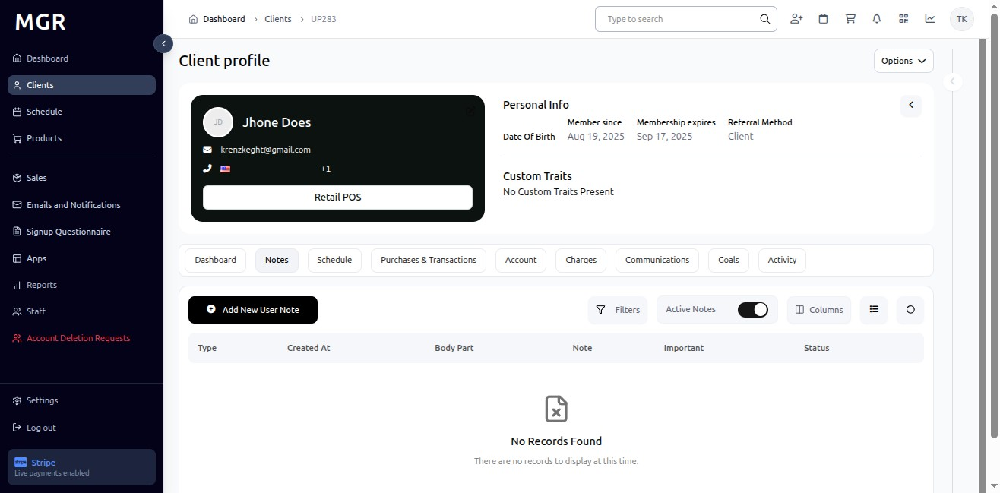

### 6. Schedule Tab

**Access:** Click **"Schedule"** tab

**URL:** `https://coreology.staging.mgrapp.com/admin/users/UP28303196?t=schedule`

**Features:**
- Review client reservations across multiple categories
- Create new reservations
- Apply filters and sorting
- Export schedule data
- View penalties and payment status

#### Schedule Sub-tabs:

**Upcoming Reservations:**
- View all future bookings
- Manage reservation details
- Check payment status

**Waitlist Reservations:**
- Date and start time
- Class information
- Package details
- State and user penalty status

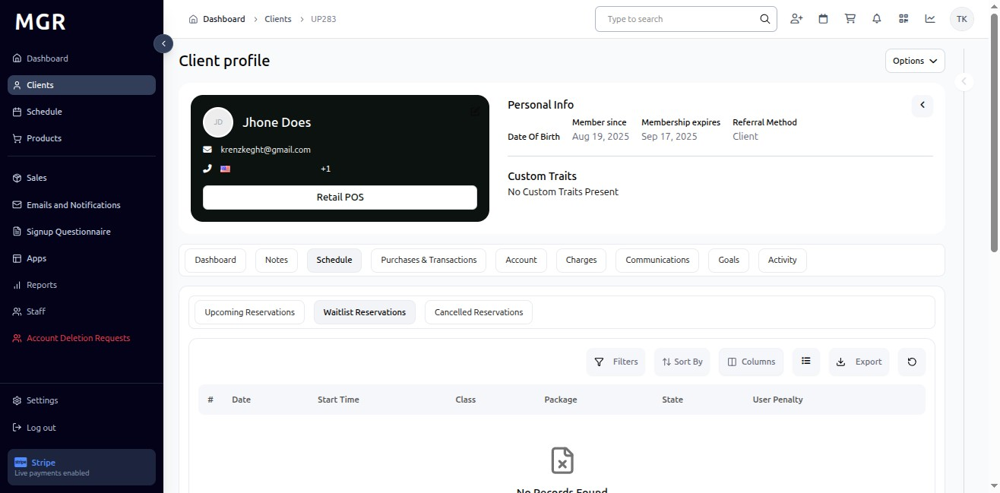

**Cancelled Reservations:**
- Historical cancelled bookings
- Same column structure as other views
- Cancellation reasons and dates

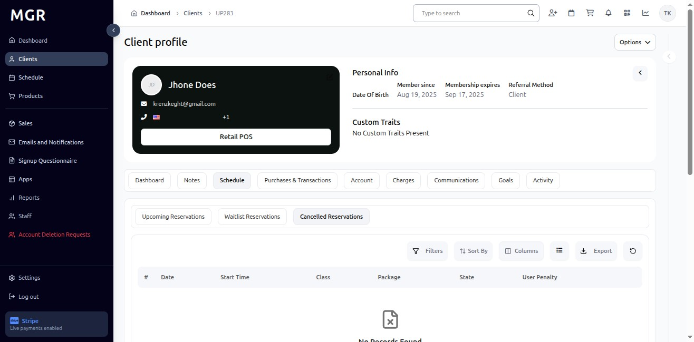

### 7. Purchases & Transactions Tab

**Access:** Click **"Purchases & Transactions"** tab

**URL:** `https://coreology.staging.mgrapp.com/admin/users/UP28303196?t=purchases-transactions`

**Features:**
- Commercial activity summary
- Gift card widgets
- Past Purchases list with:
  - Order IDs
  - Items purchased
  - Subtotal amounts
  - Discounts applied
  - Final amounts
  - Transaction status
- Advanced filtering options
- Date sorting capabilities
- Column visibility controls
- Export functionality

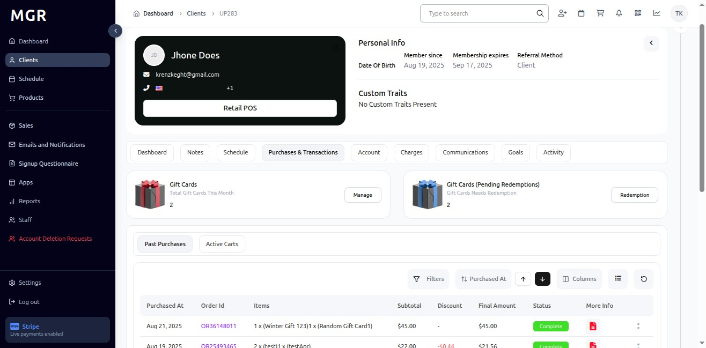

### 8. Account Tab

**Access:** Click **"Account"** tab

**URL:** `https://coreology.staging.mgrapp.com/admin/users/UP28303196?t=account`

**Membership Information:**
- Basic pricing details
- Purchase/order IDs
- Total amounts
- Contract duration

**Instances Panel:**
- Status indicators:
  - Active
  - Previously Active
  - Upcoming Next
- Start and end dates
- Purchase price vs. list price
- Payment dates
- Session usage tracking

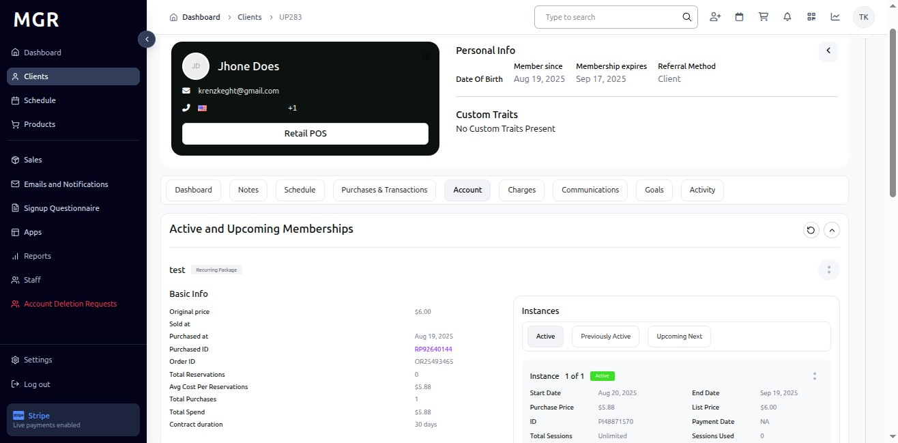

### 9. Charges Tab

**Access:** Click **"Charges"** tab

**URL:** `https://coreology.staging.mgrapp.com/admin/users/UP28303196?t=charges`

**Charges Table:**
- Charge ID
- Amount charged
- Credits applied
- Penalty type
- Class name
- Created date
- Process date
- Notes
- State
- Payment method

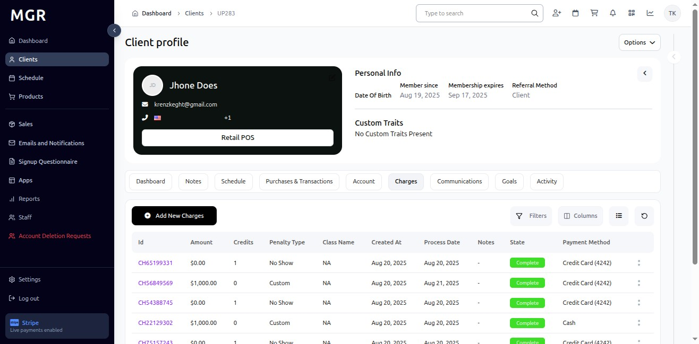

### 10. Communications Tab

**Access:** Click **"Communications"** tab

**URL:** `https://coreology.staging.mgrapp.com/admin/users/UP28303196?t=communications`

**User Notifications Log:**
- Notification name
- Created date
- Type classification
- Notification type
- Brief trigger description
- Delivery status

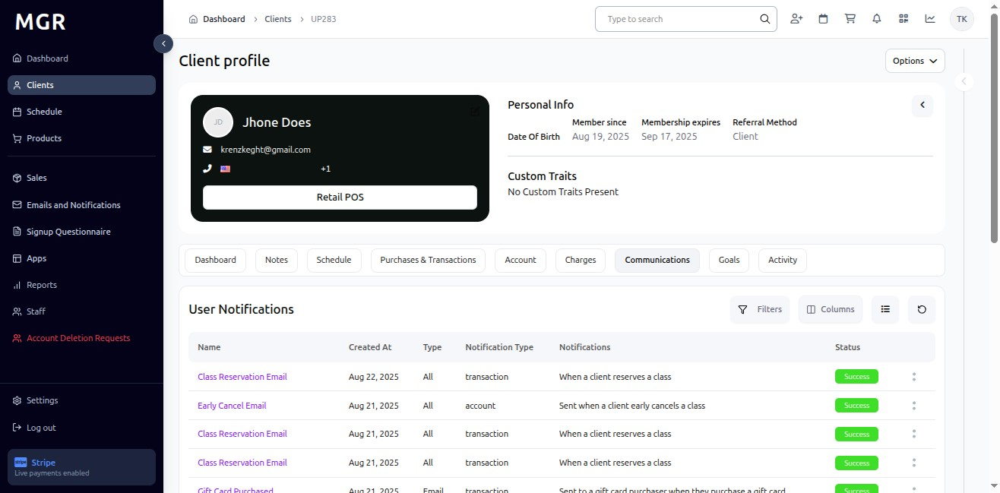

### 11. Goals Tab

**Access:** Click **"Goals"** tab

**URL:** `https://coreology.staging.mgrapp.com/admin/users/UP28303196?t=goals`

**Features:**
- View client goals
- Track progress
- Manage goal settings

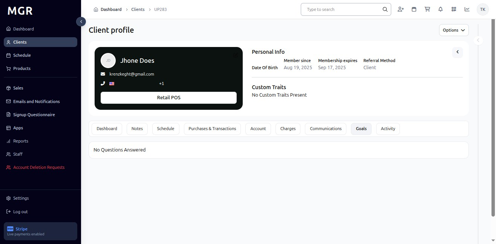

### 12. Activity Tab

**Access:** Click **"Activity"** tab

**URL:** `https://coreology.staging.mgrapp.com/admin/users/UP28303196?t=activity`

**Activity Timeline:**
- Recent events summary
- Successful payment creations
- Dates and amounts
- Chronological view of today's actions

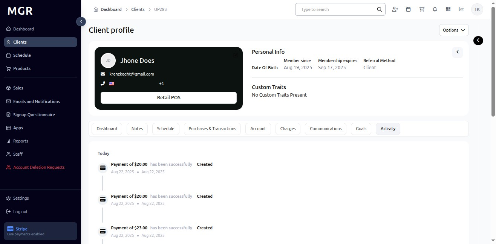

### 13. Right-Side Stats Panel

#### Quick Metrics Display

The right-side panel shows essential client statistics:

**Available Metrics:**
- Unpaid Visits
- Account Balance
- Total Reservations
- Pending Charges
- Outstanding Payments

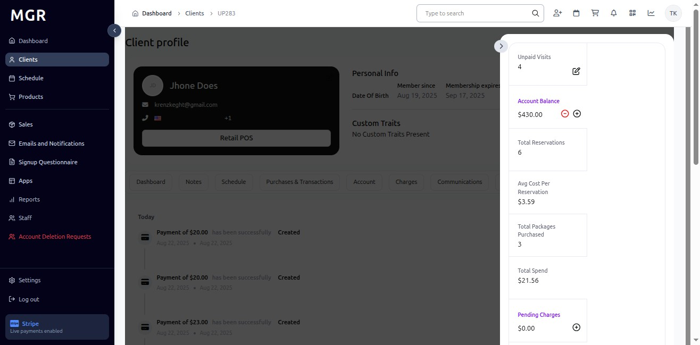

### 14. Unpaid Visits Management

**Access:** Click **"Unpaid Visits"** in the stats panel

**Features:**
- Modal listing each unpaid visit
- Columns: Date, Time, Class
- Controls: Sort, Columns, Refresh
- Example entries: Full-Body Workout, kt test class, Barre Sculpt

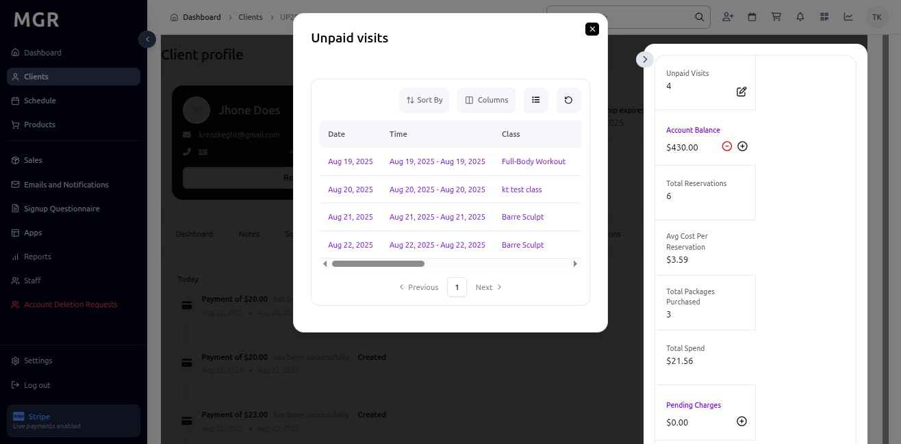

### 15. Account Balance Management

#### 15.1 Add Balance

**Access:** Click **"+"** icon beside Account Balance

**Process:**
1. Balance adjustment dialog opens
2. Enter amount
3. Add optional notes
4. Click **"Add Balance"** to confirm
5. Use **"Cancel"** to abort

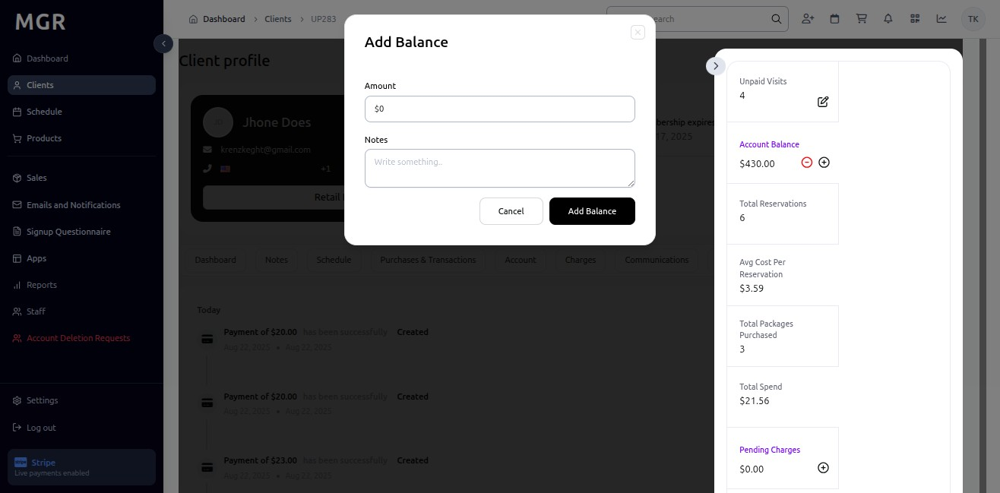

#### 15.2 Deduct Balance

**Access:** Click **"-"** icon beside Account Balance

**Process:**
1. Balance adjustment dialog opens
2. Enter amount to deduct
3. Add optional notes
4. Click **"Deduct Balance"** to confirm
5. Use **"Cancel"** to abort

### 16. Pending Charges Management

**Access:** Click **"Pending Charges"** in the stats panel

**Process:**
1. Form opens for scheduled charges
2. Required fields:
   - Payment Type
   - Process After date
   - Amount
   - Optional Note
3. Actions: **Cancel** or **Save**

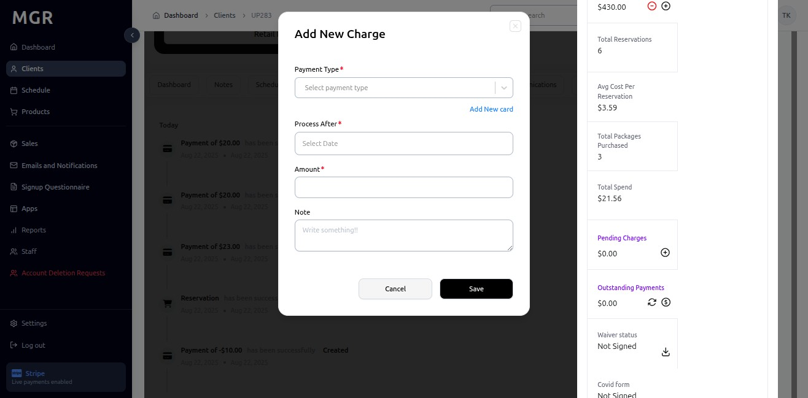

### 17. Outstanding Payments

**Access:** Click **"Outstanding Payments"** in the stats panel

**Features:**
- Settle unpaid amounts
- Action icons for refresh and process payments
- Payment processing controls

#### 17.1 Pay All Outstanding Payments

**Process:**
1. Confirmation dialog opens
2. Title: "Pay All Outstanding Payments"
3. Actions: **Cancel** or **Confirm**
4. Proceeds with settling all outstanding balances

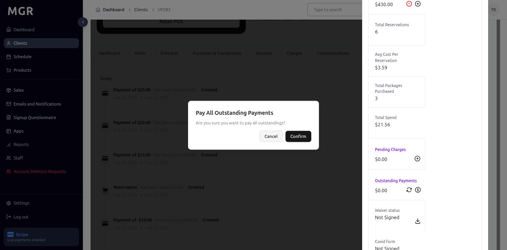

### 18. Scheduled Transactions

#### 18.1 Access Scheduled Transactions

**Process:**
1. Scroll to Active packages section
2. Click **"Scheduled transactions"** button

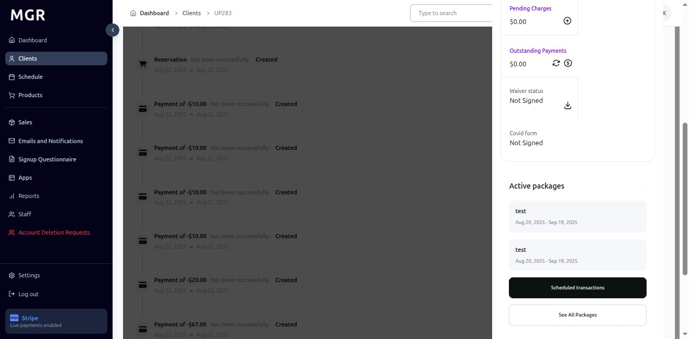

**Features:**
- Modal with tabs for different transaction views
- Controls: Filters, Process After sorting, Columns, List view
- Grid columns: Process On, Amount, Type, Payment Type, Transaction ID, Created At, Transaction State

#### 18.2 Transaction Views

**18.2.1 Upcoming Transactions Tab:**
- Future-dated payments
- Processing schedule
- Transaction details

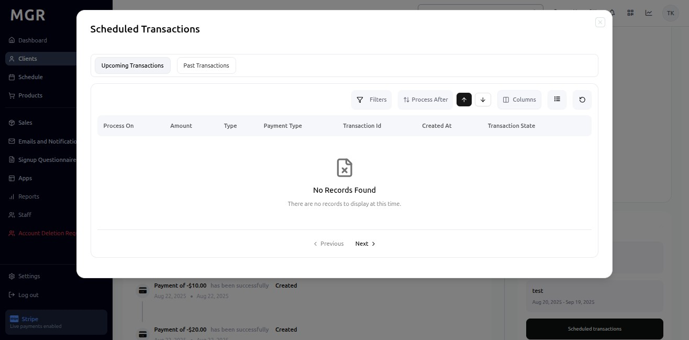

**18.2.2 Past Transactions Tab:**
- Previously processed items
- Historical transaction data
- Status indicators (Complete, Credited, etc.)

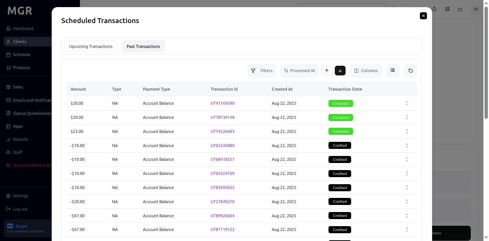

## Troubleshooting

**Common Issues:**
- **Profile Not Loading:** Check client ID in URL
- **Tab Navigation Issues:** Verify URL parameters are correct
- **Data Not Updating:** Refresh page or check permissions
- **Balance Adjustments Failing:** Verify amount format and permissions

**Permission Requirements:**
- Admin access to view client profiles
- Appropriate permissions for balance adjustments
- Access rights for financial transactions
- Client data privacy compliance

**Data Validation:**
- Ensure all monetary amounts are properly formatted
- Verify date formats for transactions
- Check payment method validity
- Confirm transaction status accuracy

**Need Help?** Contact system administrator or technical support for assistance with client profile management. 