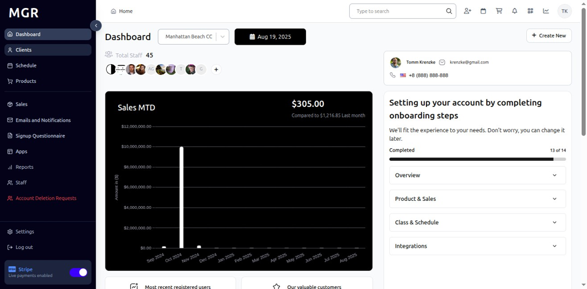
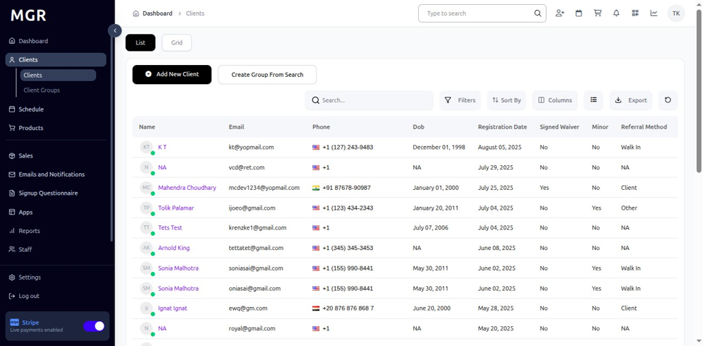
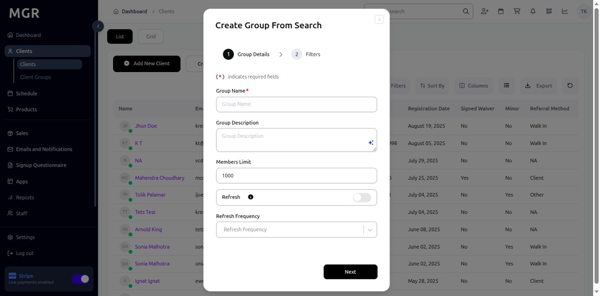
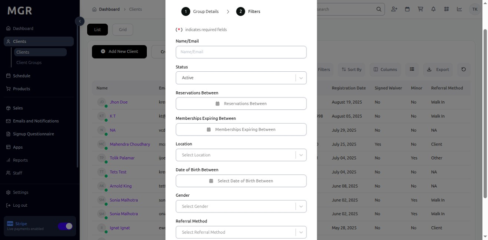

# Create Group From Search Guide

This guide provides step-by-step instructions for creating client groups using search filters within the admin dashboard.

## Steps to Create Group From Search

### 1. Access Admin Dashboard

a. Log into the admin dashboard

b. Navigate to **Dashboard**

**URL:** `https://coreology.staging.mgrapp.com/next/admin`

### 2. Navigate to the Clients Section

a. Click on **"Clients"** in the sidebar or top menu

**URL:** `https://coreology.staging.mgrapp.com/next/admin/users`

### 3. Start Create Group From Search

a. Click the **"Create Group From Search"** button

### 4. Enter Group Details

Complete the basic information for the new group:

**Required Fields:**
- Group Name *
- Description
- members limit
- refresh frequency

Click **"Next"** when complete.

### 5. Add Filters and Finish

Configure search filters to automatically populate the group with matching clients:

**Available Filter Types:**

**Personal Information:**
- Name
- Gender (Male, Female, Other)
- Date of Birth Range
- Registration Date Range

**Contact Information:**
- Email Address
- Address/Location

**Membership Details:**
- Membership Status (Active, Inactive, Expired)
- Membership Type
- Membership expiry range

**Filter Preview:**
- Shows total number of matching clients
- Displays sample client list
- Updates in real-time as filters change
- Option to export filtered results

Click **"Finish"** to create the group with applied filters.

The system will create the group and automatically add all clients matching the specified criteria.

## Troubleshooting

**Common Issues:**
- **No Matching Clients:** Filters may be too restrictive - try broadening criteria
- **Too Many Results:** Add more specific filters to narrow down the group
- **Filter Conflicts:** Ensure filter logic (AND/OR) is set correctly
- **Missing Clients:** Check if clients meet all specified criteria

**Filter Validation:**
- Verify date ranges are valid
- Check numeric values are within acceptable ranges
- Ensure text filters use correct spelling
- Confirm custom trait values exist in system

**Performance Considerations:**
- Large groups may take time to populate
- Complex filters may slow down group updates
- Consider breaking very large groups into smaller segments

**Permissions:**
- Ensure you have rights to create groups
- Verify access to client data for filtering
- Check group management permissions

**Need Help?** Contact system administrator or technical support.
