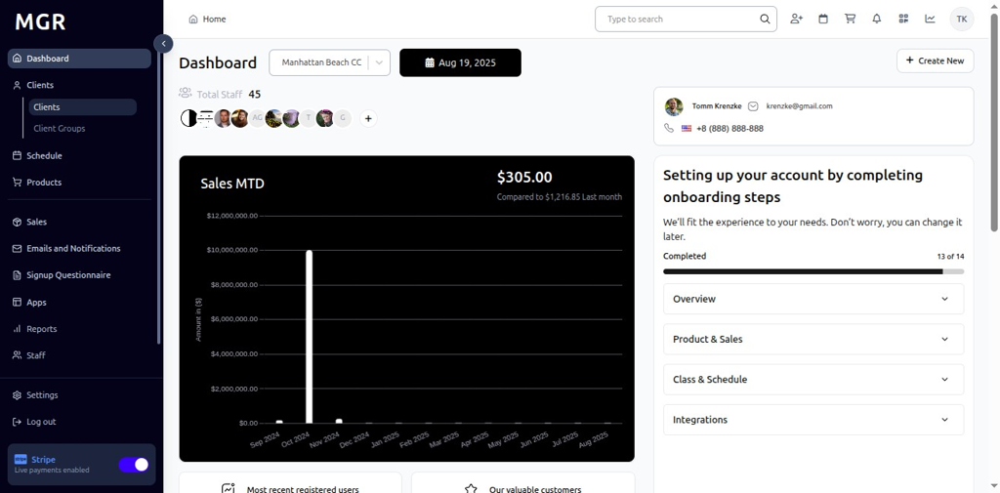

# Create Reservation for Client Guide

This guide provides step-by-step instructions for creating reservations for existing clients within the admin dashboard.

## Steps to Create Reservation

### 1. Access Admin Dashboard

a. Log into the admin dashboard

b. Navigate to **Dashboard**

**URL:** `https://coreology.staging.mgrapp.com/next/admin`

### 2. Navigate to the Clients Section

a. Click on **"Clients"** in the sidebar or top menu

**URL:** `https://coreology.staging.mgrapp.com/next/admin/users`

### 3. Open the Relevant Client Entry

a. Browse the list of existing clients

b. Use search or filters to locate specific client

c. Click the designated button to access the client you want to modify

**Client List Features:**
- View client name and contact information
- See membership status
- Check last activity date
- View client ID
- See registration date

### 4. Access Create Reservation

a. Click **"Create Reservation"** to open the reservation creation system for the selected client

**Reservation Features:**
- Book appointments and sessions
- Schedule classes and events
- Manage guest details
- Select seating arrangements
- Process payment information
- Track reservation history

## Reservation Creation Process

### 5. Fill General Details

a. Complete the general reservation information

**General Details Fields:**
- Event or service type
- Date and time selection
- Reservation class

### 6. Add Guest Details

a. Enter information for additional guests (if applicable)

**Guest Information:**
- Guest names
- Guest phone number
- Guest email

### 7. Select Seat

a. Choose seating arrangement for the reservation

**Seating Options:**
- Individual seats
- Preferred locations
- Accessibility considerations
- View preferences

### 8. Add Payment Details

a. Complete payment information for the reservation

b. Click **"Finish"** to create the reservation

**Payment Information:**
- Paid class
- Non-Paid class
- Package

## Troubleshooting

**Common Reservation Issues:**

**Booking Problems:**
- **Service Not Available:** Check availability calendar and service schedules
- **Time Slot Conflicts:** Verify client and service availability
- **Location Issues:** Confirm venue availability and capacity
- **Instructor Conflicts:** Check staff schedules and availability

**Guest Management Issues:**
- **Guest Limit Exceeded:** Verify maximum guest allowances
- **Guest Information Missing:** Complete all required guest fields
- **Special Requirements:** Ensure accommodations can be met
- **Contact Information:** Verify guest contact details

**Seating Problems:**
- **Seats Not Available:** Check seating chart for availability
- **Seating Chart Not Loading:** Refresh page and check permissions
- **Group Seating Issues:** Verify group seating arrangements
- **Accessibility Concerns:** Confirm accessible seating availability

**Payment Processing Issues:**
- **Payment Declined:** Check payment method and available funds
- **Incorrect Pricing:** Verify service costs and applicable fees
- **Discount Application:** Confirm discount eligibility and codes
- **Split Payment Errors:** Verify payment amounts and methods

**System Issues:**
- **Reservation Not Created:** Check system status and try again
- **Confirmation Not Sent:** Verify email delivery and spam folders
- **Calendar Sync Issues:** Allow time for system updates
- **Permission Errors:** Ensure admin access rights for reservations

**Performance Issues:**
- **Slow Loading:** Check network connection and system resources
- **System Freezing:** Close and restart reservation application
- **Data Sync Delays:** Allow time for information propagation
- **Timeout Errors:** Try refreshing page and re-entering data

**Need Help?** Contact system administrator or technical support for reservation-related issues. 