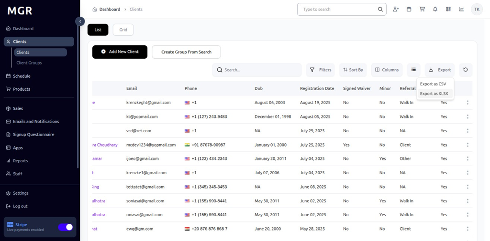

# Export Client Data Guide

This guide provides step-by-step instructions for exporting client data from the admin dashboard in various formats.

## Steps to Export Client Data

### 1. Access Admin Dashboard

a. Log into the admin dashboard

b. Navigate to **Dashboard**

**URL:** `https://coreology.staging.mgrapp.com/next/admin`

### 2. Navigate to the Clients Section

a. Click on **"Clients"** in the sidebar or top menu

**URL:** `https://coreology.staging.mgrapp.com/next/admin/users`

### 3. Access Export Options

a. Click the **"Export"** button

### 4. Export as CSV

a. Click **"Export as CSV"** to download data in CSV format

**CSV Format Benefits:**
- Lightweight file size
- Compatible with most spreadsheet applications
- Easy to import into other systems
- Quick processing and download

The system will generate and download a CSV file containing the client data.

### 5. Alternative: Export as XLSX

a. Click **"Export"**, then choose **"Export as XLSX"**

**XLSX Format Benefits:**
- Preserves formatting and data types
- Supports multiple sheets
- Better for complex data analysis
- Native Excel format

The system will generate and download an Excel file containing the client data.

## Troubleshooting

**Common Issues:**
- **Large File Size:** Export may take longer for large datasets
- **Browser Timeout:** Large exports might need to be broken into smaller chunks
- **Permission Denied:** Ensure you have export permissions
- **Incomplete Data:** Check filter settings and data access rights

**File Format Issues:**
- **CSV Special Characters:** Ensure proper encoding (UTF-8)
- **Excel Compatibility:** Use XLSX for best Excel compatibility
- **Date Formatting:** Verify date formats match your locale
- **Number Formatting:** Check decimal separators and currency formats

**Download Problems:**
- **Failed Download:** Check browser download settings
- **Corrupted File:** Try re-exporting with different options
- **Missing File:** Check downloads folder or try different browser
- **File Size Limit:** Break large exports into smaller segments

**Data Privacy:**
- **GDPR Compliance:** Ensure export complies with privacy regulations
- **Sensitive Data:** Exclude personal information if not needed
- **Access Logging:** Export activities are logged for audit purposes
- **Data Retention:** Follow organization policies for exported data

**Need Help?** Contact system administrator or technical support.
