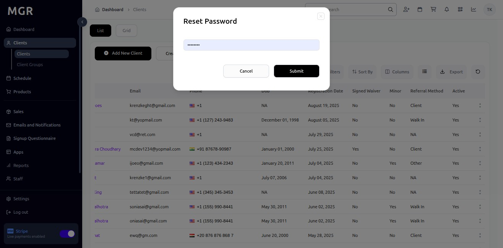

# Manage Existing Client Guide

This guide provides step-by-step instructions for managing, editing, and merging existing client profiles within the admin dashboard.

## Steps to Manage Existing Client

### 1. Access Admin Dashboard

a. Log into the admin dashboard

b. Navigate to **Dashboard**

**URL:** `https://coreology.staging.mgrapp.com/next/admin`

### 2. Navigate to the Clients Section

a. Click on **"Clients"** in the sidebar or top menu

**URL:** `https://coreology.staging.mgrapp.com/next/admin/users`

### 3. Open the Relevant Client Entry

a. Browse the list of existing clients

b. Use search or filters to locate specific client

c. Click the designated button to access the client you want to modify

**Client List Features:**
- View client name and contact information
- See membership status
- Check last activity date
- View client ID
- See registration date

### 4. Edit the Client Details

a. Click **"Edit"** to modify client information

**Example URL:** `https://coreology.staging.mgrapp.com/next/admin/users/UP28303196/edit`

**Editable Client Information:**

**Personal Details:**
- First Name *
- Last Name *
- Email *
- Date of Birth *

**Optional Fields:**
- Gender
- Phone
- Referred Type
- Photo
- client name
- location

**Address Information:**
- Address Line 1 *
- Address Line 2
- City *
- State/Province *
- Postal Code *
- Country *

**Emergency Contact:**
- Emergency Contact Name
- Emergency Contact Phone
- Emergency Contact Relationship

**Custom Traits:**
- Fitness Goals
- Experience Level
- Preferred Class Times
- Health Considerations
- Special Needs
- Interest Tags

**Communication Preferences:**
- Email Notifications
- SMS/Text Messages
- Phone Call Preferences
- Direct Mail Preferences
- Marketing Communication Consent
- Preferred Contact Method

### 5. Save and Close the Edit Screen

a. Review all changes made to the client profile

b. Click **"Save & Close"** to apply any preliminary edits

**Before Saving:**
- Verify all required fields are completed
- Check contact information accuracy
- Confirm address details
- Review notification preferences

The system will save your changes and return to the client management view.

## Advanced Client Management Operations

### 6. Merge Client with Other

a. Click **"Merge with Other"** to combine duplicate client profiles

**Example URL:** `https://coreology.staging.mgrapp.com/next/admin/users/merge?primary_user_id=UP28303196`

**Important Considerations Before Merging:**
- Client merging is permanent and cannot be undone
- All booking history will be consolidated
- Payment history will be combined
- Custom traits will be merged
- Duplicate information will be resolved

### 7. Select Clients to Merge

a. Select the two clients you want to merge

b. Choose which client will be the primary profile

c. Click **"Merge Client"** to proceed

**Merge Process:**
- Primary client retains their ID
- Secondary client data is merged into primary
- Conflicting information requires manual resolution
- System creates audit trail of merge

### 8. Update Email Address

a. Click **"Update Email"** to change client email

**Email Update Process:**
- Verify new email format
- Check for existing email conflicts
- Send verification to new email (optional)
- Update communication preferences

### 9. Enter New Email

a. Enter the new email address

b. Verify email format is correct

c. Confirm the change

**Email Validation:**
- Check email format validity
- Ensure email is not already in use
- Verify client consent for email change
- Update related communication settings

### 10. Deactivate Client

a. Click **"Deactivate"** to temporarily disable client access

**Deactivation Process:**
- Client account becomes inactive
- Access to services is suspended
- Billing may be affected
- Client can be reactivated later if needed

### 11. Confirm Deactivation

a. Review the deactivation confirmation dialog

b. Confirm the action to proceed

### 12. Reset Client Password

a. Click **"Reset Password"** to generate new login credentials

**Password Reset Process:**
- Generates temporary password
- Sends notification to client email
- Requires client to change password on next login
- Maintains security protocols

### 13. Submit Password Reset

a. Click **"Submit"** to process the password reset

**Reset Confirmation:**
- System generates new temporary password
- Client receives email notification
- Password reset is logged in system
- Client can login with temporary credentials

### 14. Confirm Password Reset

a. Review the password reset confirmation

b. Verify the reset was successful

### 15. View Outstanding Payments

a. Click **"Outstanding Payments"** to review client's payment status

**Payment Overview:**
- View all unpaid invoices
- Check payment due dates
- Review payment amounts
- See payment history

### 16. Display Outstanding Payment Records

a. Review detailed payment information

b. Access payment management options

**Payment Details Available:**
- Invoice numbers and dates
- Service descriptions
- Amount owed
- Due dates and late fees
- Payment method preferences
- Collection notes

## Troubleshooting

**Common Issues:**

**Edit Problems:**
- **Permission Denied:** Ensure you have client management rights
- **Changes Not Saving:** Check required fields and network connection
- **Data Conflicts:** Resolve conflicting information before saving
- **Validation Errors:** Verify email formats and phone number formats

**Merge Issues:**
- **Cannot Merge Clients:** Check if clients have conflicting data
- **Merge Fails:** Ensure you have merge permissions
- **Data Loss:** Contact administrator immediately if data appears lost
- **Duplicate Detection:** System should identify potential duplicates

**Email Update Problems:**
- **Email Already Exists:** Choose different email or merge with existing client
- **Invalid Format:** Verify email address format is correct
- **Verification Fails:** Check email delivery and spam folders
- **Permission Errors:** Ensure you have rights to update contact information

**Deactivation Issues:**
- **Cannot Deactivate:** Check for outstanding payments or active memberships
- **Deactivation Fails:** Ensure you have deactivation permissions
- **Client Still Active:** Allow time for system to process deactivation
- **Data Access:** Verify client data is properly secured

**Password Reset Problems:**
- **Reset Fails:** Check client email is valid and accessible
- **Email Not Sent:** Verify email delivery settings
- **Temporary Password Invalid:** Generate new reset if expired
- **Client Cannot Login:** Ensure password complexity requirements are met

**Payment Issues:**
- **Payment Records Not Loading:** Check network connection and permissions
- **Incorrect Payment Data:** Verify payment system integration
- **Missing Payment History:** Contact billing administrator
- **Payment Processing Errors:** Review payment gateway status

**Performance Issues:**
- **Slow Loading:** Large client profiles may take time to load
- **Timeout Errors:** Try refreshing page or breaking operations into steps
- **System Lag:** Perform operations during off-peak hours
- **Data Sync Issues:** Allow time for changes to propagate through system

**Need Help?** Contact system administrator or technical support.
