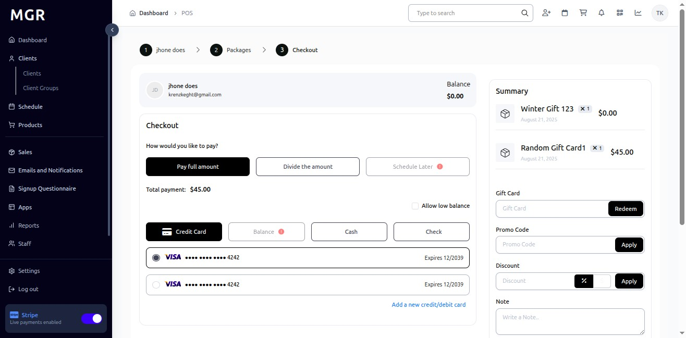

# Retail POS for Client Guide

This guide provides step-by-step instructions for using the Retail Point of Sale (POS) system to sell packages, products, and services to existing clients within the admin dashboard.

## Steps to Access Retail POS

### 1. Access Admin Dashboard

a. Log into the admin dashboard

b. Navigate to **Dashboard**

**URL:** `https://coreology.staging.mgrapp.com/next/admin`

### 2. Navigate to the Clients Section

a. Click on **"Clients"** in the sidebar or top menu

**URL:** `https://coreology.staging.mgrapp.com/next/admin/users`

### 3. Open the Relevant Client Entry

a. Browse the list of existing clients

b. Use search or filters to locate specific client

c. Click the designated button to access the client you want to modify

**Client List Features:**
- View client name and contact information
- See membership status
- Check last activity date
- View client ID
- See registration date

### 4. Access Retail POS

a. Click **"Retail POS"** to open the point of sale system for the selected client

**URL:** `https://coreology.staging.mgrapp.com/admin/retail?user_profile_id=UP28303196`

**POS Features:**
- Sell packages and services
- Process retail products
- Handle gift card sales
- Manage payment transactions
- Track sales history

## Retail POS Product Categories

### 5. All Packages Tab

a. The **"All Packages"** tab is active by default

b. Browse the searchable list of available packages

c. Click the cart icon to add items to the shopping cart

**Package Features:**
- Comprehensive package listing
- Search functionality
- Quick add to cart
- Package details and pricing
- Session information

### 6. Favorites Tab

a. Click **"Favorites"** to view preferred packages

b. Displays only favorite packages with buy cart icons

c. Click cart icon to add favorites directly to cart

**Favorites Benefits:**
- Quick access to preferred items
- Streamlined purchasing process
- Personalized shopping experience
- Easy reordering

### 7. Recurring Packages Tab

a. Click **"Recurring Packages"** to view subscription options

b. Lists recurring package options for selection

c. Click cart icon to add recurring packages to cart

**Recurring Package Features:**
- Subscription-based services
- Automatic billing cycles
- Ongoing service access
- Flexible renewal options

### 8. Non-Recurring Packages Tab

a. Click **"Non Recurring Packages"** to view one-time options

b. Shows one-time packages with price and sessions columns

c. Click Buy icons to add non-recurring packages to cart

**Non-Recurring Features:**
- One-time purchases
- Fixed session counts
- No ongoing commitment
- Immediate access

### 9. Retail Products Tab

a. Click **"Retail Products"** to view physical items

b. Displays physical products with Buy icons

c. Click Buy icons to add retail products to cart

**Retail Product Features:**
- Physical merchandise
- Inventory tracking
- Product categories
- Pricing and availability

### 10. Gift Cards Tab

a. Click **"Gift Cards"** to view gift card options

b. Shows Gift Cards with price and Buy icons

c. Click Buy icons to add gift cards to cart

**Gift Card Features:**
- Prepaid value cards
- Flexible denominations
- Gift recipient options
- Next button visible for checkout

## Checkout Process

### 11. Checkout POS

a. Review items in cart and proceed to checkout

b. Default option is **"Pay full amount"**

c. Select **"Credit Card"** for payment method

**Checkout Options:**
- Full payment processing
- Credit card acceptance
- Payment verification
- Transaction security

### 12. Divide the Amount

a. Click **"Divide the amount"** for split payment options

b. Select **"Cash"** or **"Check"** along with **"Credit Card"**

c. Split amount as per availability and preference

**Split Payment Benefits:**
- Multiple payment methods
- Flexible payment arrangements
- Partial payment processing
- Customer convenience

### 13. Complete Transaction

a. Review totals and payment breakdown at bottom of checkout page

b. Click **"Finish"** to complete the transaction

c. Confirm all payment details are correct

**Transaction Completion:**
- Payment processing
- Receipt generation
- Order confirmation
- Sales record creation

## Troubleshooting

**Common POS Issues:**

**Product Loading Problems:**
- **Packages Not Displaying:** Check inventory availability and permissions
- **Search Not Working:** Verify search functionality and database connection
- **Cart Errors:** Clear cart and restart POS session
- **Price Discrepancies:** Verify current pricing and discount applications

**Payment Processing Issues:**
- **Credit Card Declined:** Check card details and available balance
- **Split Payment Errors:** Verify payment amounts add up to total
- **Transaction Failures:** Check payment gateway status and network connection
- **Receipt Generation:** Ensure printer connection and paper availability

**Client Access Problems:**
- **Client Not Found:** Verify client ID and profile status
- **Permission Denied:** Check admin access rights for POS operations
- **Session Timeout:** Refresh page and re-authenticate
- **Data Sync Issues:** Allow time for system updates

**Performance Issues:**
- **Slow Loading:** Check network connection and system resources
- **POS Freezing:** Close and restart POS application
- **Print Delays:** Verify printer status and queue
- **System Lag:** Perform operations during off-peak hours

**Need Help?** Contact system administrator or technical support for POS-related issues. 