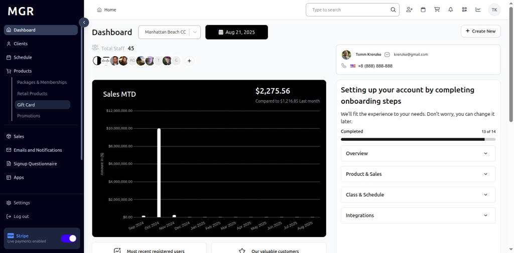
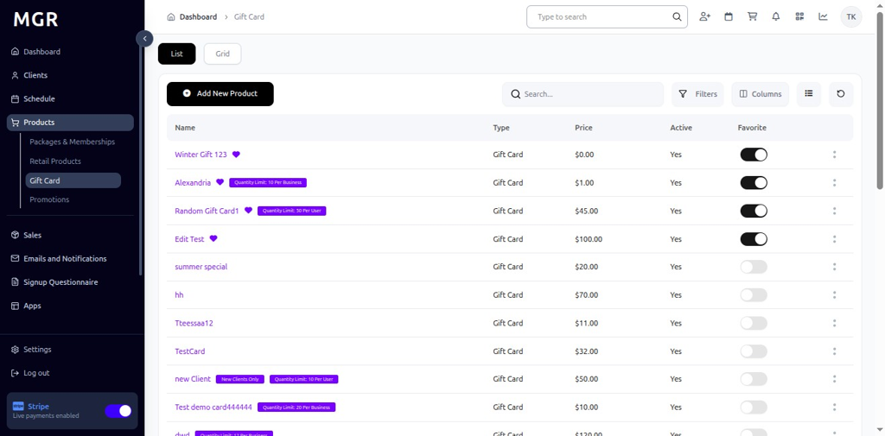

# Add New Gift Card Product Guide

This guide provides step-by-step instructions for creating new gift card products in the admin dashboard.

## Steps to Add New Gift Card Product

### 1. Access Dashboard

Navigate to the admin dashboard

**URL:** `https://coreology.staging.mgrapp.com/next/admin`

### 2. Navigate to Products Section

Click on **"Gift Card"** in the sidebar or top menu

**URL:** `https://coreology.staging.mgrapp.com/admin/products/gift-card`

  

### 3. Start Adding a New Product

Initiate the gift card creation process by clicking the add new product button.

**URL:** `https://coreology.staging.mgrapp.com/admin/products/new?initialParams=%257B%2522product_type%2522%253A%2522gift_card%2522%257D`

### 4. Enter Product Details

Fill in the required product information:

**Required Fields:**
- Product Name
- Description
- Slug
- Price
- Product Type (Gift Card)

**Optional Fields:**
- Revenue Category
- Tax Category

Click **"Next"** when complete.

### 5. Select Gift Card Attributes

Configure the specific attributes that define how the gift card will function.

**Available Options:**
- Gift Card Type
- Number of Sessions
- Amount
- Fixed Amount

Click **"Next"** to continue.

### 6. Set Marketing Settings

Define how and where the gift card will be displayed and marketed to customers.

**Marketing Options:**
- Admin Only
- Mobile Only
- Public
- Favorites
- Special
- Mobile Highlight

Click **"Next"** to proceed.

### 7. Add Restrictions

Set any applicable restrictions for the gift card product:

**Restriction Types:**
- Age Restrictions
- Location Restrictions
- Time-based Restrictions
- Usage Limitations
- Special Conditions

Click **"Next"** when restrictions are configured.

### 8. Review Summary and Finish

a. Review all entered information for accuracy

b. Check gift card attributes and settings

c. Verify marketing and restriction configurations

d. Use **"Previous"** to make corrections if needed

e. Click **"Finish"** to create the gift card product

The system will save the record and redirect to the product detail page.

## Troubleshooting

**Common Issues:**
- **Validation Errors:** Check all required fields are filled correctly
- **Price Format Issues:** Ensure price is entered in correct currency format
- **Product Type Conflicts:** Verify product type selection matches intended use
- **Restriction Conflicts:** Check for conflicting restriction settings

**Need Help?** Contact system administrator or technical support. 