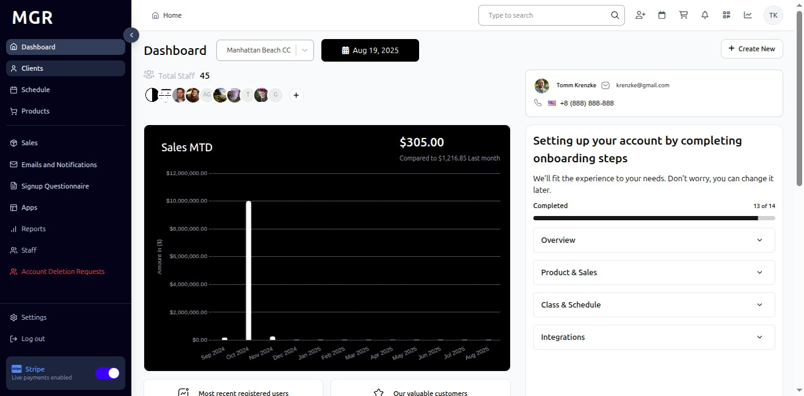
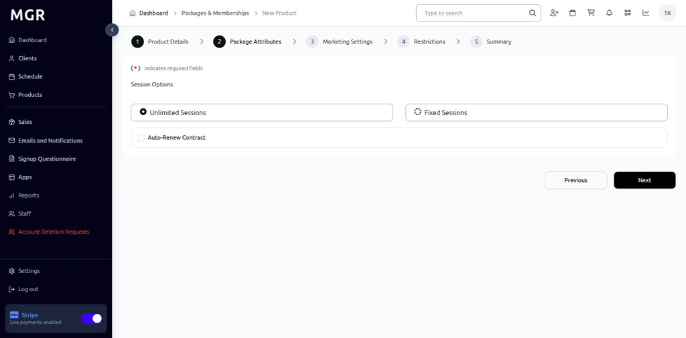

# Add New Package or Membership Guide

This guide provides step-by-step instructions for creating new packages or memberships in the admin dashboard.

## Steps to Add New Package or Membership

### 1. Access Dashboard

Navigate to the admin dashboard

**URL:** `https://coreology.staging.mgrapp.com/next/admin`

  

### 2. Navigate to Products Section

Click on **"Package or Membership"** in the sidebar or top menu

**URL:** `https://coreology.staging.mgrapp.com/admin/products/packages`

### 3. Start Adding a New Product

Click the **"Add New Product"** button

**URL:** `https://coreology.staging.mgrapp.com/admin/products/new?initialParams=%257B%2522product_type%2522%253A%2522package%2522%257D`

### 4. Enter Product Details

Fill in the required product information:

**Required Fields:**
- Product Name
- Description
- Slug
- Price
- Product Type (Package)

**Optional Fields:**
- Revenue Category
- Tax Category

Click **"Next"** when complete.

### 5. Select Package Attributes

Configure the package-specific attributes:

**Available Options:**
- Unlimited Sessions
- Fixed Sessions

Click **"Next"** to continue.

### 6. Set Marketing Settings

Configure marketing and promotional settings:

**Marketing Options:**
- Admin Only
- Mobile Only
- Public
- Favorites
- Special
- Mobile Highlight

Click **"Next"** to proceed.

### 7. Add Restrictions

Set any applicable restrictions for the package:

**Restriction Types:**
- Age Restrictions
- Location Restrictions
- Time-based Restrictions
- Usage Limitations
- Special Conditions

Click **"Next"** when restrictions are configured.

### 8. Review Summary and Finish

a. Review all entered information for accuracy

b. Check package attributes and settings

c. Verify marketing and restriction configurations

d. Use **"Previous"** to make corrections if needed

e. Click **"Finish"** to create the package/membership

The system will save the record and redirect to the product detail page.

## Troubleshooting

**Common Issues:**
- **Validation Errors:** Check all required fields are filled correctly
- **Price Format Issues:** Ensure price is entered in correct currency format
- **Package Type Conflicts:** Verify package type selection matches intended use
- **Restriction Conflicts:** Check for conflicting restriction settings

**Need Help?** Contact system administrator or technical support.
