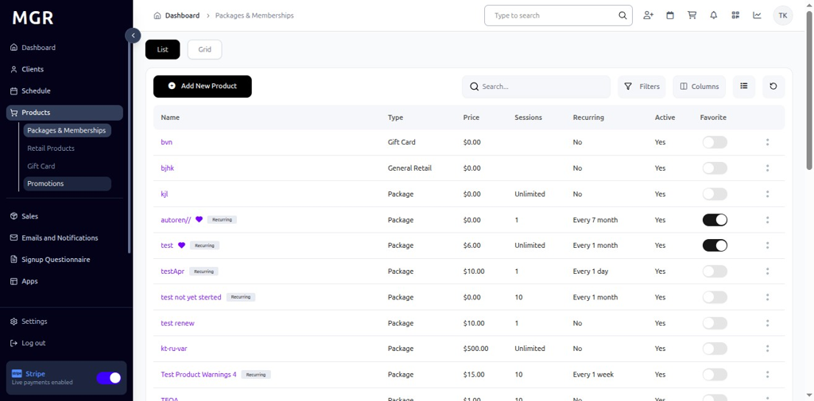

# Create New Product Promotion Guide

This guide provides step-by-step instructions for creating new product promotions in the admin dashboard.

## Steps to Create New Product Promotion

### 1. Access Dashboard

Navigate to the admin dashboard

**URL:** `https://coreology.staging.mgrapp.com/next/admin`

### 2. Navigate to Products Section

Click on **"Promotions"** in the sidebar or top menu

**URL:** `https://coreology.staging.mgrapp.com/admin/promotions`

### 3. Start Adding a New Promotion

Click the **"Add New Promotion"** button

**URL:** `https://coreology.staging.mgrapp.com/admin/promotions/new?initialParams=%257B%257D`

### 4. Enter General Details

Fill in the required promotion information:

**Required Fields:**
- Promotion Name
- Description
- Start Date
- End Date
- Promotion Type

**Optional Fields:**
- Notes
- Status
- Priority Level

Click **"Next"** when complete.

### 5. Add Pricing

Configure the promotion pricing and discounts:

**Available Options:**
- Discount Type (Percentage, Fixed Amount, Buy One Get One)
- Discount Value
- Minimum Purchase Amount
- Maximum Discount Amount
- Applicable Products/Services

Click **"Next"** to continue.

### 6. Add Restrictions

Set any applicable restrictions for the promotion:

**Restriction Types:**
- Age Restrictions
- Location Restrictions
- Time-based Restrictions
- Usage Limitations
- Customer Type Restrictions
- Product Category Restrictions

Click **"Next"** when restrictions are configured.

### 7. Review Summary and Finish

a. Review all entered information for accuracy

b. Check promotion details and pricing

c. Verify restrictions and limitations

d. Use **"Previous"** to make corrections if needed

e. Click **"Finish"** to create the promotion

The system will save the record and redirect to the promotion detail page.

## Troubleshooting

**Common Issues:**
- **Validation Errors:** Check all required fields are filled correctly
- **Date Conflicts:** Ensure start date is before end date
- **Pricing Issues:** Verify discount values are within acceptable ranges
- **Restriction Conflicts:** Check for conflicting restriction settings

**Need Help?** Contact system administrator or technical support. 