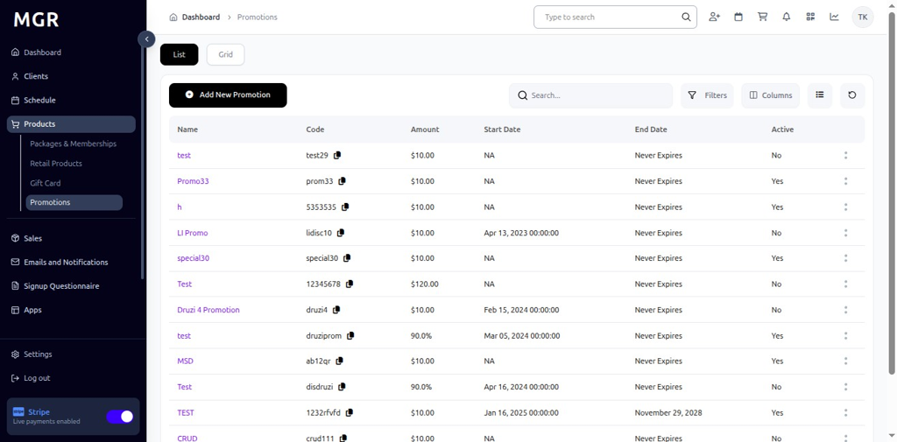

# Detailed View of Promotions Guide

This guide provides step-by-step instructions for viewing detailed information about promotions in the admin dashboard.

## Steps to View Promotion Details

### 1. Access Dashboard

Navigate to the admin dashboard

**URL:** `https://coreology.staging.mgrapp.com/next/admin`

### 2. Navigate to Products Section

Click on **"Promotions"** in the sidebar or top menu

**URL:** `https://coreology.staging.mgrapp.com/admin/promotions`

### 3. Select Promotion

Click the Promotion that reveals further details about the promotion

### 4. Overview Tab

The **"Overview"** tab is active by default and displays detailed information about the promotion

**Information Displayed:**
- Promotion Name and Description
- Start and End Dates
- Promotion Type
- Discount Details
- Applicable Products/Services
- Status Information
- Creation and Modification Dates
- Marketing Settings
- Terms and Conditions

### 5. Promotion Usage Tab

Click **"Promotion Usage"** to view the usage performance data

**Usage Information:**
- Total Usage Count
- Usage Chart with multiple time periods:
  - Daily
  - Weekly
  - Monthly
  - Quarterly
  - Yearly
- Usage Trends and Patterns
- Performance Analytics
- Conversion Rates

### 6. Promotion Users Tab

Click **"Promotion Users"** to view user engagement data

**User Information:**
- Total Users of this Promotion
- User Data Chart with multiple time periods:
  - Daily
  - Weekly
  - Monthly
  - Quarterly
  - Yearly
- User Growth Trends
- Customer Demographics
- User Adoption Patterns

### 7. Promotion Restrictions Tab

Click **"Promotion Restrictions"** to view restriction details

**Restriction Information:**
- Age Restrictions
- Location Restrictions
- Time-based Restrictions
- Usage Limitations
- Customer Type Restrictions
- Product Category Restrictions
- Special Conditions

### 8. Promotion Redemptions Tab

Click **"Promotion Redemptions"** to view redemption data

**Redemption Information:**
- Total Redemptions
- Redemption History
- Redemption Patterns
- Customer Redemption Data
- Redemption Success Rates
- Failed Redemption Attempts

## Troubleshooting

**Common Issues:**
- **Tab Loading Errors:** Refresh the page if tabs don't load properly
- **Chart Display Issues:** Ensure JavaScript is enabled for interactive charts
- **Data Loading Delays:** Large datasets may take time to load
- **Permission Errors:** Verify you have view permissions for the promotion

**Need Help?** Contact system administrator or technical support. 