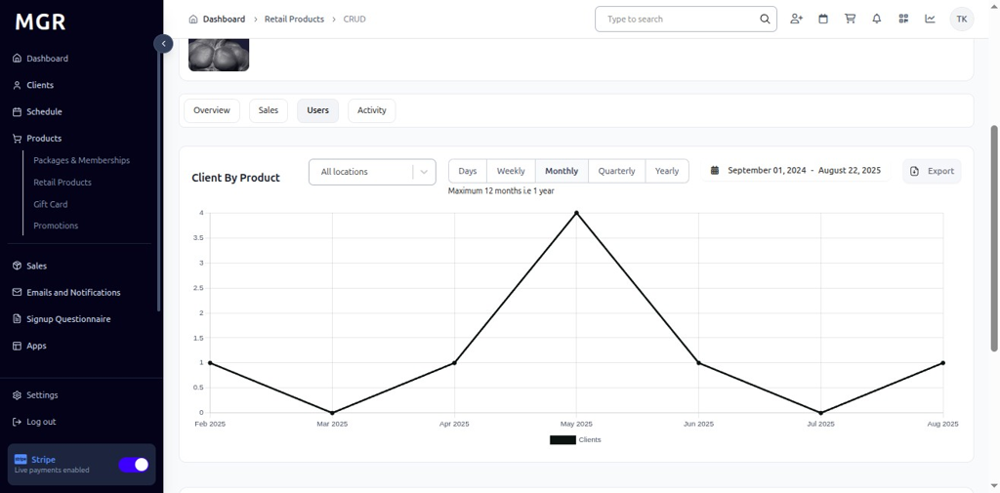

# Detailed View of Retail Products Guide

This guide provides step-by-step instructions for viewing detailed information about retail products in the admin dashboard.

## Steps to View Retail Product Details

### 1. Access Dashboard

Navigate to the admin dashboard

**URL:** `https://coreology.staging.mgrapp.com/next/admin`

### 2. Navigate to Products Section

Click on **"Retail Products"** in the sidebar or top menu

**URL:** `https://coreology.staging.mgrapp.com/admin/products/retail-items`

### 3. Select Product

Click the Product that reveals further details about the retail item

### 4. Overview Tab

The **"Overview"** tab is active by default and displays detailed information about the product

**Information Displayed:**
- Product Name and Description
- Pricing Details
- SKU and Barcode
- Brand Information
- Inventory Status
- Stock Quantity
- Creation and Modification Dates
- Marketing Settings
- Restrictions and Limitations

### 5. Sales Tab

Click **"Sales"** to view the sales performance data

**Sales Information:**
- Total Sales Revenue
- Sales Chart with multiple time periods:
  - Daily
  - Weekly
  - Monthly
  - Quarterly
  - Yearly
- Sales Trends and Patterns
- Revenue Analytics
- Inventory Turnover

### 6. Users Tab

Click **"Users"** to view user engagement data

**User Information:**
- Total Users of this Product
- User Data Chart with multiple time periods:
  - Daily
  - Weekly
  - Monthly
  - Quarterly
  - Yearly
- User Growth Trends
- Customer Demographics
- Purchase Patterns

### 7. Activity Tab

Click **"Activity"** to view recent activity related to the product

**Activity Information:**
- Recent Purchases
- User Registrations
- Status Changes
- Modifications and Updates
- Inventory Adjustments

## Troubleshooting

**Common Issues:**
- **Tab Loading Errors:** Refresh the page if tabs don't load properly
- **Chart Display Issues:** Ensure JavaScript is enabled for interactive charts
- **Data Loading Delays:** Large datasets may take time to load
- **Permission Errors:** Verify you have view permissions for the product

**Need Help?** Contact system administrator or technical support. 