# Manage Existing Package or Membership Guide

This guide provides step-by-step instructions for managing existing packages or memberships in the admin dashboard.

## Steps to Manage Existing Package or Membership

### 1. Access Dashboard

Navigate to the admin dashboard

**URL:** `https://coreology.staging.mgrapp.com/next/admin`

### 2. Navigate to Products Section

Click on **"Package or Membership"** in the sidebar or top menu

**URL:** `https://coreology.staging.mgrapp.com/admin/products/packages`

### 3. Select Product

Click the icon that reveals further actions (usually represented by a symbol like three dots)

### 4. Edit Product

Click **"Edit"** to modify the product details

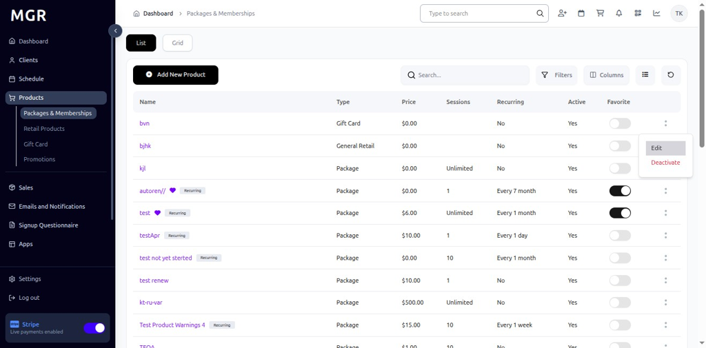

### 5. Save and Close

Click **"Save & Close"** to apply any preliminary edits

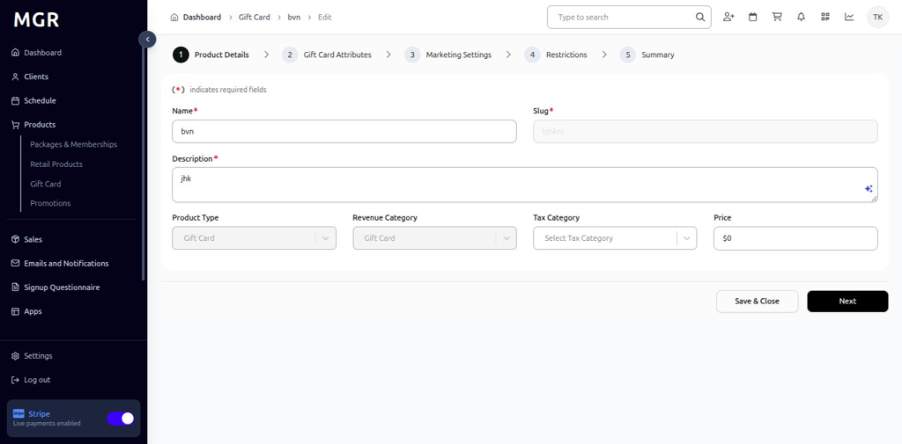

### 6. Deactivate Product

Click **"Deactivate"** to temporarily disable the product

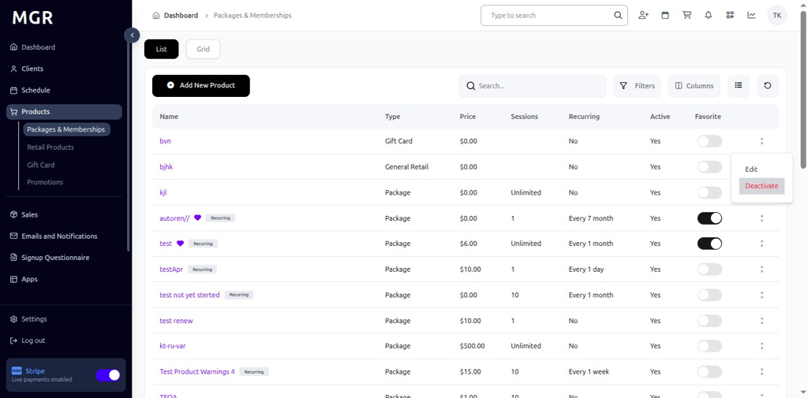

### 7. Confirm Product Deactivation

Confirm the deactivation action in the popup dialog

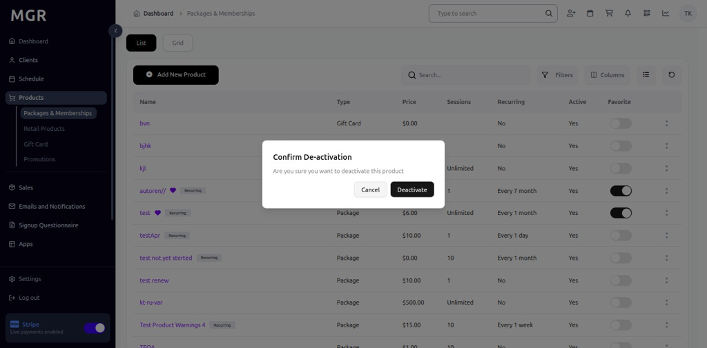

### 8. Activate Product

Click on **"Activate"** to re-enable a deactivated product

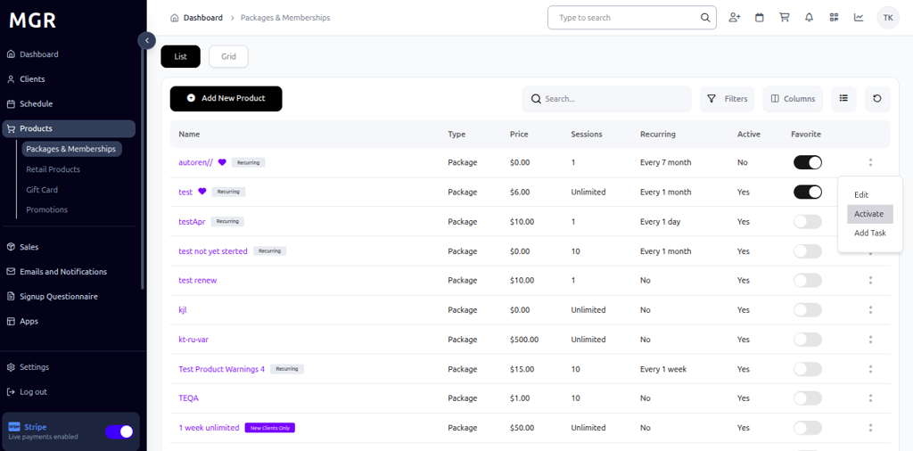

### 9. Confirm Product Activation

Confirm the activation action in the popup dialog

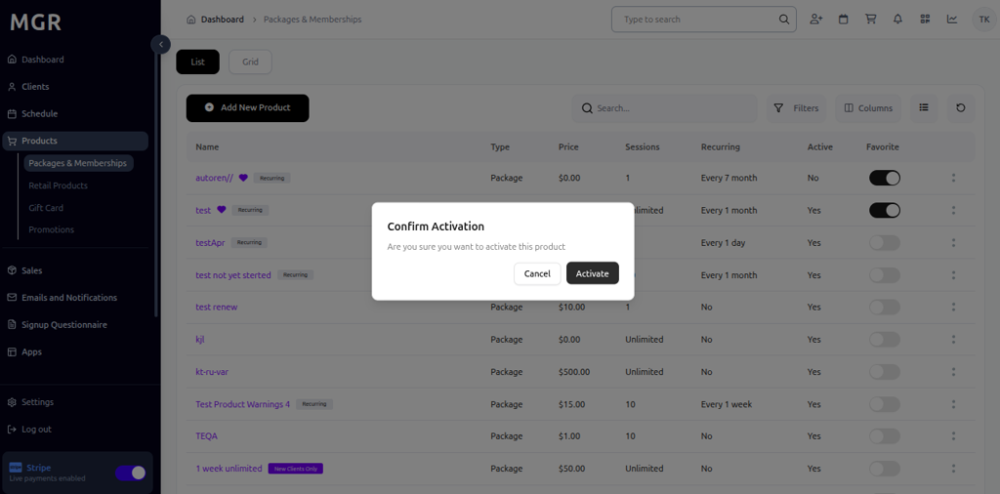

### 10. Add to Favorites

Click on toggle button to add the package to favorites

### 11. Confirm Add to Favorite

Confirm adding the package to favorites in the popup dialog

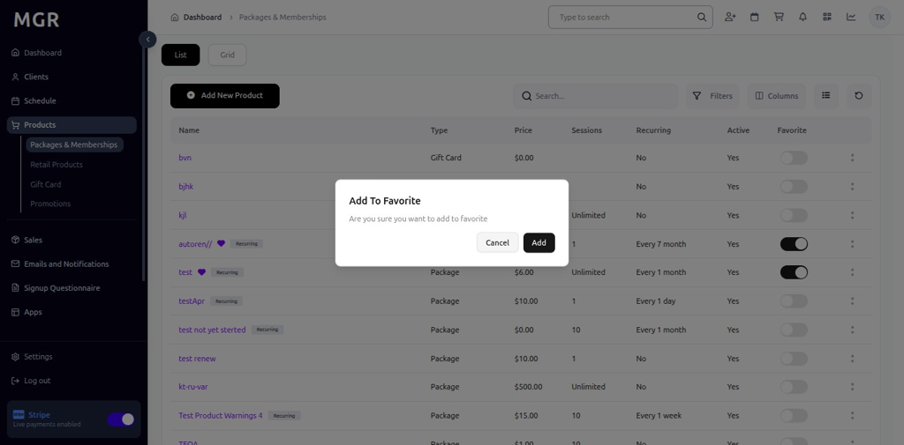

### 12. Remove from Favorites

Click on toggle button to remove the package from favorites

### 13. Confirm Remove From Favorite

Confirm removing the package from favorites in the popup dialog

### 14. Add Task for Package

Click on **"Add Task"** to create a new task related to the package

### 15. Fill the General Details

Complete the task information form:

**Required Fields:**
- Task Title
- Description
- Due Date
- Priority Level

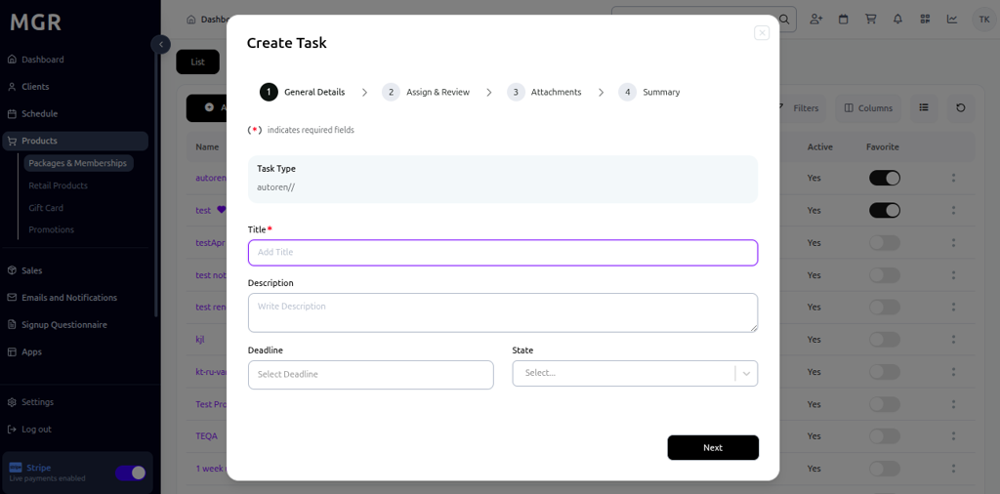

Click **"Next"** when complete.

### 16. Assign & Review the Task

Assign the task to appropriate staff members and review details

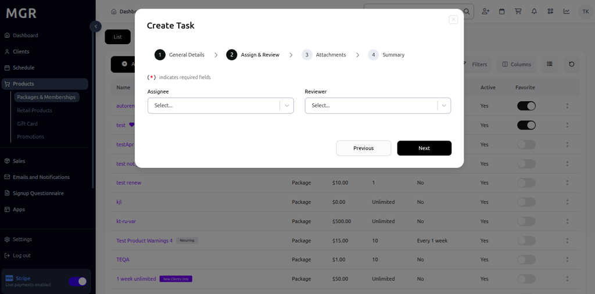

Click **"Next"** to continue.

### 17. Add Attachments

Upload any relevant files or documents to the task

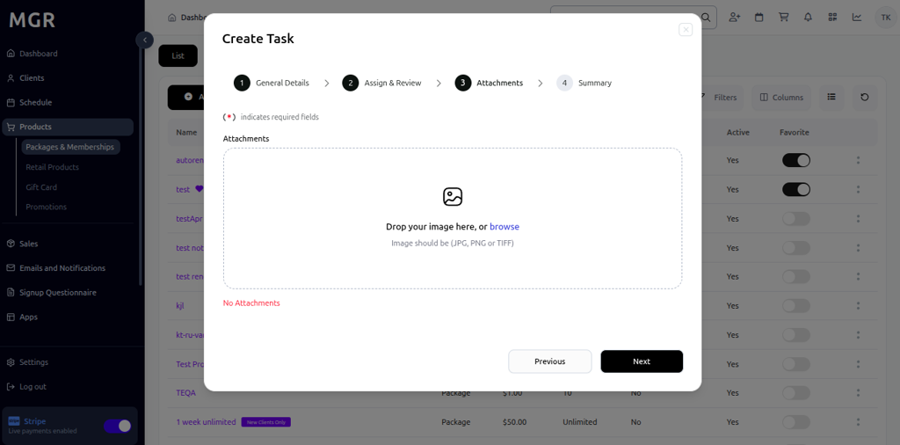

Click **"Next"** when attachments are added.

### 18. Review Summary and Finish

a. Review all entered information for accuracy

b. Check task details and assignments

c. Verify attachments and settings

d. Use **"Previous"** to make corrections if needed

e. Click **"Finish"** to create the task

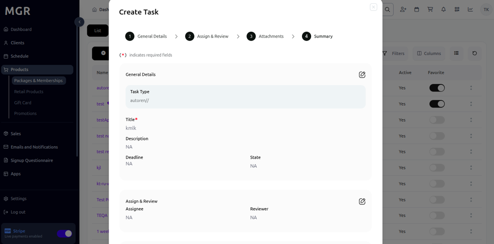

The system will save the task and redirect to the task detail page.

## Troubleshooting

**Common Issues:**
- **Edit Permission Errors:** Verify you have edit permissions for the product
- **Save Failures:** Check all required fields are filled correctly
- **Activation/Deactivation Issues:** Ensure product status allows the action
- **Task Creation Problems:** Verify task form validation requirements

**Need Help?** Contact system administrator or technical support.
