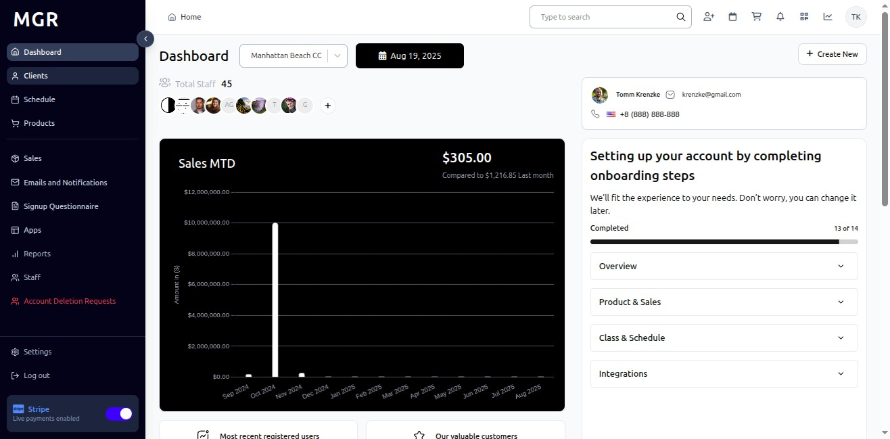
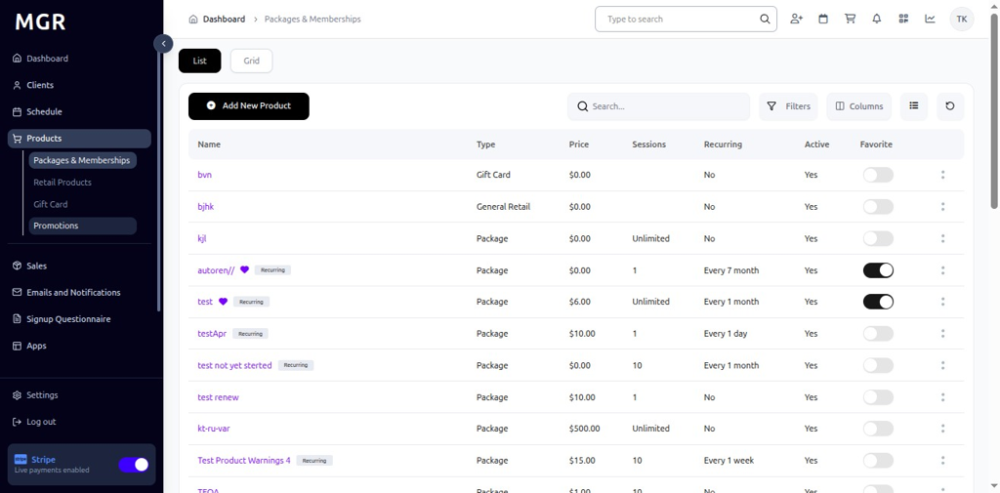
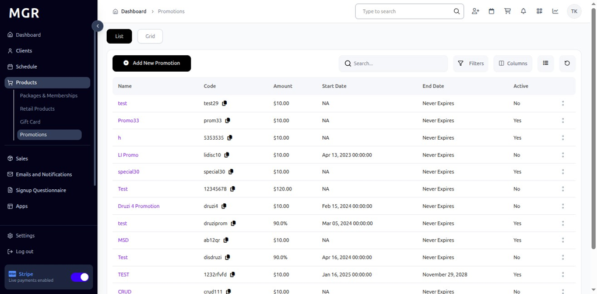
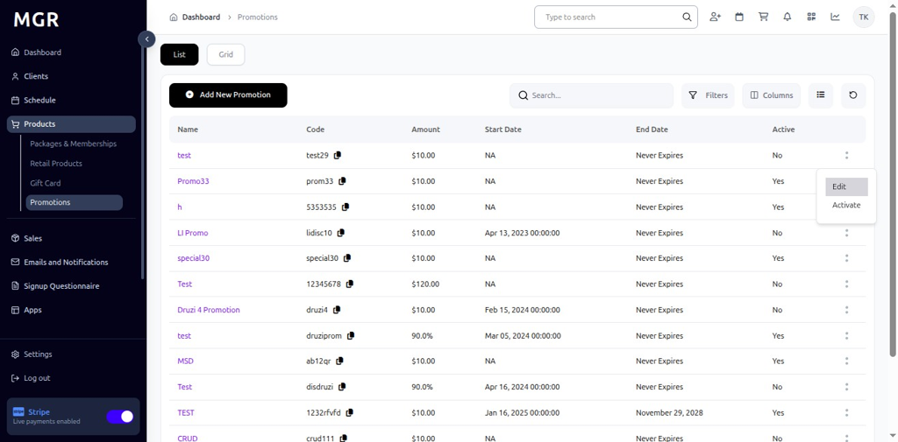
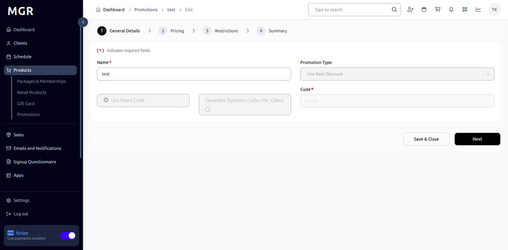
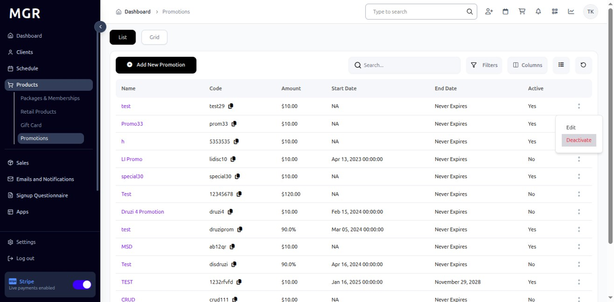
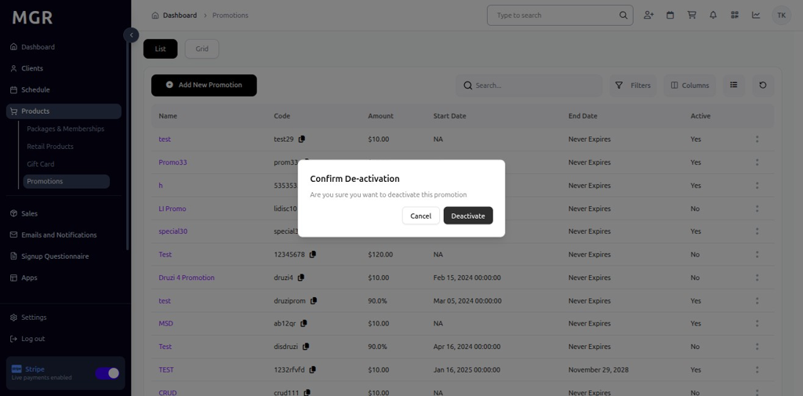
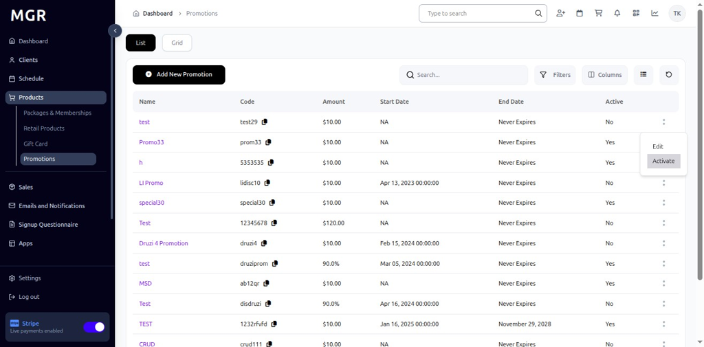
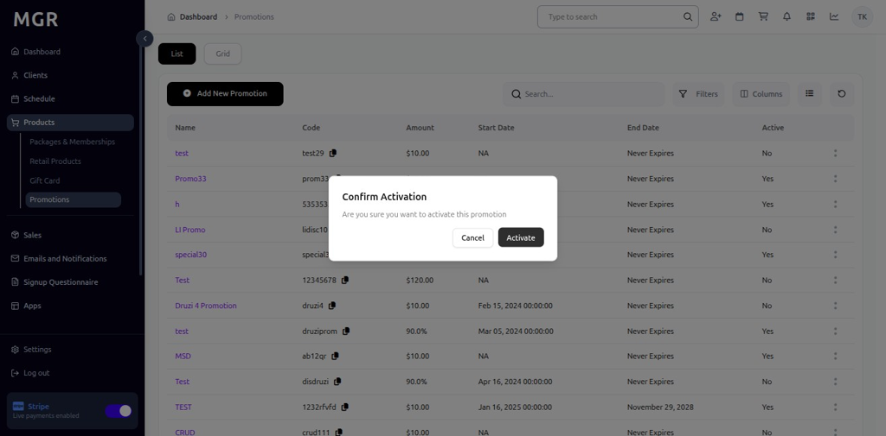

# Manage Existing Promotions Guide

This guide provides step-by-step instructions for managing existing promotions in the admin dashboard.

## Steps to Manage Existing Promotions

### 1. Access Dashboard

Navigate to the admin dashboard

**URL:** `https://coreology.staging.mgrapp.com/next/admin`

### 2. Navigate to Products Section

Click on **"Promotions"** in the sidebar or top menu

**URL:** `https://coreology.staging.mgrapp.com/admin/promotions`

### 3. Select Promotion

Click the icon that reveals further actions (usually represented by a symbol like three dots)

### 4. Edit Promotion

Click **"Edit"** to modify the promotion details

### 5. Save and Close

Click **"Save & Close"** to apply any preliminary edits

### 6. Deactivate Promotion

Click **"Deactivate"** to temporarily disable the promotion

### 7. Confirm Promotion Deactivation

Confirm the deactivation action in the popup dialog

### 8. Activate Promotion

Click on **"Activate"** to re-enable a deactivated promotion

### 9. Confirm Promotion Activation

Confirm the activation action in the popup dialog

## Troubleshooting

**Common Issues:**
- **Edit Permission Errors:** Verify you have edit permissions for the promotion
- **Save Failures:** Check all required fields are filled correctly
- **Activation/Deactivation Issues:** Ensure promotion status allows the action
- **Date Conflicts:** Verify promotion dates are valid and don't conflict

**Need Help?** Contact system administrator or technical support.
