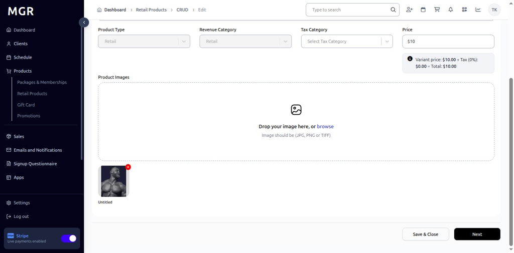
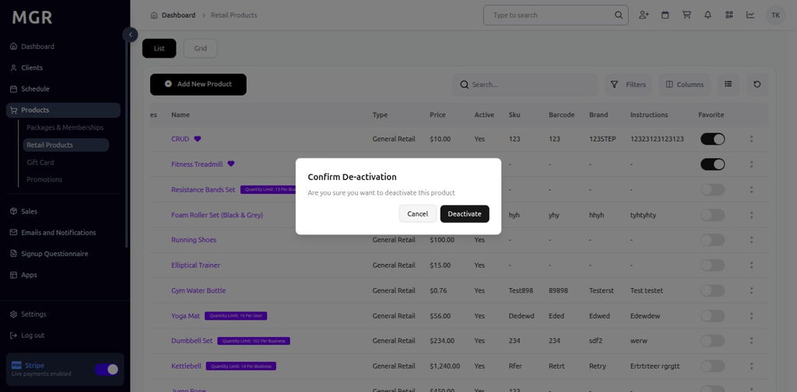
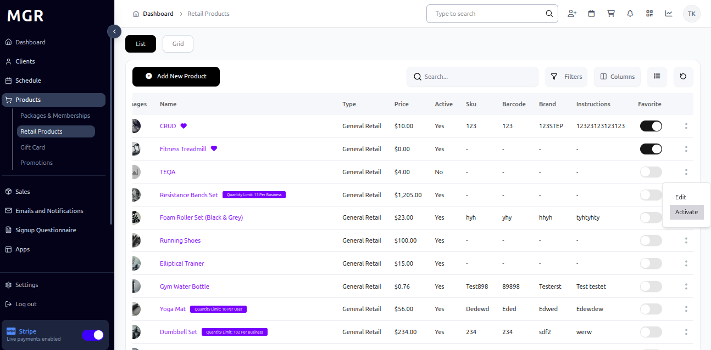
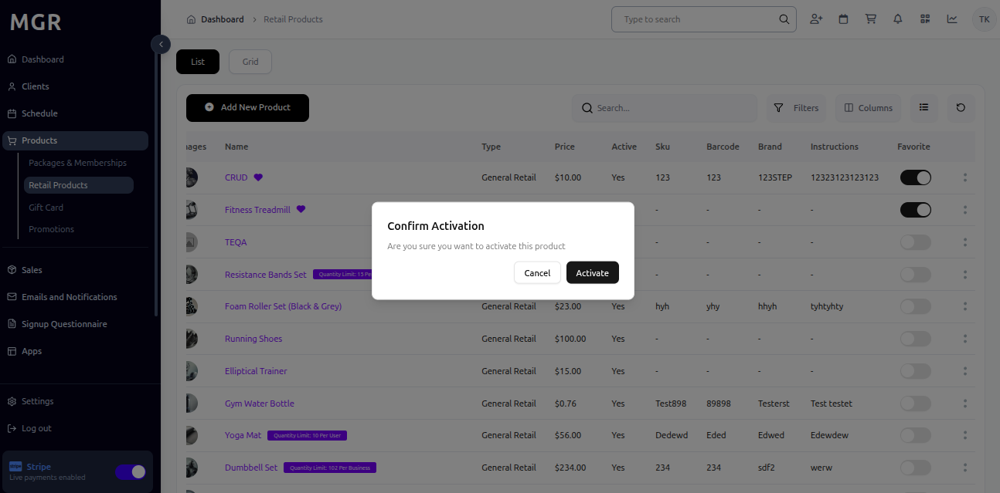
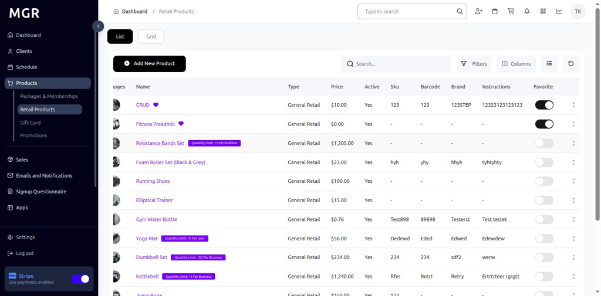
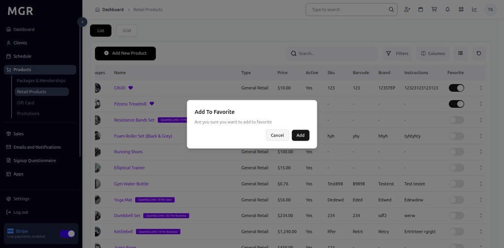
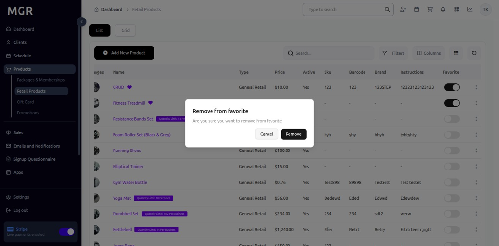

# Manage Existing Retail Product Guide

This guide provides step-by-step instructions for managing existing retail products in the admin dashboard.

## Steps to Manage Existing Retail Product

### 1. Access Dashboard

Navigate to the admin dashboard

**URL:** `https://coreology.staging.mgrapp.com/next/admin`

### 2. Navigate to Products Section

Click on **"Retail Products"** in the sidebar or top menu

**URL:** `https://coreology.staging.mgrapp.com/admin/products/retail-items`

### 3. Select Product

Click the icon that reveals further actions (usually represented by a symbol like three dots)

### 4. Edit Product

Click **"Edit"** to modify the product details

### 5. Save and Close

Click **"Save & Close"** to apply any preliminary edits

### 6. Deactivate Product

Click **"Deactivate"** to temporarily disable the product

### 7. Confirm Product Deactivation

Confirm the deactivation action in the popup dialog

### 8. Activate Product

Click on **"Activate"** to re-enable a deactivated product

### 9. Confirm Product Activation

Confirm the activation action in the popup dialog

### 10. Add to Favorites

Click on toggle button to add the retail product to favorites

### 11. Confirm Add to Favorite

Confirm adding the product to favorites in the popup dialog

### 12. Remove from Favorites

Click on toggle button to remove the product from favorites

### 13. Confirm Remove From Favorite

Confirm removing the product from favorites in the popup dialog

## Troubleshooting

**Common Issues:**
- **Edit Permission Errors:** Verify you have edit permissions for the retail product
- **Save Failures:** Check all required fields are filled correctly
- **Activation/Deactivation Issues:** Ensure product status allows the action
- **Inventory Conflicts:** Verify stock levels before deactivating products

**Need Help?** Contact system administrator or technical support.
