# All Orders of Sales Guide

This guide provides step-by-step instructions for accessing and managing all orders in the Sales section of the admin dashboard.

## Overview

The All Orders view displays comprehensive order information including payment details, fulfillment status, item information, and order management options. This section allows administrators to view, edit, and manage all sales orders across the system.

## Accessing All Orders

### 1. Navigate to Dashboard

a. Go to the admin dashboard

**URL:** `https://coreology.staging.mgrapp.com/next/admin`

### 2. Open Sales Section

a. In the left sidebar, click **"Sales"** to open the reporting area of the MGR dashboard

### 3. Switch to "All Orders" View

a. Click **"All Orders"** to access the comprehensive orders listing

**URL:** `https://coreology.staging.mgrapp.com/admin/orders`

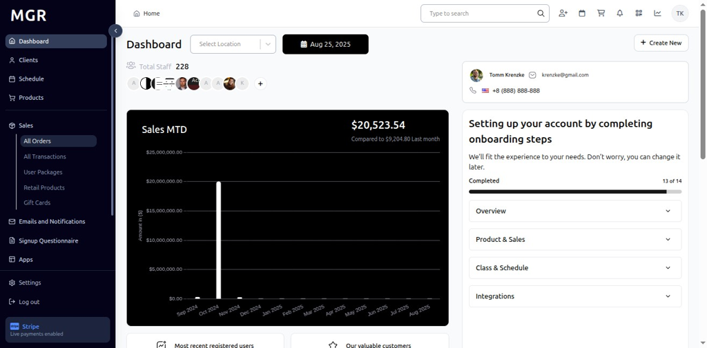

## Order Management Operations

### 4. Select Order

a. Click the icon that reveals further actions (usually represented by a symbol like three dots)

b. This opens the order actions menu

### 5. View Order Details

a. Click **"Order Details"** from the actions menu

b. This opens a detailed view of the selected order, showing:
   - Payment information
   - Fulfillment status
   - Item details
   - Order summary

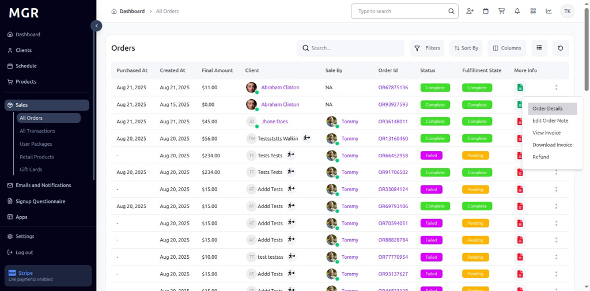

### 6. Display Order Summary

The order details page shows comprehensive information including:
- **Subtotal:** Base amount before adjustments
- **Discounts:** Applied discounts and promotions
- **Taxes:** Tax calculations and amounts
- **Fulfillment Status:** Current order processing status
- **Customer Information:** Client details and contact info

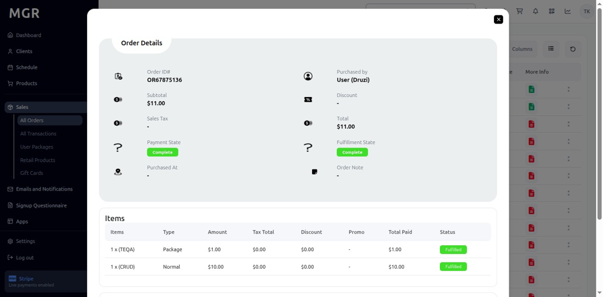

### 7. Edit Order Notes

a. Click **"Edit Order Note"** to open the notes editing popup
b. A text box appears where you can add or update notes for the order
c. Options to save or cancel changes are available

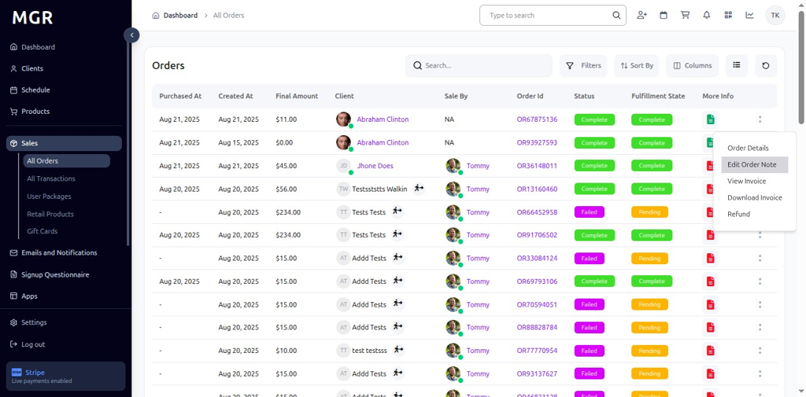

### 8. Display Edit Order Note Popup

The popup interface provides:
- Text input area for order notes
- Save button to confirm changes
- Cancel button to discard modifications
- Clear formatting for easy note entry

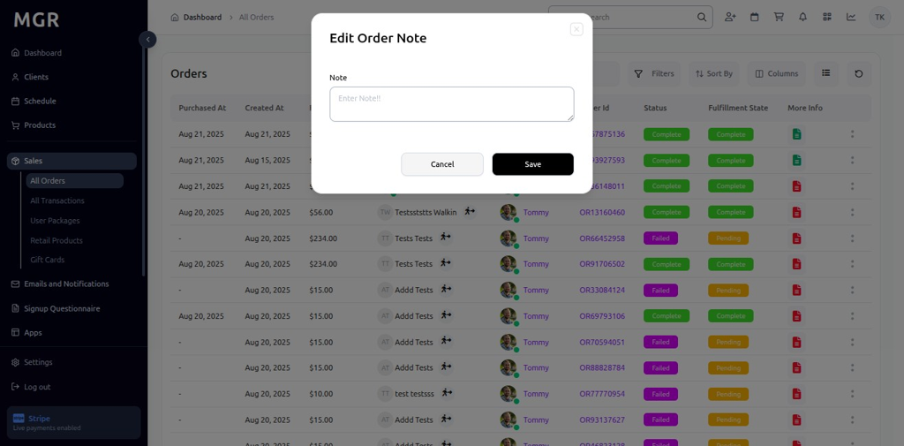

### 9. View Invoice

a. Click **"View Invoice"** to open the invoice for the selected order
b. The invoice opens in a popup window

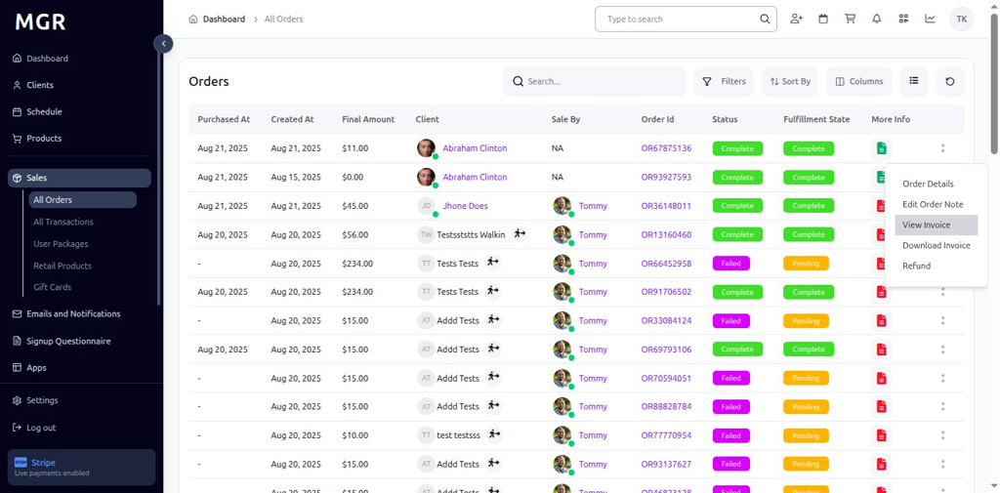

### 10. Display Invoice

The invoice popup shows comprehensive order information:
- **Invoice Number:** Unique identifier for the order
- **Client Details:** Customer information and billing address
- **Purchased Items:** Complete list of products/services
- **Total Amount:** Final cost including all charges
- **Print Option:** Button to print the invoice

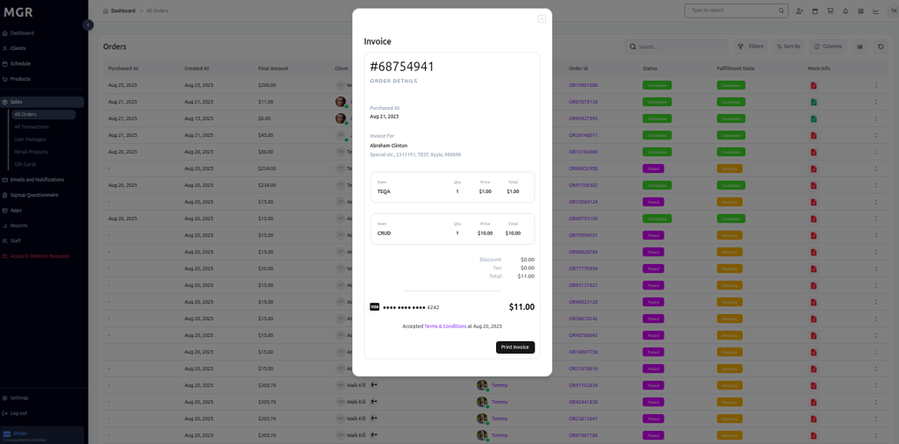

### 11. Download Invoice

a. Click **"Download Invoice"** to save the invoice as a file
b. The invoice downloads for offline records and archiving
c. File format is typically PDF for professional presentation

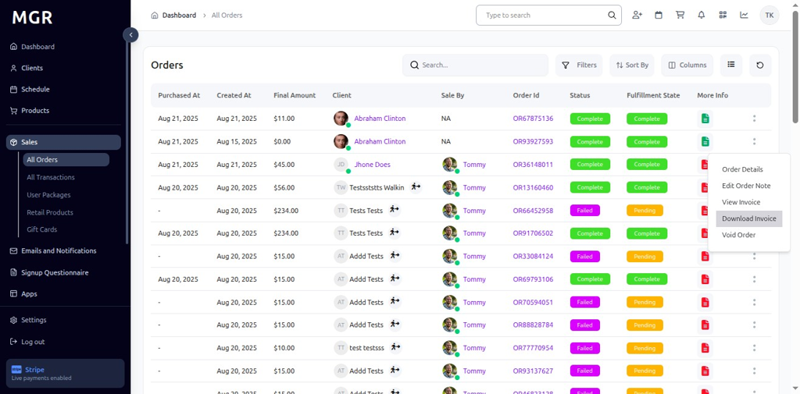

### 12. Void Order

a. Click **"Void Order"** to initiate the order cancellation process
b. This opens a confirmation dialog for voiding/canceling the order

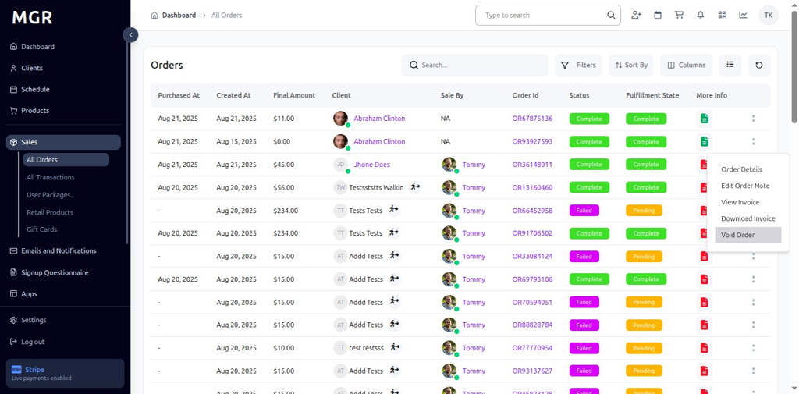

### 13. Display Void Order Confirmation

The confirmation dialog shows:
- Warning that the order will be voided
- Confirmation message about the action
- Options to proceed or cancel the void operation
- Clear indication of the irreversible nature of the action

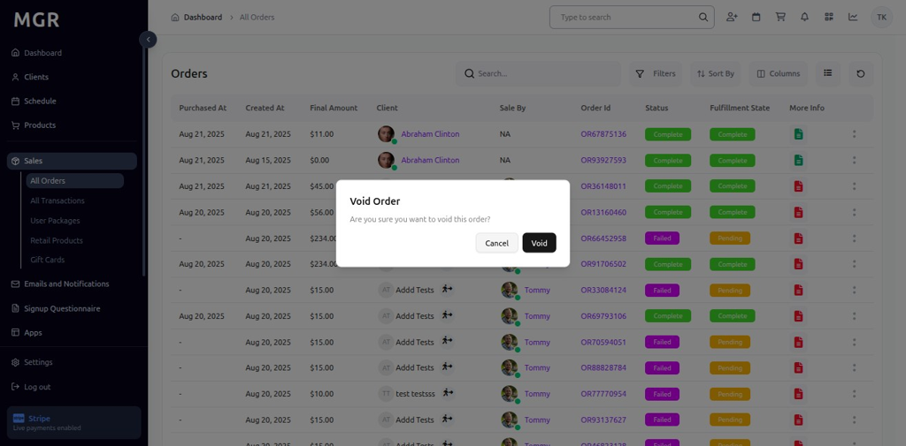

### 14. Access Order via Order ID

a. Click directly on the **"Order ID"** link

b. This also opens the full order details page

c. Alternative method to access order information

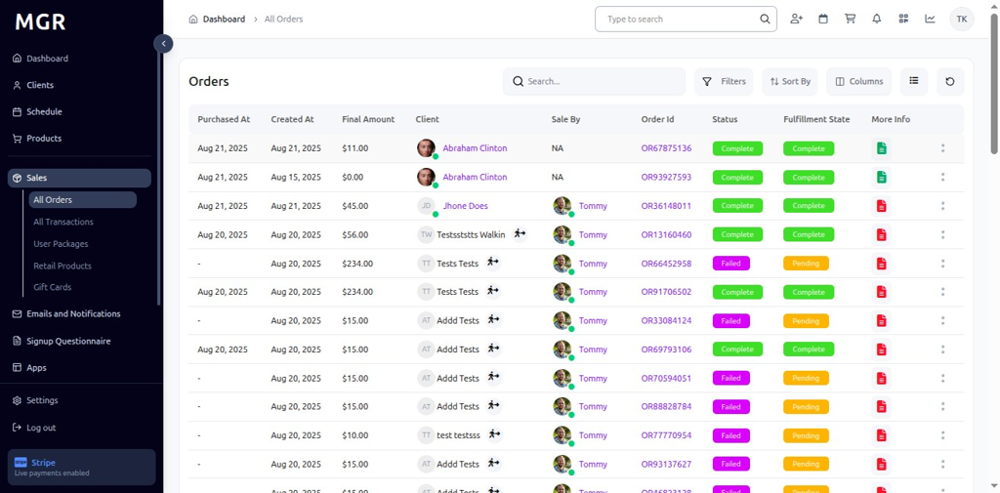

### 15. Display Full Order Details

Clicking the Order ID link displays:
- Complete order information
- All available order management options
- Full order history and status
- Comprehensive order data view

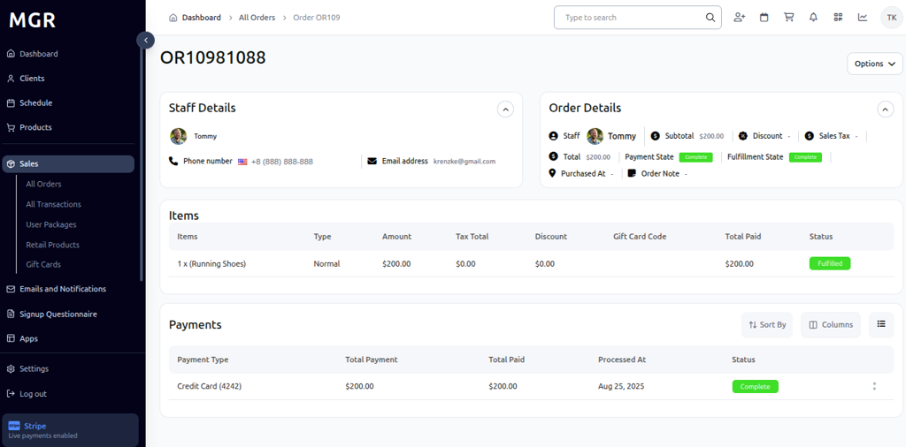

## Order Information Display

### Order Status Indicators

The All Orders view displays various status indicators:
- **Pending:** Orders awaiting processing
- **Processing:** Orders currently being fulfilled
- **Completed:** Successfully fulfilled orders
- **Cancelled:** Voided or cancelled orders
- **Refunded:** Orders with processed refunds

### Order Filtering Options

Use the available filters to organize orders:
- **Date Range:** Filter by order creation date
- **Status:** Filter by order fulfillment status
- **Customer:** Search orders by customer name
- **Amount:** Filter by order total amount
- **Location:** Filter by business location

## Troubleshooting

**Common Issues:**
- **Orders Not Loading:** Check internet connection and refresh the page
- **Order Details Not Displaying:** Verify order selection and permissions
- **Invoice Generation Failures:** Ensure order data is complete and valid
- **Void Operation Errors:** Confirm order status allows voiding

**Need Help?** Contact system administrator or technical support for assistance with order management or access issues.
