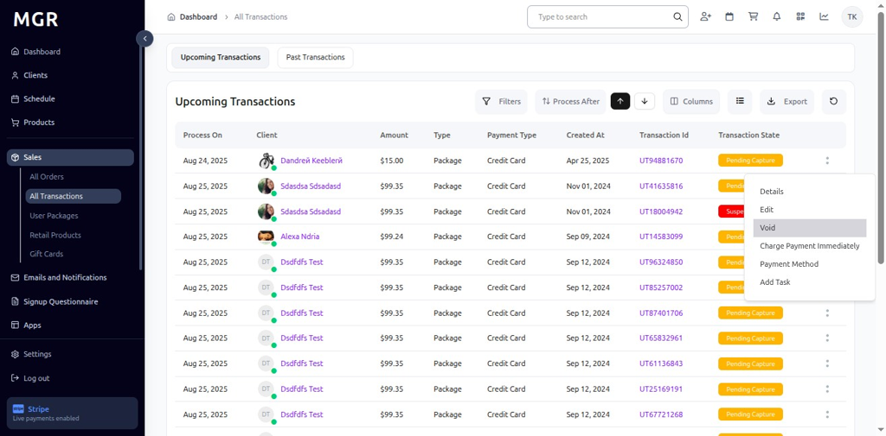
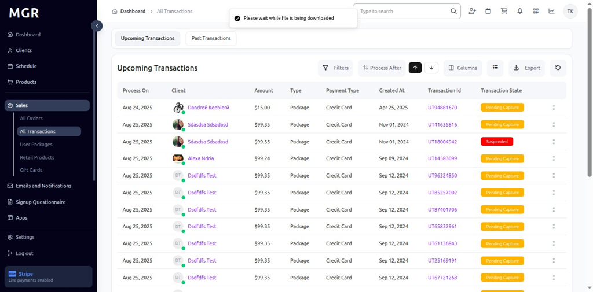

# All Transactions of Sales Guide

This guide provides step-by-step instructions for accessing and managing all transactions in the Sales section of the admin dashboard.

## Overview

The All Transactions view displays comprehensive transaction information including payment details, payment methods, transaction status, and transaction management options. This section allows administrators to view, edit, and manage all sales transactions across the system.

## Accessing All Transactions

### 1. Navigate to Dashboard

a. Go to the admin dashboard

**URL:** `https://coreology.staging.mgrapp.com/next/admin`

### 2. Open Sales Section

a. In the left sidebar, click **"Sales"** to open the reporting area of the MGR dashboard

### 3. Switch to "All Transactions" View

a. Click **"All Transactions"** to access the comprehensive transactions listing

**URL:** `https://coreology.staging.mgrapp.com/admin/transactions`

## Transaction Management Operations

### 4. Select Transaction

a. Click the icon that reveals further actions (usually represented by a symbol like three dots)

b. This opens the transaction actions menu

### 5. View Transaction Details

a. Click **"Details"** from the actions menu

b. This opens a detailed view of the selected transaction, showing:
   - Payment information
   - Fulfillment status
   - Item details
   - Transaction summary

### 6. Display Transaction Summary

The transaction details page shows comprehensive information including:
- **Amount:** Transaction total amount
- **Payment Method:** Method used for payment
- **Date:** Transaction date and time
- **Notes:** Associated transaction notes
- **Fulfillment Status:** Current transaction processing status

### 7. Edit Transaction

a. Click **"Edit"** to open the transaction editing popup

b. A form appears where you can edit:
   - Payment type
   - Payment method
   - Notes

c. Options to save or cancel changes are available

### 8. Display Edit Transaction Popup

The popup interface provides:
- Payment type selection dropdown
- Payment method selection
- Notes text input area
- Save button to confirm changes
- Cancel button to discard modifications

### 9. Void Transaction

a. Click **"Void"** to initiate the transaction cancellation process

b. This opens a confirmation dialog for voiding/canceling the transaction

### 10. Display Void Transaction Confirmation

The confirmation dialog shows:
- Warning that the transaction will be voided
- Confirmation message about the action
- Options to proceed or cancel the void operation
- Clear indication of the irreversible nature of the action

### 11. Charge Payment Immediately

a. Click **"Charge Payment Immediately"** to process an immediate payment

b. This opens a payment processing form

### 12. Display Charge Payment Form

The payment form provides:
- Payment type selection
- Payment method configuration
- Notes field for payment details
- Save and cancel options
- Immediate processing capability

### 13. View Payment Method Details

a. Click **"Payment Method"** to access detailed payment information

b. This displays comprehensive payment method details

### 14. Display Payment Method Details

The payment method details show:
- **Card Name:** Name on the payment card
- **Card Number:** Masked card number for security
- **Card Expiry Date:** Expiration date of the payment method
- **Payment Date:** Date when payment was processed

### 15. Add Task to Transaction

a. Click **"Add Task"** to create a new task associated with the transaction

b. This opens the task creation workflow

### 16. Display Create Task Window

The task creation process involves multiple steps:

#### 16.1 General Details
- Fill in the general details of the task
- Click **"Next"** to proceed to the next step

#### 16.2 Assign & Review
- Add **Assignee** for the task
- Add **Reviewer** for the task
- Click **"Next"** to continue

#### 16.3 Attachments
- Attach images or files for task reference
- Upload relevant documents
- Click **"Next"** to proceed

#### 16.4 Summary & Finish
- Verify all task details in the summary
- Click **"Finish"** to add the task to the transaction

## Export and Data Management

### 17. Export Transactions

a. Click **"Export"** to access export options

b. This opens the export menu with available formats

### 18. Export as CSV

a. Click **"Export as CSV"** to download transaction data

b. File downloads in CSV format for spreadsheet applications

### 19. Export as XLSX

a. Click **"Export as XLSX"** to download transaction data

b. File downloads in Excel format maintaining formatting

## Past Transactions View

### 20. Switch to Past Transactions

a. Click **"Past Transactions"** to view historical transaction data

b. This switches the view to show completed and archived transactions

### 21. View Past Transaction Details

a. Click **"Details"** on any past transaction

b. This opens the detailed view of the historical transaction

### 22. Display View Transaction

The past transaction view shows:
- Historical transaction information
- Archived payment details
- Completed transaction status
- Historical notes and attachments

## Transaction Information Display

### Transaction Status Indicators

The All Transactions view displays various status indicators:
- **Pending:** Transactions awaiting processing
- **Processing:** Transactions currently being processed
- **Completed:** Successfully processed transactions
- **Failed:** Transactions that failed to process
- **Voided:** Cancelled or voided transactions
- **Refunded:** Transactions with processed refunds

### Transaction Filtering Options

Use the available filters to organize transactions:
- **Date Range:** Filter by transaction date
- **Status:** Filter by transaction processing status
- **Payment Method:** Filter by type of payment method
- **Amount:** Filter by transaction amount
- **Customer:** Search transactions by customer name
- **Location:** Filter by business location

## Troubleshooting

**Common Issues:**
- **Transactions Not Loading:** Check internet connection and refresh the page
- **Transaction Details Not Displaying:** Verify transaction selection and permissions
- **Payment Processing Failures:** Ensure payment method data is complete and valid
- **Void Operation Errors:** Confirm transaction status allows voiding
- **Export Failures:** Check file permissions and available storage space

**Need Help?** Contact system administrator or technical support for assistance with transaction management or access issues.
