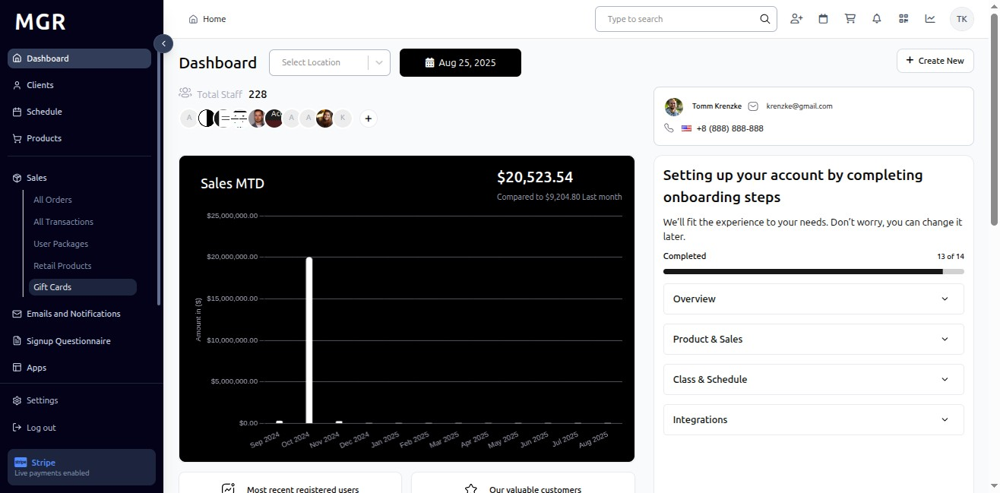
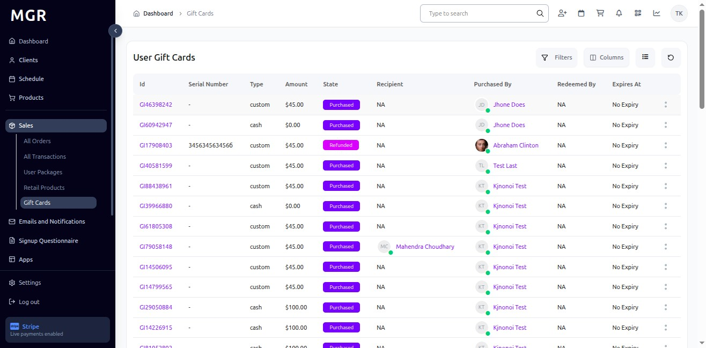
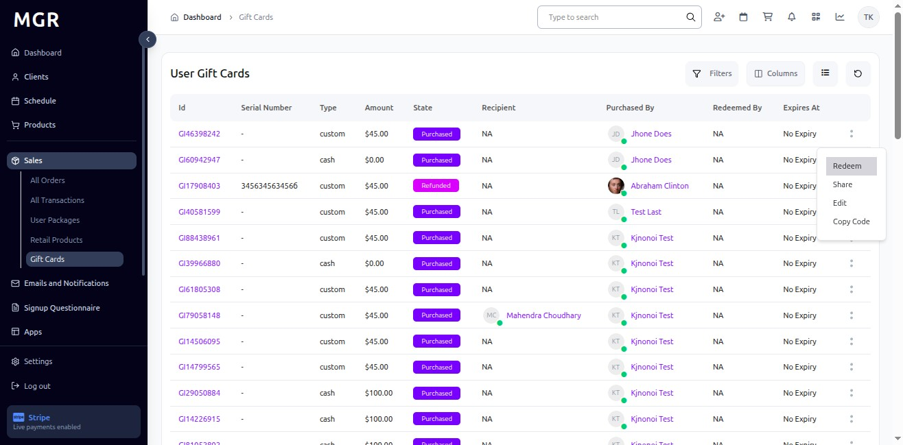
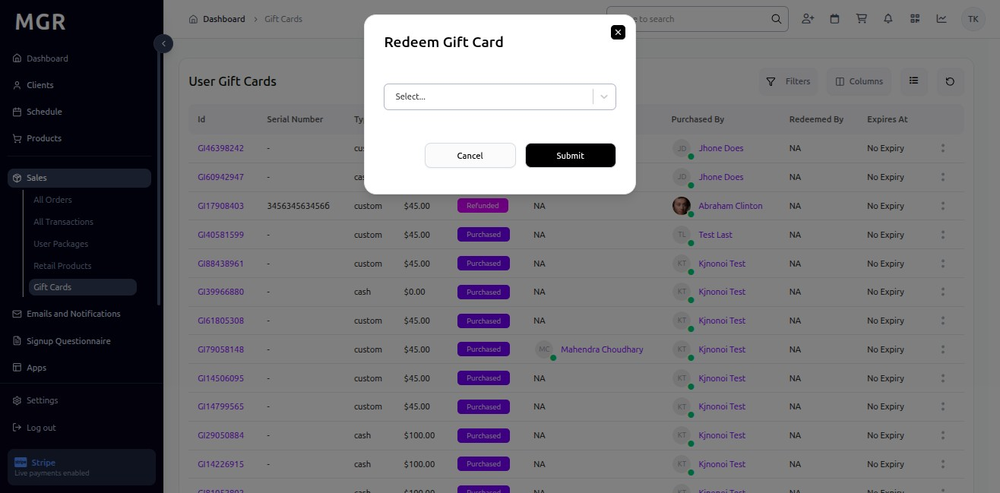
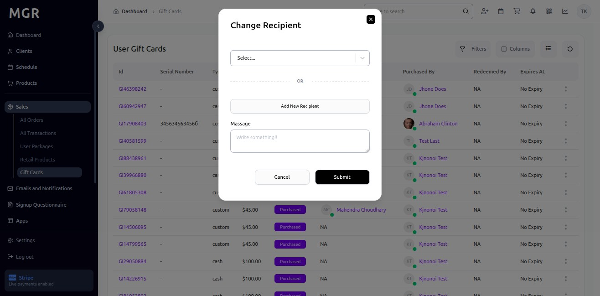
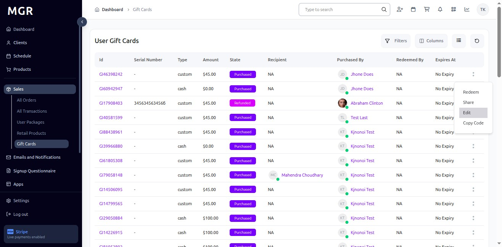
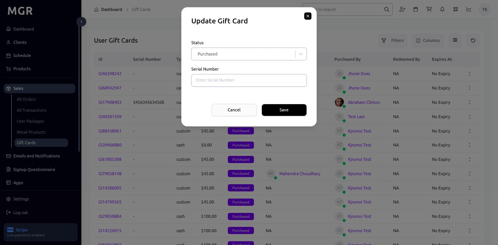
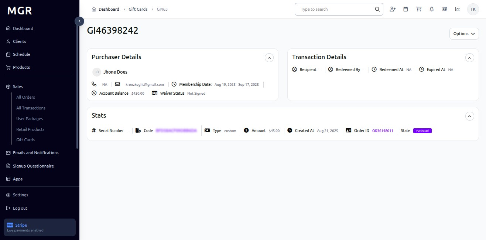

# Gift Card in Sales Guide

This guide provides step-by-step instructions for accessing and managing gift cards in the Sales section of the admin dashboard.

## Overview

The Gift Card view displays comprehensive gift card information including card details, redemption status, sharing options, and gift card management features. This section allows administrators to view, redeem, share, and manage all gift cards across the system.

## Accessing Gift Cards

### 1. Navigate to Dashboard

a. Go to the admin dashboard

**URL:** `https://coreology.staging.mgrapp.com/next/admin`

### 2. Open Sales Section

a. In the left sidebar, click **"Sales"** to open the reporting area of the MGR dashboard

### 3. Switch to "Gift Card" View

a. Click **"Gift Card"** to access the comprehensive gift cards listing

**URL:** `https://coreology.staging.mgrapp.com/admin/purchases/gift_cards`

## Gift Card Management Operations

### 4. Select Gift Card

a. Click the icon that reveals further actions (usually represented by a symbol like three dots)

b. This opens the gift card actions menu

### 5. Redeem Gift Card

a. Click **"Redeem"** to initiate the gift card redemption process

b. This opens the redemption interface

### 6. Display Redeem Gift Card

The redemption interface provides:
- **Gift Card Selection:** Choose the specific gift card to redeem
- **Redemption Details:** Gift card information and available balance
- **Submit Button:** Process the redemption request

### 7. Share Gift Card

a. Click **"Share"** to share the gift card with another recipient

b. This opens a popup for changing the gift card recipient

### 8. Display Change Recipient

The sharing popup shows:
- **Recipient Selection:** Choose new recipient for the gift card
- **Transfer Options:** Available sharing and transfer methods
- **Confirmation:** Confirm the recipient change

### 9. Edit Gift Card

a. Click **"Edit"** to modify gift card details

b. This opens the gift card editing interface

### 10. Display Edit and Update Gift Card

The editing interface provides:
- **Gift Card Details:** Modify card information and settings
- **Update Options:** Available fields for editing
- **Save Changes:** Apply modifications to the gift card

### 11. Copy Gift Card Code

a. Click **"Copy Code"** to copy the gift card code

b. This copies the unique gift card identifier to clipboard

### 12. Access Gift Card via Gift ID

a. Click directly on the **"Gift ID"** link

b. This also opens the full gift card details page

c. Alternative method to access gift card information

### 13. Display Gift Card Details

Clicking the Gift ID link displays:
- Complete gift card information
- All available gift card management options
- Full gift card specifications and details
- Comprehensive gift card data view

## Troubleshooting

**Common Issues:**
- **Gift Cards Not Loading:** Check internet connection and refresh the page
- **Gift Card Details Not Displaying:** Verify gift card selection and permissions
- **Redemption Failures:** Ensure gift card is valid and has available balance
- **Sharing Errors:** Confirm recipient information and sharing permissions
- **Code Copy Issues:** Check clipboard permissions and browser settings
- **Gift ID Access Issues:** Confirm gift card exists and is accessible

**Need Help?** Contact system administrator or technical support for assistance with gift card management or access issues.
 