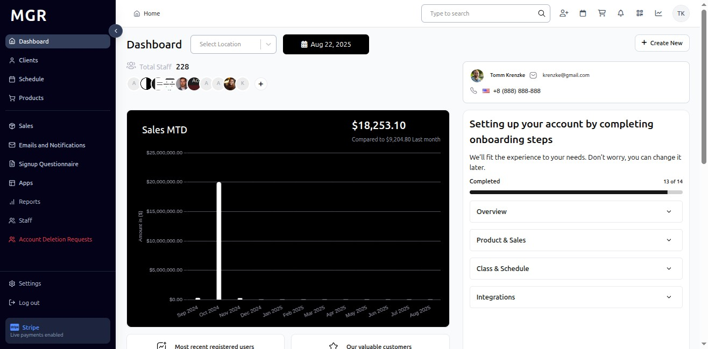

# Retail Products in Sales Guide

This guide provides step-by-step instructions for accessing and managing retail products in the Sales section of the admin dashboard.

## Overview

The Retail Products view displays comprehensive product information including product details, pricing, subscription status, and product management options. This section allows administrators to view, manage, and process returns for all retail products across the system.

## Accessing Retail Products

### 1. Navigate to Dashboard

a. Go to the admin dashboard

**URL:** `https://coreology.staging.mgrapp.com/next/admin`

### 2. Open Sales Section

a. In the left sidebar, click **"Sales"** to open the reporting area of the MGR dashboard

### 3. Switch to "Retail Product" View

a. Click **"Retail Product"** to access the comprehensive retail products listing

**URL:** `https://coreology.staging.mgrapp.com/admin/purchases/retail_products`

## Retail Product Management Operations

### 4. Select Product

a. Click the icon that reveals further actions (usually represented by a symbol like three dots)

b. This opens the product actions menu

### 5. View Product Details

a. Click **"View Product Details"** from the actions menu

b. This opens a detailed view of the selected retail product

### 6. Display Product Details

The product details page shows comprehensive information including:
- **Product Name:** Name and title of the retail product
- **Description:** Detailed product description and features
- **Amount:** Product price and cost information
- **Subscription Status:** Current subscription and availability status
- Additional product specifications and details

### 7. Return Product

a. Click **"Return Product"** to initiate the product return process

b. This opens a popup for processing the product return

### 8. Display Refund Selection

The return popup provides:
- **Transaction Selection:** Choose the specific transaction to refund
- **Return Details:** Product return information and reason
- **Refund Options:** Available refund methods and amounts

### 9. Continue Return Process

a. Click **"Continue"** to proceed with the return

b. Review return details and confirm the refund amount

### 10. Submit Return

a. Click **"Submit"** to finalize the product return

b. This processes the return and initiates the refund

### 11. Access Product via Product ID

a. Click directly on the **"Product ID"** link

b. This also opens the full product details page

c. Alternative method to access product information

### 12. Display Full Product Details

Clicking the Product ID link displays:
- Complete product information
- All available product management options
- Full product specifications and details
- Comprehensive product data view

## Troubleshooting

**Common Issues:**
- **Products Not Loading:** Check internet connection and refresh the page
- **Product Details Not Displaying:** Verify product selection and permissions
- **Return Process Failures:** Ensure transaction data is complete and valid
- **Refund Processing Errors:** Verify transaction status and refund eligibility
- **Product ID Access Issues:** Confirm product exists and is accessible

**Need Help?** Contact system administrator or technical support for assistance with retail product management or access issues.
