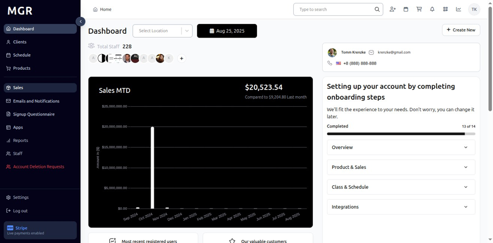
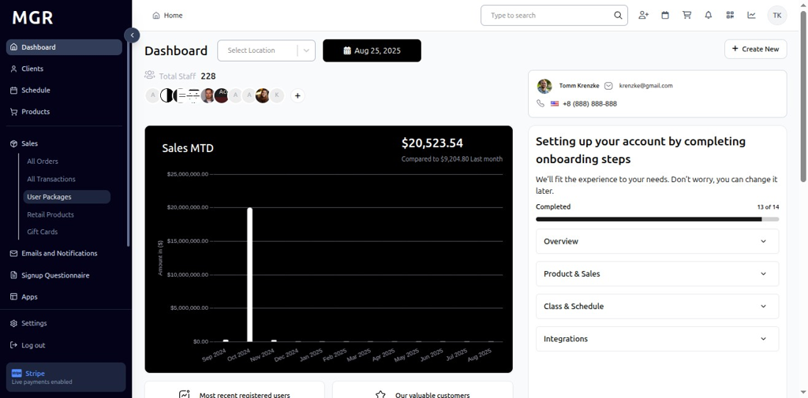
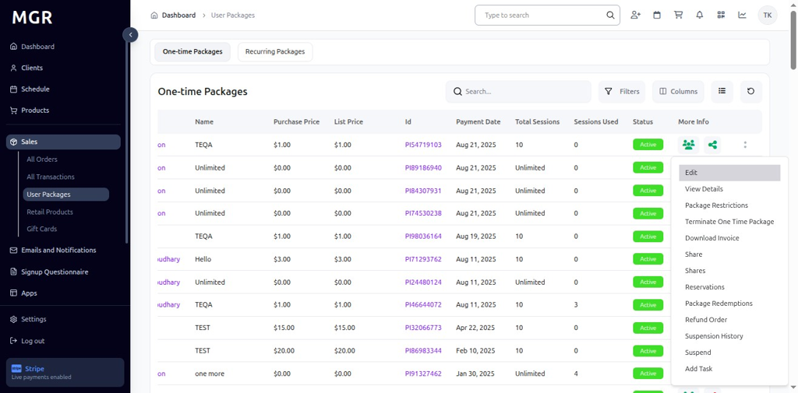

# User Packages of Sales Guide

This guide provides step-by-step instructions for accessing and managing user packages in the Sales section of the admin dashboard.

## Overview

The User Packages view displays comprehensive package information including package details, restrictions, redemption history, and package management options. This section allows administrators to view, edit, and manage all user packages across the system.

## Accessing User Packages

### 1. Navigate to Dashboard

a. Go to the admin dashboard

**URL:** `https://coreology.staging.mgrapp.com/next/admin`

### 2. Open Sales Section

a. In the left sidebar, click **"Sales"** to open the reporting area of the MGR dashboard

### 3. Switch to "User Packages" View

a. Click **"User Packages"** to access the comprehensive packages listing

**URL:** `https://coreology.staging.mgrapp.com/admin/user_packages`

## Package Management Operations

### 4. Select Package

a. Click the icon that reveals further actions (usually represented by a symbol like three dots)

b. This opens the package actions menu

### 5. View Package Details

a. Click **"Details"** from the actions menu

b. This opens a detailed view of the selected package

### 6. Display Package Details

The package details page shows comprehensive information including:
- Package name and description
- Number of sessions included
- Package validity dates
- Current status and usage
- Associated user information

### 7. Edit Package

a. Click **"Edit"** to open the package editing popup

b. A form appears where you can edit:
   - Dates (start and end dates)
   - Number of Sessions
   - Notes
   - Active status

c. Options to save or cancel changes are available

### 8. Display Edit Package Popup

The popup interface provides:
- Date selection fields for package validity
- Number of sessions input
- Notes text area
- Active status toggle
- Save button to confirm changes
- Cancel button to discard modifications

### 9. View Package Restrictions

a. Click **"Package Restrictions"** to access package limitation details

b. This opens the restrictions view for the selected package

### 10. Display Package Restrictions

The restrictions view shows:
- Package usage limitations
- Session restrictions
- Time-based restrictions
- Location restrictions
- Other applicable package constraints

### 11. Terminate One Time Package

a. Click **"Terminate One Time Package"** to initiate package termination

b. This opens a termination form for one-time packages

### 12. Display Terminate Package Form

The termination form provides:
- **Terminate Date:** Date when package will be terminated
- **Terminate Reason:** Reason for package termination
- **Feedback:** Additional notes or feedback
- Save and cancel options

### 13. Download Invoice

a. Click **"Download Invoice"** to download the invoice for the package

b. The invoice downloads for offline records and archiving

### 14. Share Package

a. Click **"Share"** to share the package with another user

b. This opens the package sharing interface

### 15. Display Share Package Interface

The sharing interface provides:
- User selection dropdown
- Package sharing options
- Save button to confirm sharing
- Cancel button to abort the operation

### 16. View Package Shares

a. Click **"Shares"** to view the list of users the package has been shared with

b. This displays all current package shares

### 17. Display Shares List

The shares list shows:
- Users who have access to the package
- Share dates and permissions
- Current share status
- Share management options

### 18. View Package Reservations

a. Click **"Reservations"** to access package reservation details

b. This shows all reservations associated with the package

### 19. Display Reservations Details

The reservations view shows:
- Scheduled sessions and appointments
- Reservation dates and times
- User reservation details
- Reservation status information

### 20. View Package Redemptions

a. Click **"Package Redemptions"** to access redemption history

b. This displays all package usage and redemption records

### 21. Display Package Redemption Details

The redemption details show:
- Session usage history
- Redemption dates and times
- Remaining sessions
- Package utilization statistics

### 22. Process Refund Order

a. Click **"Refund Order"** to initiate a refund for the package

b. This opens the refund processing workflow

### 23. Select Transactions to Refund

a. Choose the specific transactions to be refunded

b. Select from available refundable transactions

c. Review refund amounts and details

### 24. Continue Refund Process

a. Click **"Continue"** to proceed with the refund

b. Review refund summary and confirm details

### 25. Submit Refund

a. Click **"Submit"** to process the refund

b. This finalizes the refund for the selected transactions

### 26. View Suspension History

a. Select **"Suspension History"** to view package suspension records

b. This displays all suspension events for the package

### 27. Display Suspension History

The suspension history shows:
- Previous suspension dates
- Suspension reasons
- Suspension duration
- Resolution details

### 28. Suspend Package

a. Click **"Suspend"** to initiate package suspension

b. This opens the suspension confirmation dialog

### 29. Confirm Suspension

a. Review suspension details and reasons

b. Confirm the suspension action

c. Set suspension duration if applicable

## Task Management for Packages

### 30. Add Task to Package

a. Click **"Add Task"** to create a new task associated with the package

b. This opens the task creation workflow

### 31. Display Create Task Window

The task creation process involves multiple steps:

#### 31.1 General Details
- Fill in the general details of the task
- Provide task description and requirements
- Click **"Next"** to proceed to the next step

#### 31.2 Assign & Review
- Add **Assignee** for the task
- Add **Reviewer** for the task
- Set task priorities and deadlines
- Click **"Next"** to continue

#### 31.3 Attachments
- Attach images or files for task reference
- Upload relevant documents
- Add supporting materials
- Click **"Next"** to proceed

#### 31.4 Review Summary and Finish
- Verify all task details in the summary
- Review assignments and attachments
- Click **"Finish"** to add the task to the package

## Package Information Display

### Package Status Indicators

The User Packages view displays various status indicators:
- **Active:** Currently active and usable packages
- **Suspended:** Temporarily suspended packages
- **Expired:** Packages past their validity date
- **Terminated:** Cancelled or terminated packages
- **Fully Used:** Packages with no remaining sessions

### Package Filtering Options

Use the available filters to organize packages:
- **Status:** Filter by package status
- **User:** Search packages by user name
- **Package Type:** Filter by package category
- **Date Range:** Filter by package creation or expiry date
- **Location:** Filter by business location

## Troubleshooting

**Common Issues:**
- **Packages Not Loading:** Check internet connection and refresh the page
- **Package Details Not Displaying:** Verify package selection and permissions
- **Edit Operation Failures:** Ensure package data is complete and valid
- **Sharing Errors:** Confirm user permissions and package availability
- **Refund Processing Issues:** Verify transaction status and refund eligibility

**Need Help?** Contact system administrator or technical support for assistance with package management or access issues.
