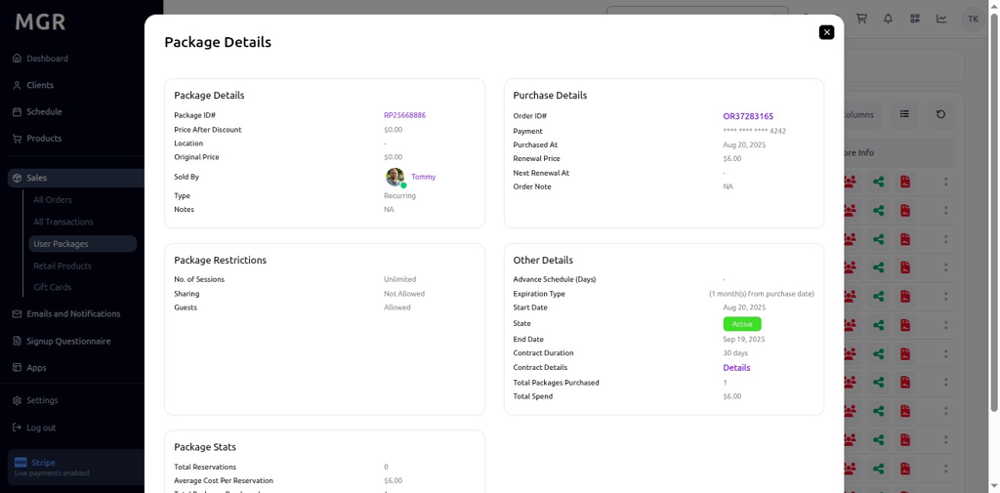
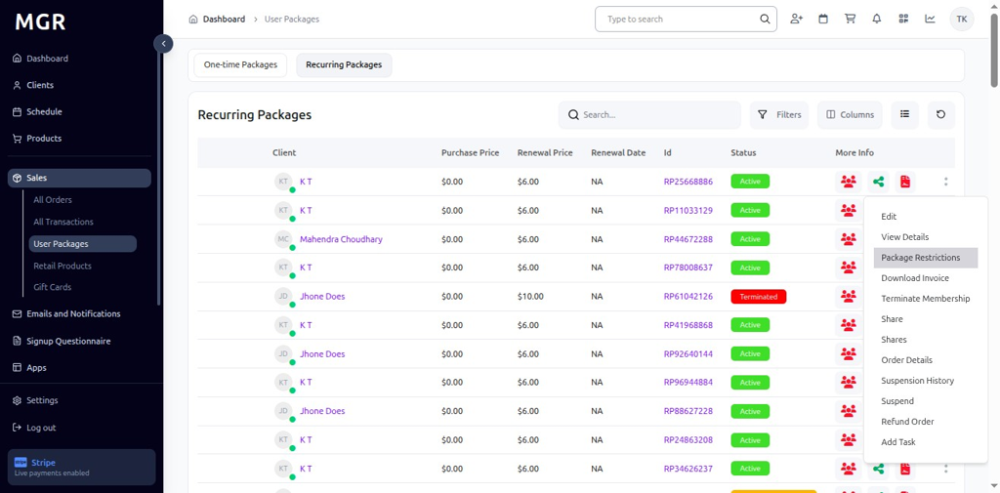
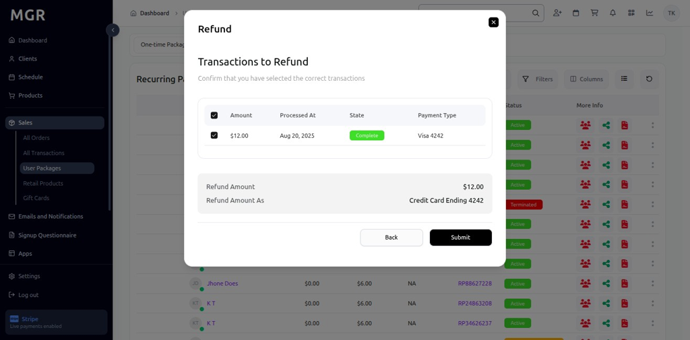

# User Recurring Packages Guide

This guide provides step-by-step instructions for accessing and managing user recurring packages in the Sales section of the admin dashboard.

## Overview

The User Recurring Packages view displays comprehensive recurring package information including package details, restrictions, order details, and package management options. This section allows administrators to view, edit, and manage all user recurring packages across the system.

## Accessing User Recurring Packages

### 1. Navigate to Dashboard

a. Go to the admin dashboard

**URL:** `https://coreology.staging.mgrapp.com/next/admin`

### 2. Open Sales Section

a. In the left sidebar, click **"Sales"** to open the reporting area of the MGR dashboard

### 3. Switch to "User Packages" View

a. Click **"User Packages"** to access the comprehensive packages listing

**URL:** `https://coreology.staging.mgrapp.com/admin/user_packages`

### 4. Switch to "Recurring Packages" and Select Package

a. Navigate to the **"Recurring Packages"** section

b. Click the icon that reveals further actions (usually represented by a symbol like three dots)

c. This opens the package actions menu

**URL:** `https://coreology.staging.mgrapp.com/admin/user_packages?t=recurring-packages`

## Recurring Package Management Operations

### 5. View Package Details

a. Click **"Details"** from the actions menu

b. This opens a detailed view of the selected recurring package

### 6. Display Package Details

The recurring package details page shows comprehensive information including:
- Package name and description
- Recurring schedule and frequency
- Package validity dates
- Current status and usage
- Associated user information

### 7. Edit Package

a. Click **"Edit"** to open the package editing popup

b. A form appears where you can edit:
   - Dates (start and end dates)
   - Notes
   - Guest Only status

c. Options to save or cancel changes are available

### 8. Display Edit Package Popup

The popup interface provides:
- Date selection fields for package validity
- Notes text area
- Guest Only toggle option
- Save button to confirm changes
- Cancel button to discard modifications

### 9. View Package Restrictions

a. Click **"Package Restrictions"** to access package limitation details

b. This opens the restrictions view for the selected recurring package

### 10. Display Package Restrictions

The restrictions view shows:
- Package usage limitations
- Recurring schedule restrictions
- Time-based restrictions
- Location restrictions
- Other applicable package constraints

### 11. Terminate Membership

a. Click **"Terminate Membership"** to initiate package termination

b. This opens a termination form for the recurring package

### 12. Display Terminate Membership Form

The termination form provides:
- **Terminate Date:** Date when package will be terminated
- **Terminate Reason:** Reason for package termination
- **Feedback:** Additional notes or feedback
- Save and cancel options

### 13. Download Invoice

a. Click **"Download Invoice"** to download the invoice for the recurring package

b. The invoice downloads for offline records and archiving

### 14. Share Package

a. Click **"Share"** to share the recurring package with another user

b. This opens the package sharing interface

### 15. Display Share Package Interface

The sharing interface provides:
- User selection dropdown
- Package sharing options
- Save button to confirm sharing
- Cancel button to abort the operation

### 16. View Package Shares

a. Click **"Shares"** to view the list of users the recurring package has been shared with

b. This displays all current package shares

### 17. Display Shares List

The shares list shows:
- Users who have access to the recurring package
- Share dates and permissions
- Current share status
- Share management options

### 18. View Order Details

a. Click **"Order Details"** to access the order information for the recurring package

b. This shows the original order and billing details

### 19. Display Order Details

The order details view shows:
- Original order information
- Billing details and payment history
- Recurring billing schedule
- Order status and fulfillment details

### 20. View Suspension History

a. Select **"Suspension History"** to view package suspension records

b. This displays all suspension events for the recurring package

### 21. Display Suspension History

The suspension history shows:
- Previous suspension dates
- Suspension reasons
- Suspension duration
- Resolution details

### 22. Suspend Package

a. Click **"Suspend"** to initiate package suspension

b. This opens the suspension confirmation dialog

### 23. Confirm Suspension

a. Review suspension details and reasons

b. Confirm the suspension action

c. Set suspension duration if applicable

### 24. Process Refund Order

a. Click **"Refund Order"** to initiate a refund for the recurring package

b. This opens the refund processing workflow

### 25. Select Transactions to Refund

a. Choose the specific transactions to be refunded

b. Select from available refundable transactions

c. Review refund amounts and details

### 26. Continue Refund Process

a. Click **"Continue"** to proceed with the refund

b. Review refund summary and confirm details

### 27. Submit Refund

a. Click **"Submit"** to process the refund

b. This finalizes the refund for the selected transactions

## Task Management for Recurring Packages

### 28. Add Task to Package

a. Click **"Add Task"** to create a new task associated with the recurring package

b. This opens the task creation workflow

### 29. Display Create Task Window

The task creation process involves multiple steps:

#### 29.1 General Details
- Fill in the general details of the task
- Provide task description and requirements
- Click **"Next"** to proceed to the next step

#### 29.2 Assign & Review
- Add **Assignee** for the task
- Add **Reviewer** for the task
- Set task priorities and deadlines
- Click **"Next"** to continue

#### 29.3 Attachments
- Attach images or files for task reference
- Upload relevant documents
- Add supporting materials
- Click **"Next"** to proceed

#### 29.4 Review Summary and Finish
- Verify all task details in the summary
- Review assignments and attachments
- Click **"Finish"** to add the task to the recurring package

## Troubleshooting

**Common Issues:**
- **Recurring Packages Not Loading:** Check internet connection and refresh the page
- **Package Details Not Displaying:** Verify package selection and permissions
- **Edit Operation Failures:** Ensure package data is complete and valid
- **Sharing Errors:** Confirm user permissions and package availability
- **Refund Processing Issues:** Verify transaction status and refund eligibility
- **Suspension Failures:** Check package status and suspension permissions

**Need Help?** Contact system administrator or technical support for assistance with recurring package management or access issues.
