# Detailed Sales Report Guide

This guide provides step-by-step instructions for accessing and using the Detailed Sales Report in the admin dashboard.

## Overview

The Detailed Sales Report displays comprehensive sales data categorized by package types including Retail, Onetime Package, Recurring Package, Gift Card, and No Show Late Cancel Custom Fee. The report provides detailed charts and KPIs for business analysis over selected time periods.

## Accessing the Detailed Sales Report

### 1. Navigate to Dashboard

a. Go to the admin dashboard

**URL:** `https://coreology.staging.mgrapp.com/next/admin`

### 2. Open Reports Section

a. In the left sidebar, click **"Reports"** to open the reporting area

**URL:** `https://coreology.staging.mgrapp.com/admin/reports`

### 3. Access Detailed Sales Report

The Detailed Sales Report loads showing charts and KPIs for all package types over the selected period.

**URL:** `https://coreology.staging.mgrapp.com/admin/reports?t=detailed_summary_sales`

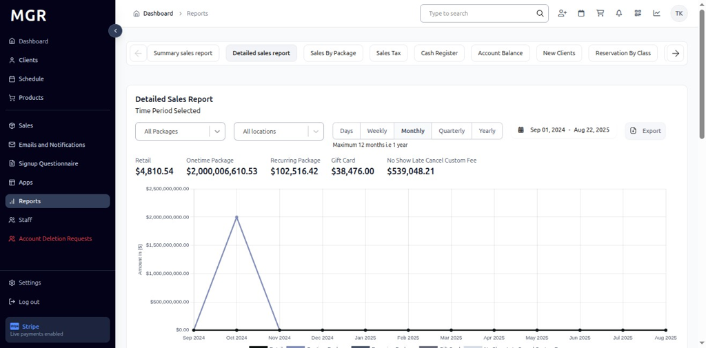

### 4. Select Package Types

By default, the report shows data for all existing packages as **"All Packages"**. Click the dropdown at the top-left of the report to filter and view data for specific package types:

### 5. Retail Package

- Select **"Retail"** from the dropdown

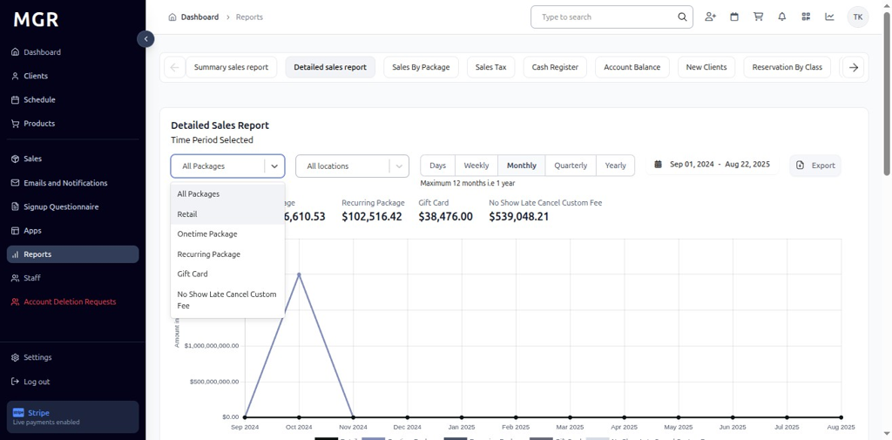

- View chart and metrics for retail sales only
- KPI updates to show Retail totals for the selected date range and interval

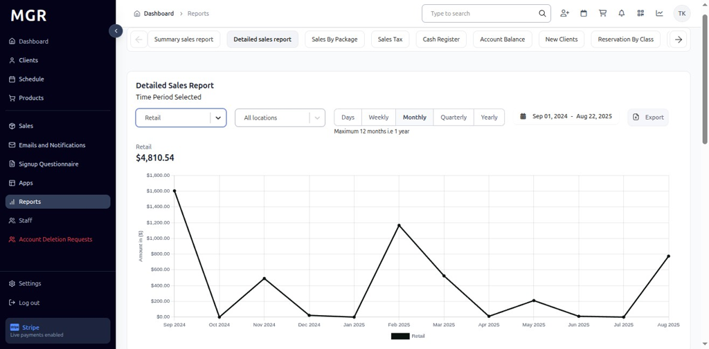

### 6. Onetime Package

- Select **"Onetime Package"** from the dropdown

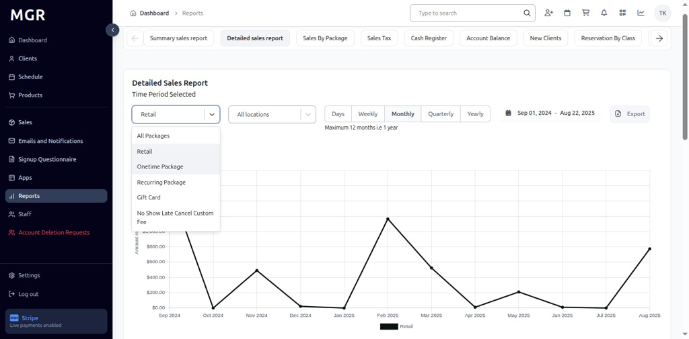

- View Onetime Package report with KPI and bars for each period
- Chart displays onetime package transaction trends

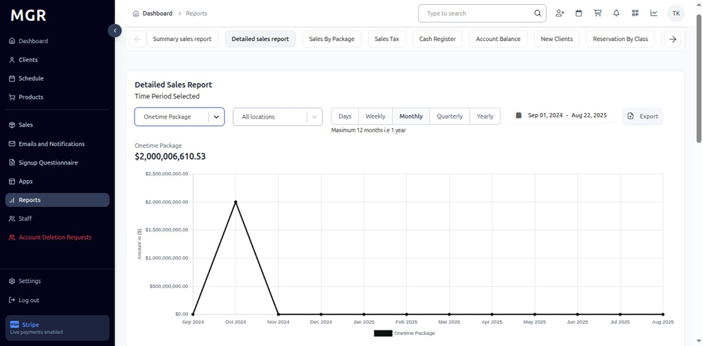

### 7. Recurring Package

- Select **"Recurring Package"** from the dropdown

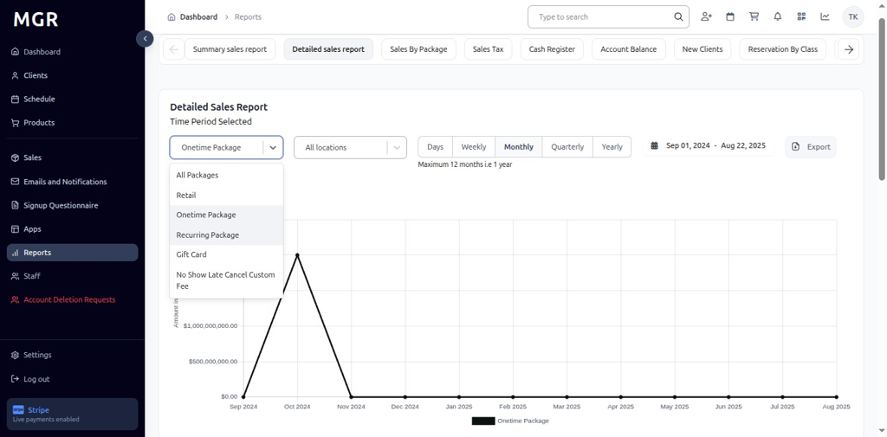

- Dashboard refreshes to display Recurring Package report metrics
- KPI and chart switch to Recurring Package totals for the chosen date range

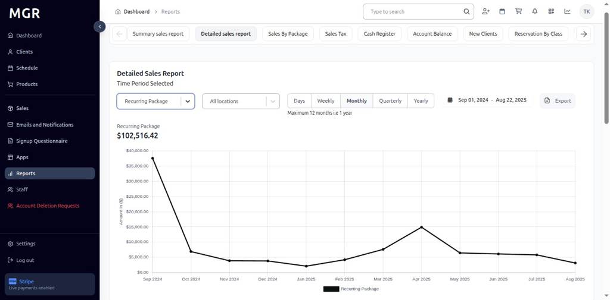

### 8. Gift Card

- Select **"Gift Card"** from the dropdown

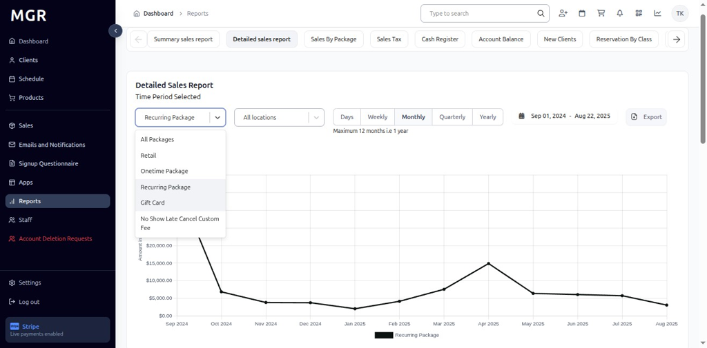

- View updates to show Gift Card totals and monthly bars
- Chart displays gift card transaction data

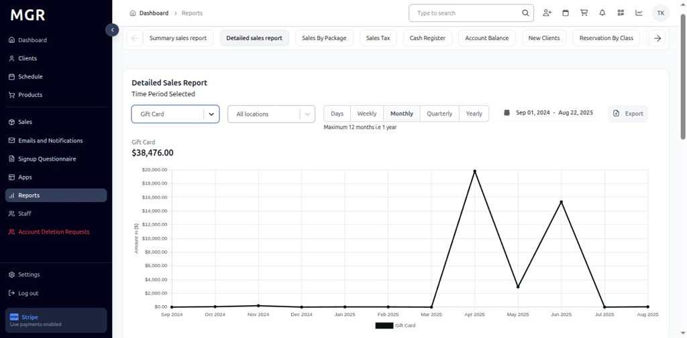

### 9. No Show Late Cancel Custom Fee

- Select **"No Show Late Cancel Custom Fee"** from the dropdown

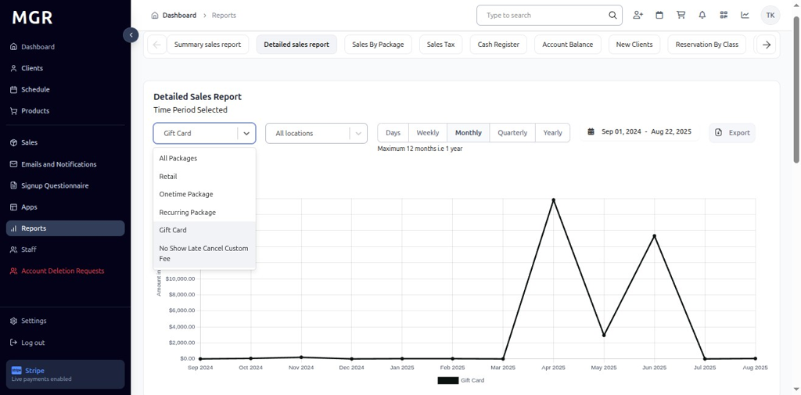

- View No Show Late Cancel Custom Fee totals and trend analysis
- Chart and KPI switch to No Show Late Cancel Custom Fee transaction data

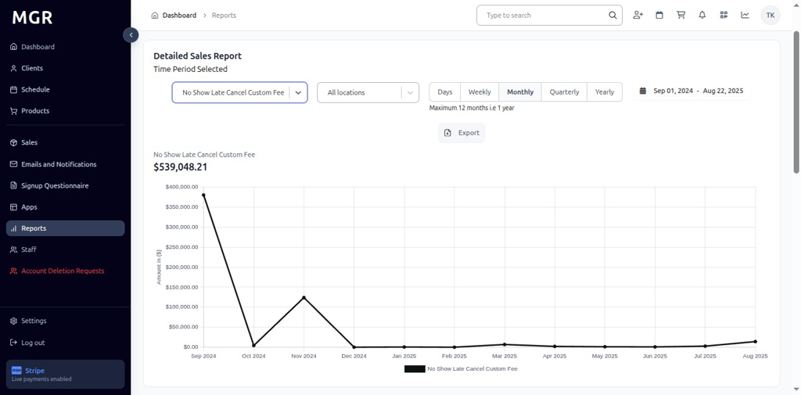

### 10. Filter by Location

a. Click **"All Locations"** dropdown beside the filter
b. Select the desired **Location** to scope the report to that specific site
c. Report updates to show data for the selected location only

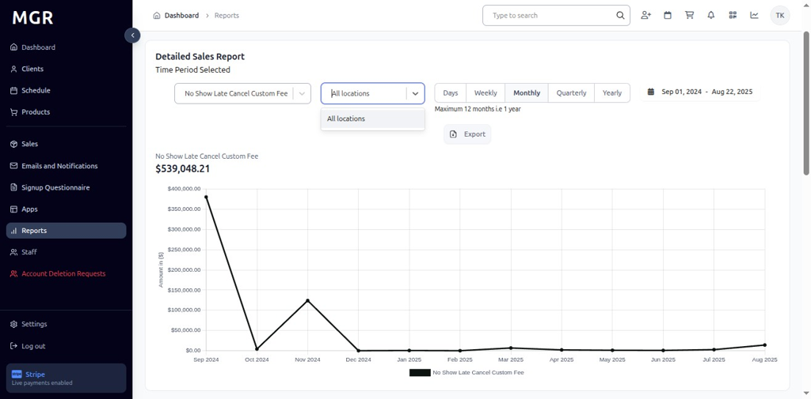

### 11. Time Period Options

#### 11.1 Daily View
- Click **"Days"** to switch to day-wise intervals
- View day-wise data for the selected date range
- Bars represent daily transaction totals

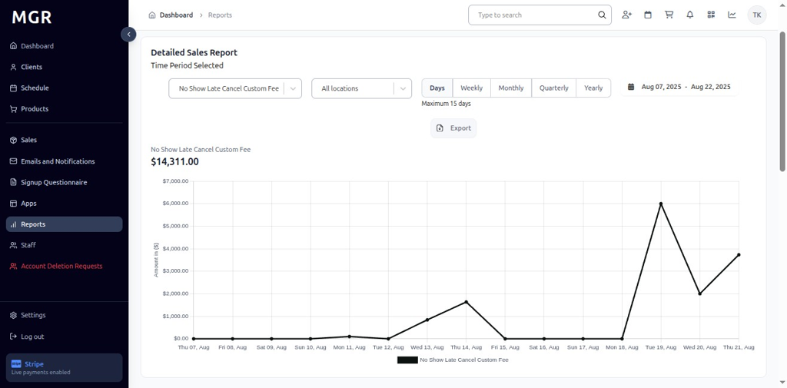

#### 11.2 Weekly View
- Click **"Weekly"** to switch to week-wise intervals
- Report displays week-wise bars and KPIs
- Data aggregated by week across the selected date range

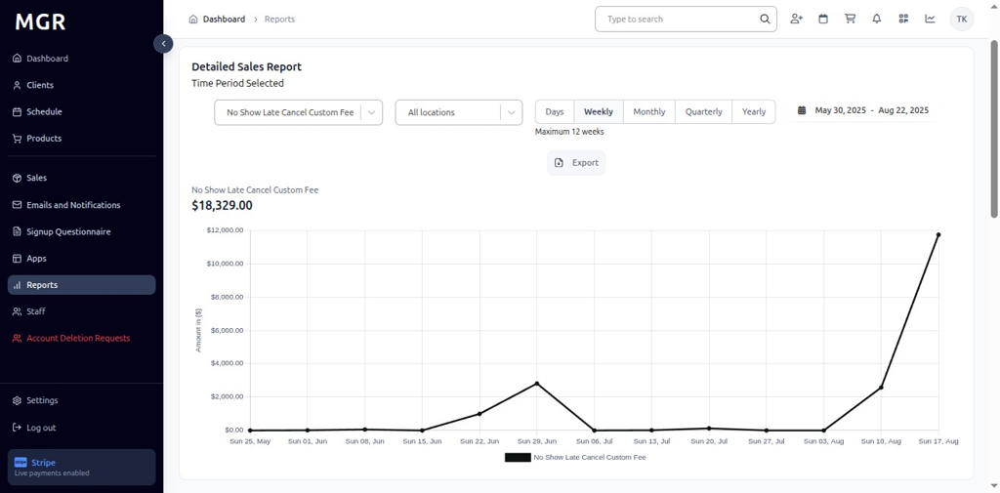

#### 11.3 Monthly View
- Click **"Monthly"** to switch to month-wise intervals
- View month-wise totals and chart representation
- Bars show monthly transaction summaries

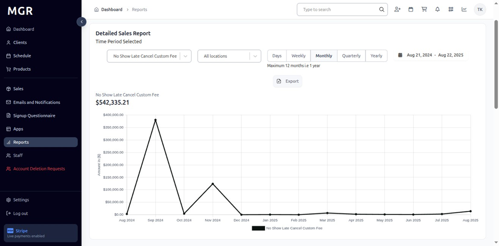

#### 11.4 Quarterly View
- Click **"Quarterly"** to switch to quarter-wise intervals
- Report aggregates data by quarter across the chosen period
- Long-term trend analysis becomes visible

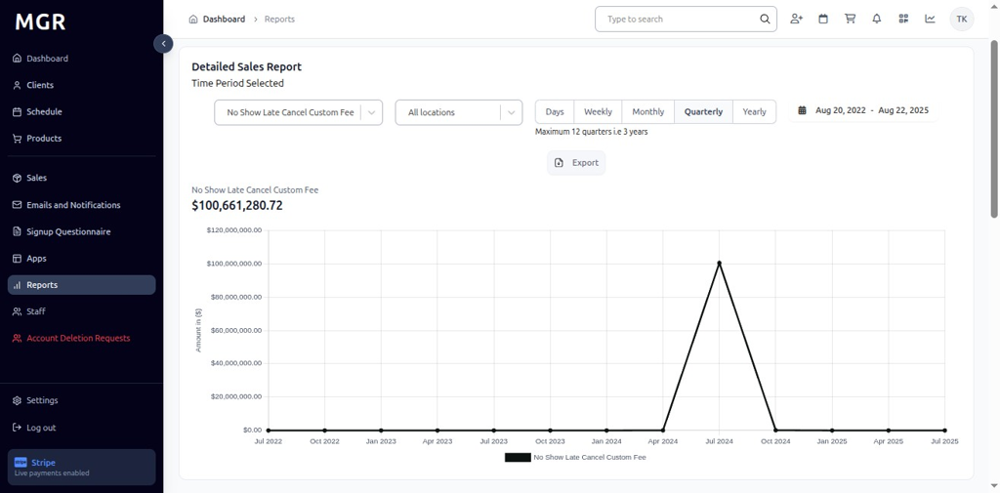

#### 11.5 Yearly View
- Click **"Yearly"** to switch to year-wise intervals
- Dashboard summarizes totals by year
- Provides long-range metrics and annual comparisons

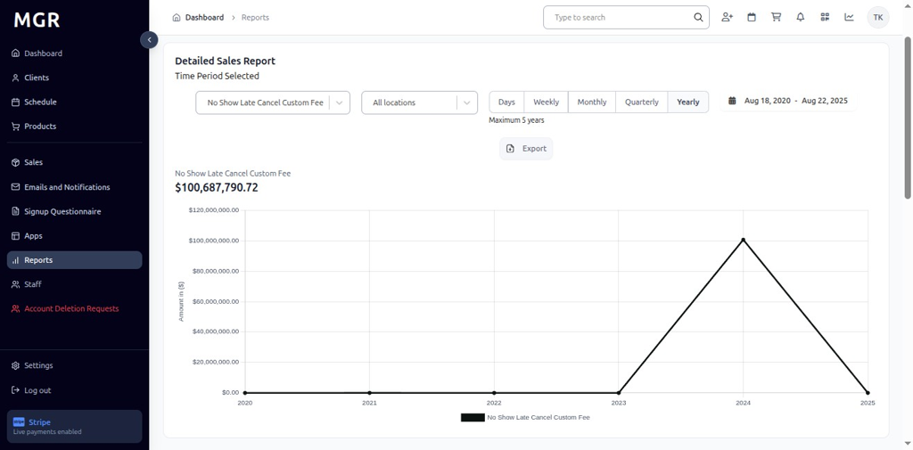

### 12. Access Export Options

Click the **"Export"** button in the top-right of the Detailed Sales Report to open download options.

### 13. Export as CSV

a. Click **"Export as CSV"** from the export menu
b. File downloads in .csv format
c. Compatible with spreadsheet applications

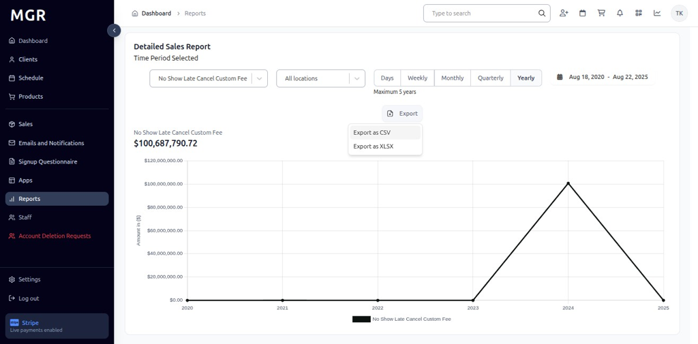

### 14. Export as Excel

a. Click **"Export as XLSX"** from the export menu
b. File downloads in Excel (.xlsx) format
c. Maintains formatting and chart data

## Troubleshooting

**Common Issues:**
- **Report Not Loading:** Check internet connection and refresh the page
- **Data Not Updating:** Verify package type selection and date range filters
- **Export Failures:** Ensure sufficient permissions and try smaller date ranges

**Need Help?** Contact system administrator or technical support for assistance with report access or data issues.
