# New Clients Report Guide

This guide provides step-by-step instructions for accessing and using the New Clients Report in the admin dashboard.

## Overview

The New Clients Report displays comprehensive new client data including Total New Users, New Paid Users, New Active Users, and Revenue From New Users. The report provides detailed charts and KPIs for new client analysis over selected time periods, allowing users to analyze client acquisition performance and trends.

## Accessing the New Clients Report

### 1. Navigate to Dashboard

a. Go to the admin dashboard

**URL:** `https://coreology.staging.mgrapp.com/next/admin`

### 2. Open Reports Section

a. In the left sidebar, click **"Reports"** to open the reporting area

**URL:** `https://coreology.staging.mgrapp.com/admin/reports`

### 3. Access New Clients Report

The New Clients Report loads showing charts and KPIs for Credited, Failed, Refunded, Voided, and Complete over the selected period.

**URL:** `https://coreology.staging.mgrapp.com/admin/reports?t=new_clients`

### 4. Select Client Metrics

Click the **"Select Options"** dropdown at the top-left of the report to filter by different client metrics:

#### 4.1 Total New Users

- Select **"Total New Users"** from the dropdown

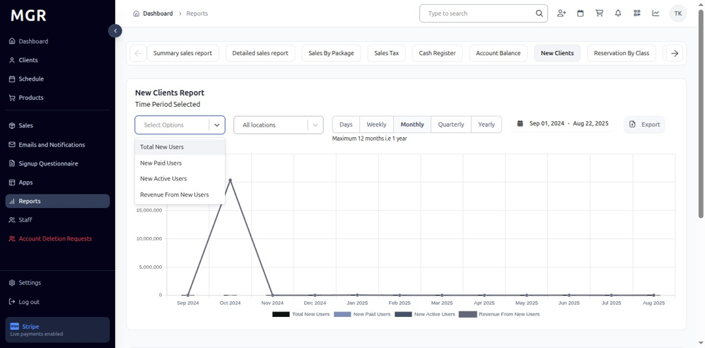

- View chart and metrics for total new user registrations
- KPI updates to show Total New Users totals for the selected date range and interval

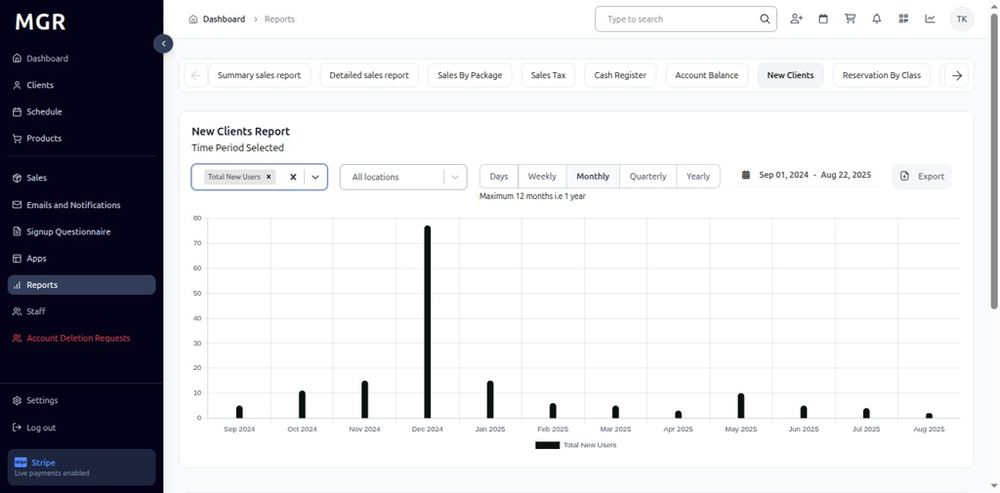

#### 4.2 New Paid Users

- Select **"New Paid Users"** from the dropdown

- View New Paid Users report with KPI and bars for each period
- Chart displays new paid user acquisition trends

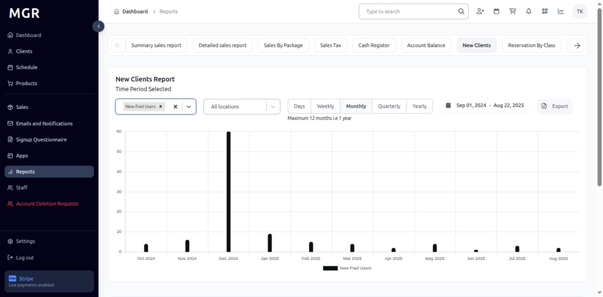

#### 4.3 New Active Users

- Select **"New Active Users"** from the dropdown

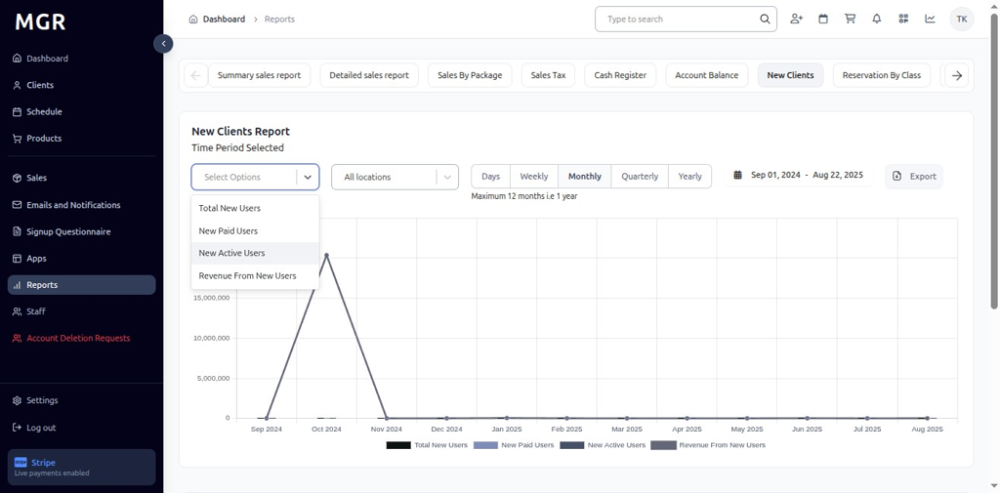

- Dashboard refreshes to display New Active Users report metrics
- KPI and chart switch to New Active Users totals for the chosen date range

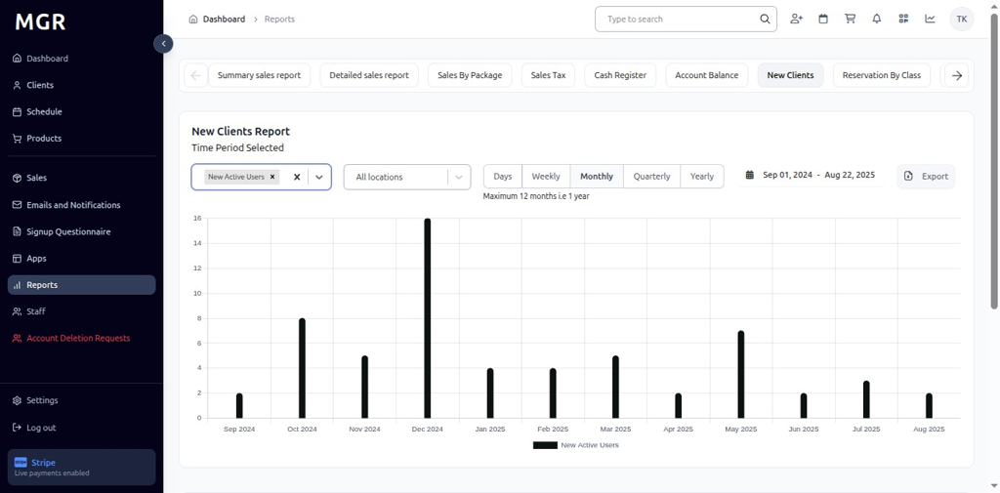

#### 4.4 Revenue From New Users

- Select **"Revenue From New Users"** from the dropdown

- View updates to show Revenue From New Users totals and monthly bars
- Chart displays revenue generated from new client acquisitions

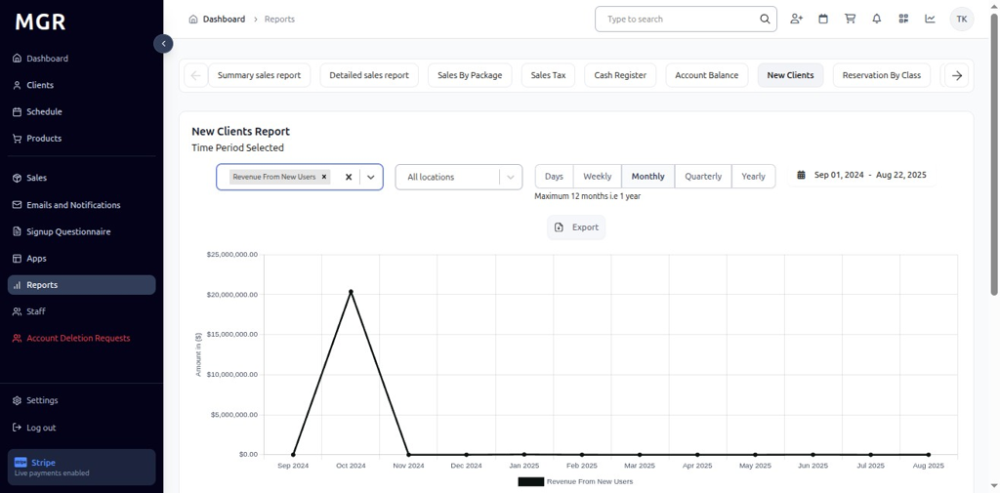

### 5. Filter by Location

a. Click **"All Locations"** dropdown beside the filter
b. Select the desired **Location** to scope the report to that specific site
c. Report updates to show data for the selected location only

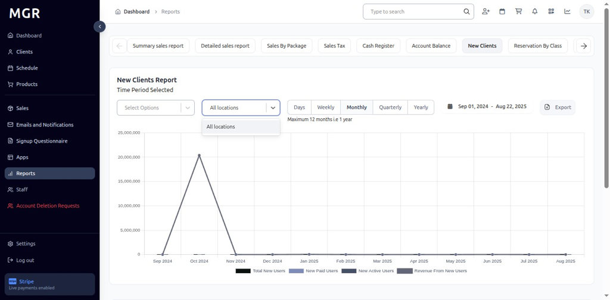

### 6. Time Period Options

#### 6.1 Daily View
- Click **"Days"** to switch to day-wise intervals
- View day-wise new client data for the selected date range
- Bars represent daily new client acquisition totals

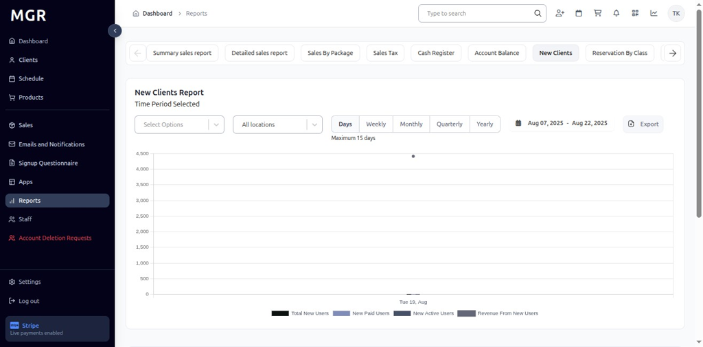

#### 6.2 Weekly View
- Click **"Weekly"** to switch to week-wise intervals
- Report displays week-wise bars and KPIs
- Data aggregated by week across the selected date range

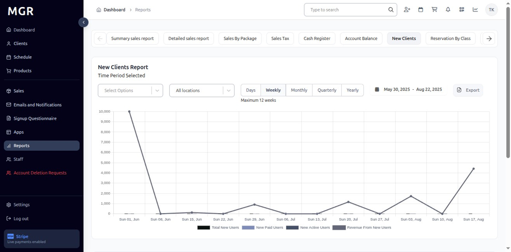

#### 6.3 Monthly View
- Click **"Monthly"** to switch to month-wise intervals
- View month-wise totals and chart representation
- Bars show monthly new client acquisition summaries

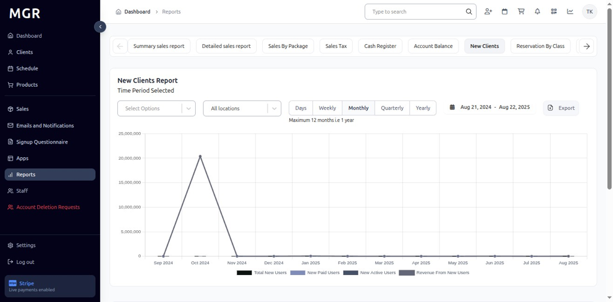

#### 6.4 Quarterly View
- Click **"Quarterly"** to switch to quarter-wise intervals
- Report aggregates data by quarter across the chosen period
- Long-term new client acquisition trend analysis becomes visible

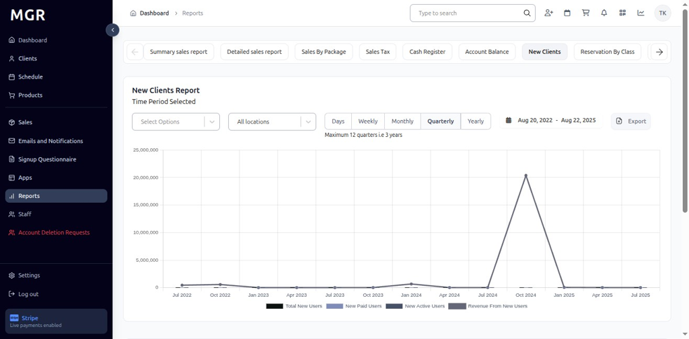

#### 6.5 Yearly View
- Click **"Yearly"** to switch to year-wise intervals
- Dashboard summarizes new client totals by year
- Provides long-range new client metrics and annual comparisons

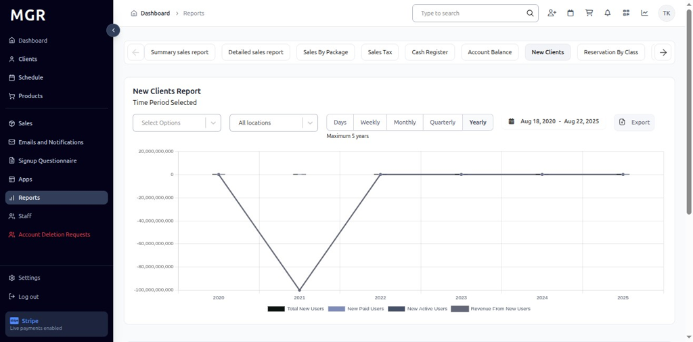

### 7. Access Export Options

Click the **"Export"** button in the top-right of the New Clients Report to open download options.

### 8. Export as CSV

a. Click **"Export as CSV"** from the export menu
b. File downloads in .csv format
c. Compatible with spreadsheet applications

### 9. Export as Excel

a. Click **"Export as XLSX"** from the export menu
b. File downloads in Excel (.xlsx) format
c. Maintains formatting and chart data

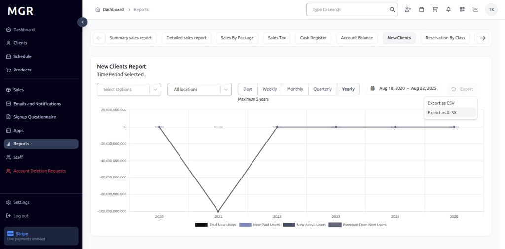

## Troubleshooting

**Common Issues:**
- **Report Not Loading:** Check internet connection and refresh the page
- **Data Not Updating:** Verify metric selection and date range filters
- **Export Failures:** Ensure sufficient permissions and try smaller date ranges

**Need Help?** Contact system administrator or technical support for assistance with report access or data issues.
