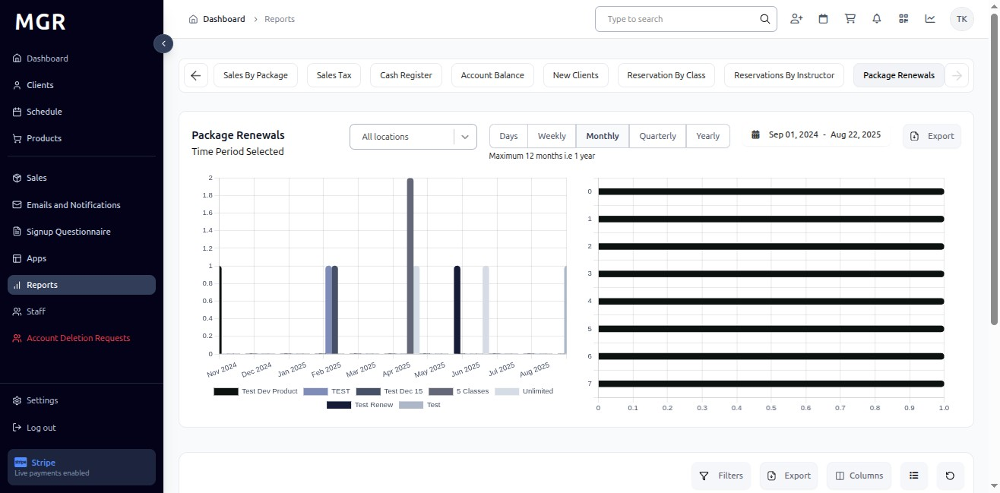
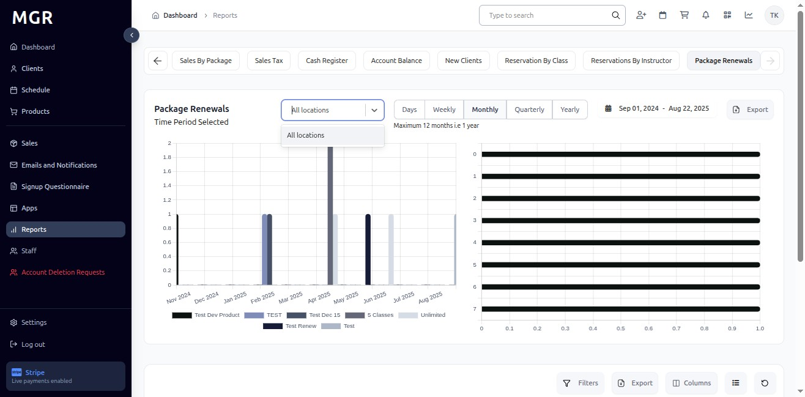
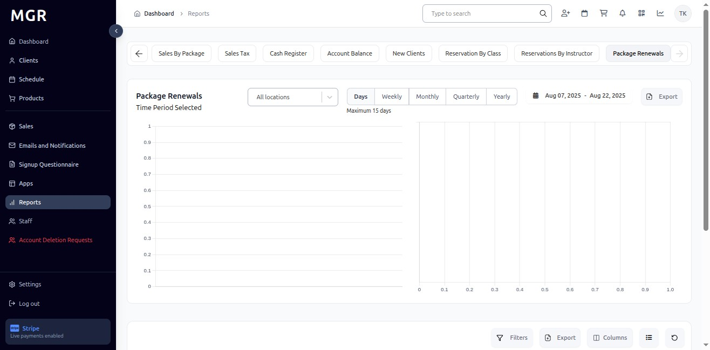
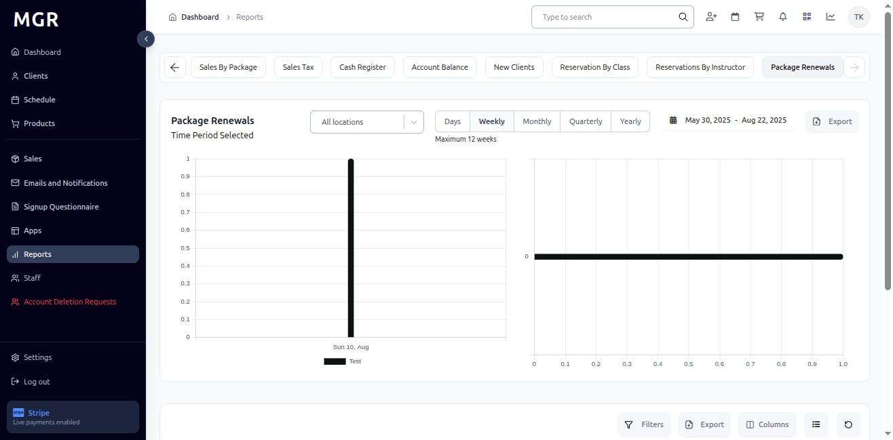
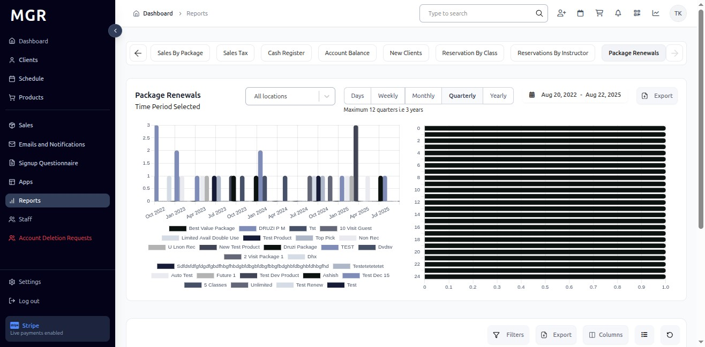
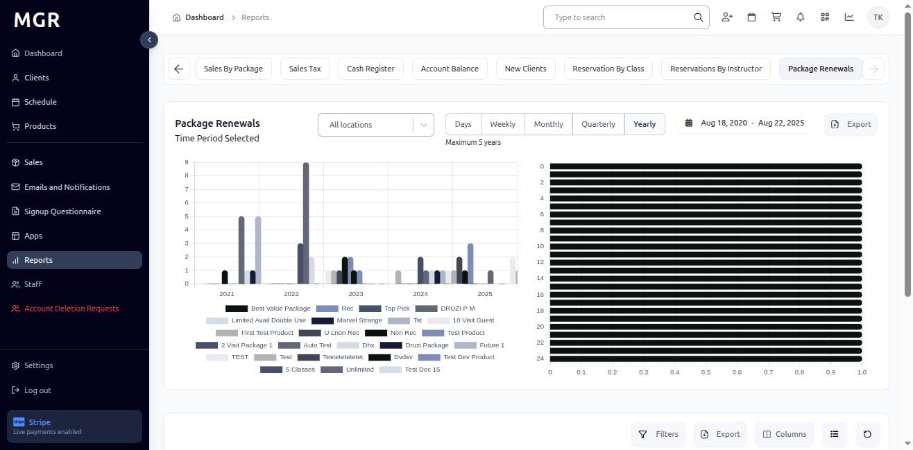
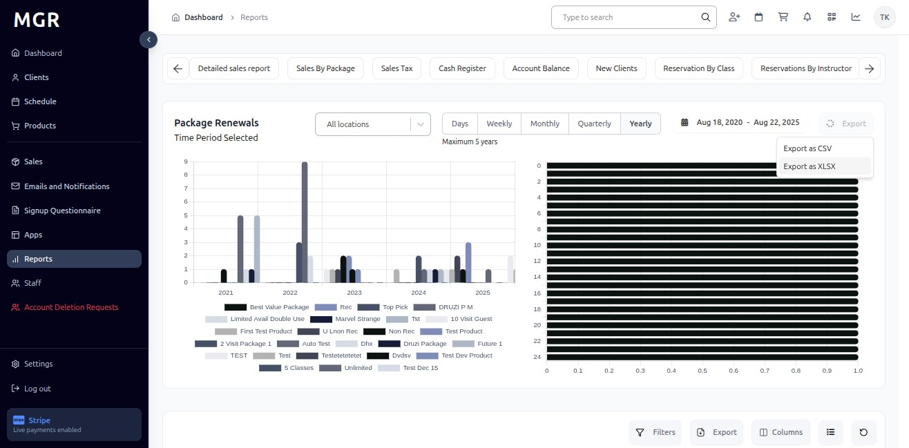

# Package Renewals Report Guide

This guide provides step-by-step instructions for accessing and using the Package Renewals Report in the admin dashboard.

## Overview

The Package Renewals Report displays comprehensive package renewal data for different locations. The report provides detailed charts and KPIs for package renewal analysis over selected time periods, allowing users to analyze renewal performance and customer retention trends.

## Accessing the Package Renewals Report

### 1. Navigate to Dashboard

a. Go to the admin dashboard

**URL:** `https://coreology.staging.mgrapp.com/next/admin`

### 2. Open Reports Section

a. In the left sidebar, click **"Reports"** to open the reporting area

**URL:** `https://coreology.staging.mgrapp.com/admin/reports`

### 3. Access Package Renewals Report

The Package Renewals Report loads showing charts and KPIs for the selected period.

**URL:** `https://coreology.staging.mgrapp.com/admin/reports?t=package_renewals`

### 4. Filter by Location

By default, the report shows data for all locations. Click the **"All Locations"** dropdown beside the filter to select specific locations.

#### 4.1 Select Specific Location

- Select the desired **Location** from the dropdown to scope the report to that specific site
- Report updates to show data for the selected location only
- KPI and charts reflect location-specific package renewal data

### 5. Time Period Options

#### 5.1 Daily View
- Click **"Days"** to switch to day-wise intervals
- View day-wise package renewal data for the selected date range
- Bars represent daily package renewal totals

#### 5.2 Weekly View
- Click **"Weekly"** to switch to week-wise intervals
- Report displays week-wise bars and KPIs
- Data aggregated by week across the selected date range

#### 5.3 Monthly View
- Click **"Monthly"** to switch to month-wise intervals
- View month-wise totals and chart representation
- Bars show monthly package renewal summaries

#### 5.4 Quarterly View
- Click **"Quarterly"** to switch to quarter-wise intervals
- Report aggregates data by quarter across the chosen period
- Long-term package renewal trend analysis becomes visible

#### 5.5 Yearly View
- Click **"Yearly"** to switch to year-wise intervals
- Dashboard summarizes package renewal totals by year
- Provides long-range package renewal metrics and annual comparisons

### 6. Access Export Options

Click the **"Export"** button in the top-right of the Package Renewals Report to open download options.

### 7. Export as CSV

a. Click **"Export as CSV"** from the export menu
b. File downloads in .csv format
c. Compatible with spreadsheet applications

### 8. Export as Excel

a. Click **"Export as XLSX"** from the export menu
b. File downloads in Excel (.xlsx) format
c. Maintains formatting and chart data

## Troubleshooting

**Common Issues:**
- **Report Not Loading:** Check internet connection and refresh the page
- **Data Not Updating:** Verify location selection and date range filters
- **Export Failures:** Ensure sufficient permissions and try smaller date ranges

**Need Help?** Contact system administrator or technical support for assistance with report access or data issues.
