# Reservation By Class Report Guide

This guide provides step-by-step instructions for accessing and using the Reservation By Class Report in the admin dashboard.

## Overview

The Reservation By Class Report displays comprehensive reservation data for different fitness classes including Full Body Workout, Dance Fit, Barre Sculpt, and other class offerings. The report provides detailed charts and KPIs for class reservation analysis over selected time periods, allowing users to analyze class popularity and booking performance.

## Accessing the Reservation By Class Report

### 1. Navigate to Dashboard

a. Go to the admin dashboard

**URL:** `https://coreology.staging.mgrapp.com/next/admin`

### 2. Open Reports Section

a. In the left sidebar, click **"Reports"** to open the reporting area

**URL:** `https://coreology.staging.mgrapp.com/admin/reports`

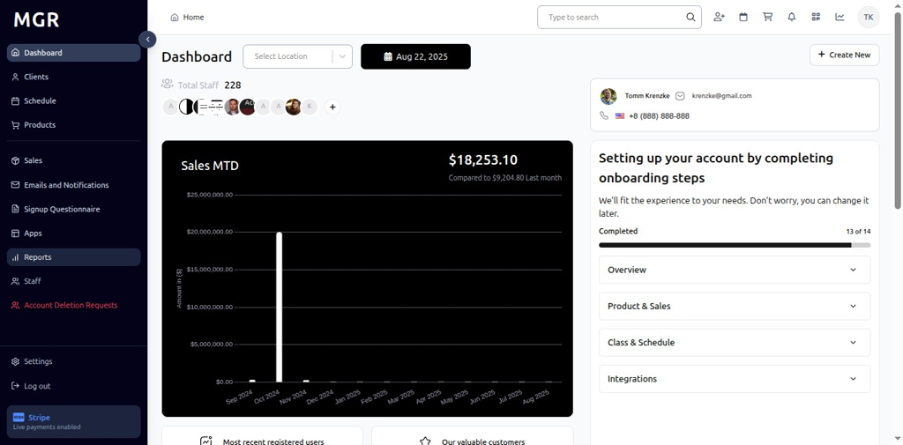

### 3. Access Reservation By Class Report

The Reservation By Class Report loads showing charts and KPIs for Credited, Failed, Refunded, Voided, and Complete over the selected period.

**URL:** `https://coreology.staging.mgrapp.com/admin/reports?t=offerings`

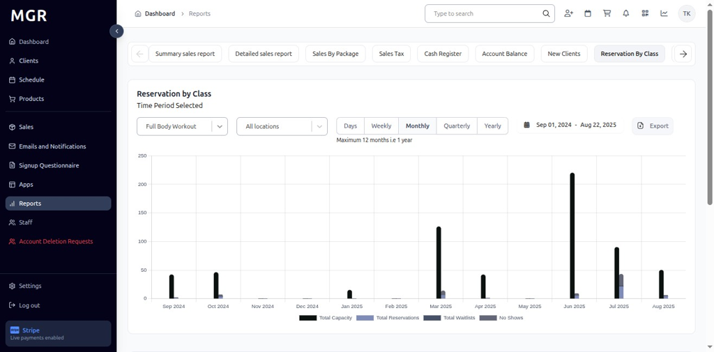

### 4. View Class Offerings

By default, the report shows data for all class offerings. The report displays various class types including:

#### 4.1 Full Body Workout

- View chart and metrics for Full Body Workout class reservations
- KPI shows Full Body Workout totals for the selected date range and interval

#### 4.2 Dance Fit

- Select **"Dance Fit"** from the dropdown to filter the chart and metrics

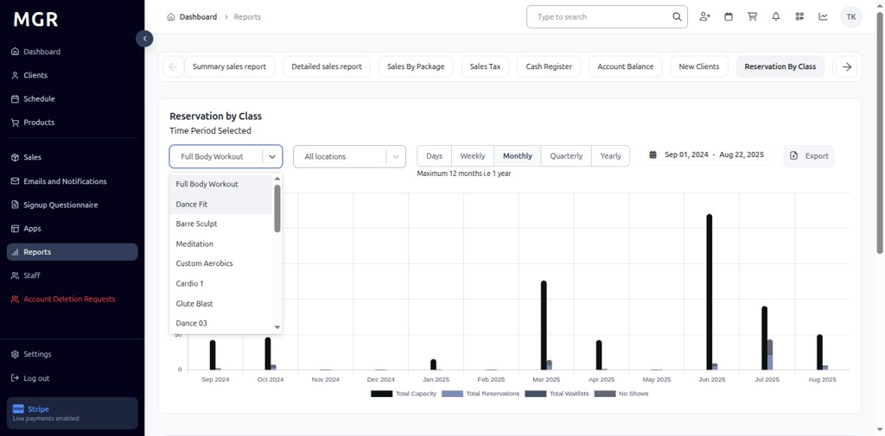

- View chart and metrics for Dance Fit class reservations
- KPI updates to show Dance Fit class totals for the selected date range and interval

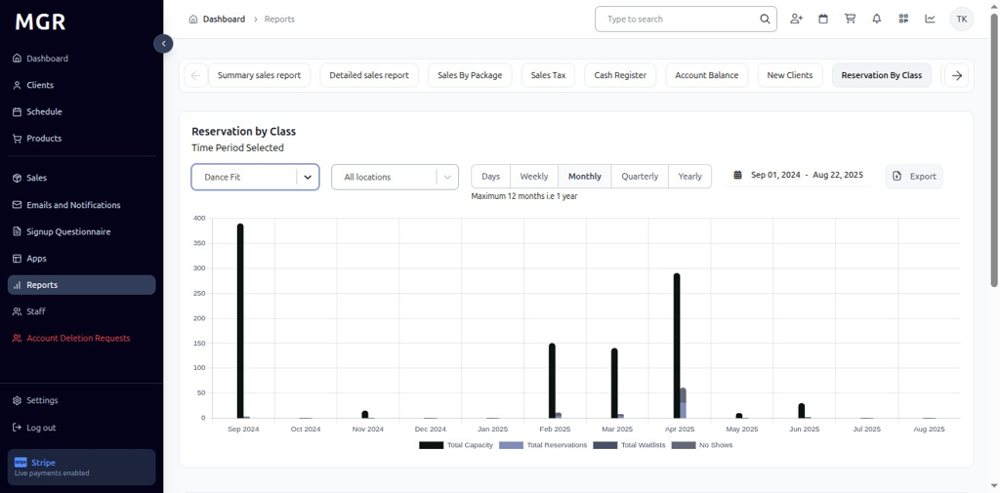

#### 4.3 Barre Sculpt

- Select **"Barre Sculpt"** from the dropdown

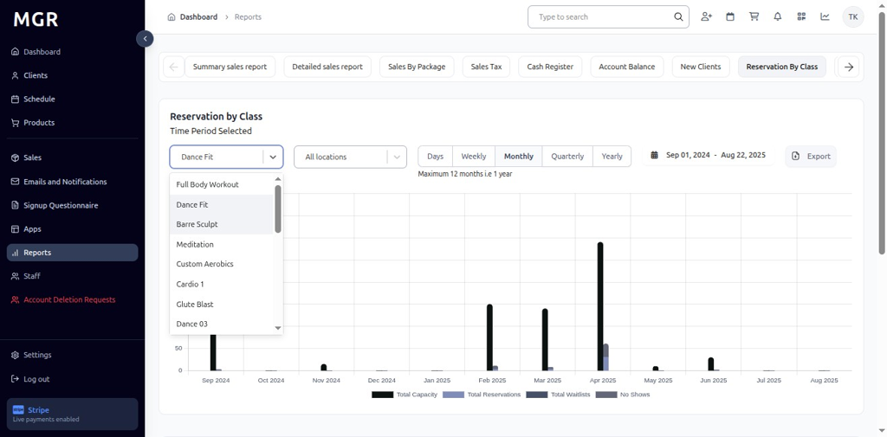

- Dashboard refreshes to display Barre Sculpt report metrics
- KPI and chart switch to Barre Sculpt totals for the chosen date range

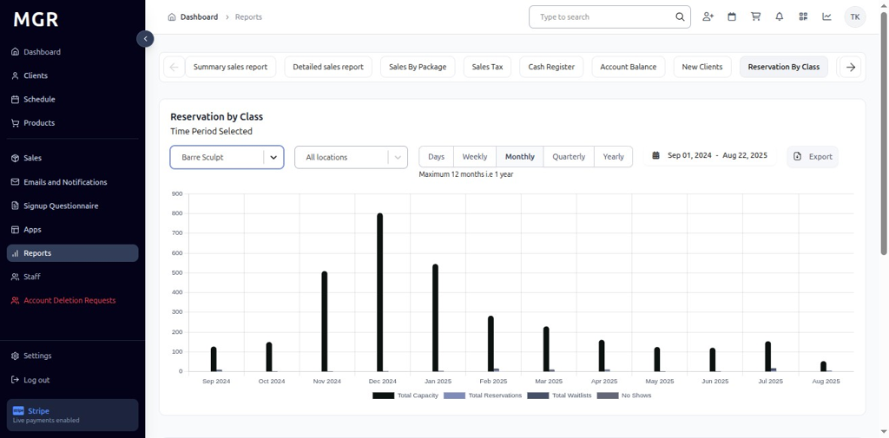

### 5. Filter by Location

a. Click **"All Locations"** dropdown beside the filter
b. Select the desired **Location** to scope the report to that specific site
c. Report updates to show data for the selected location only

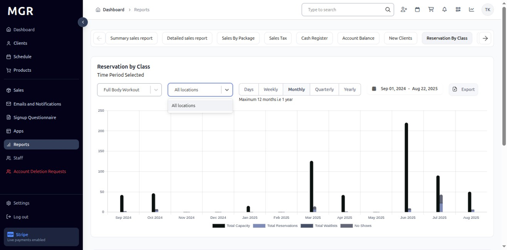

### 6. Time Period Options

#### 6.1 Daily View
- Click **"Days"** to switch to day-wise intervals
- View day-wise class reservation data for the selected date range
- Bars represent daily class reservation totals

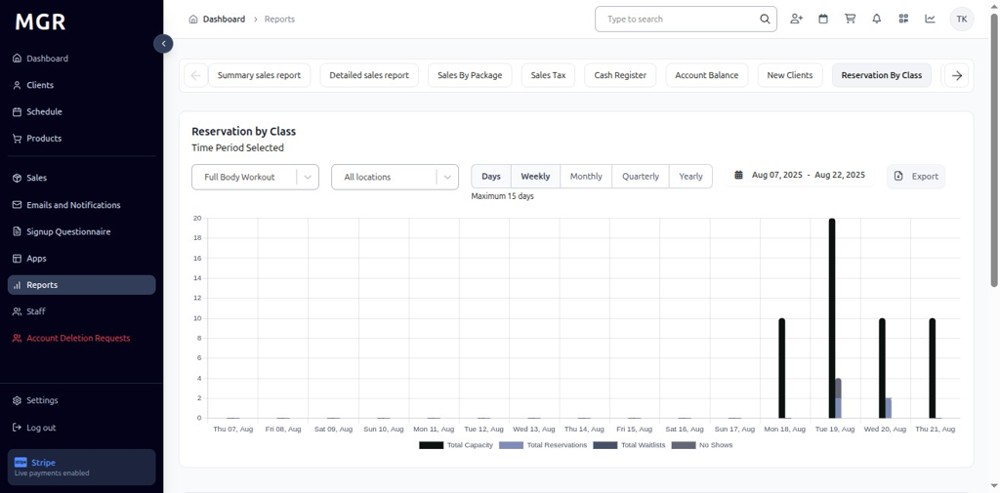

#### 6.2 Weekly View
- Click **"Weekly"** to switch to week-wise intervals
- Report displays week-wise bars and KPIs
- Data aggregated by week across the selected date range

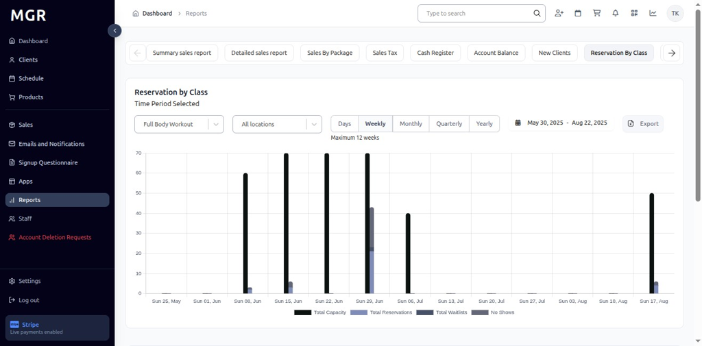

#### 6.3 Monthly View
- Click **"Monthly"** to switch to month-wise intervals
- View month-wise totals and chart representation
- Bars show monthly class reservation summaries

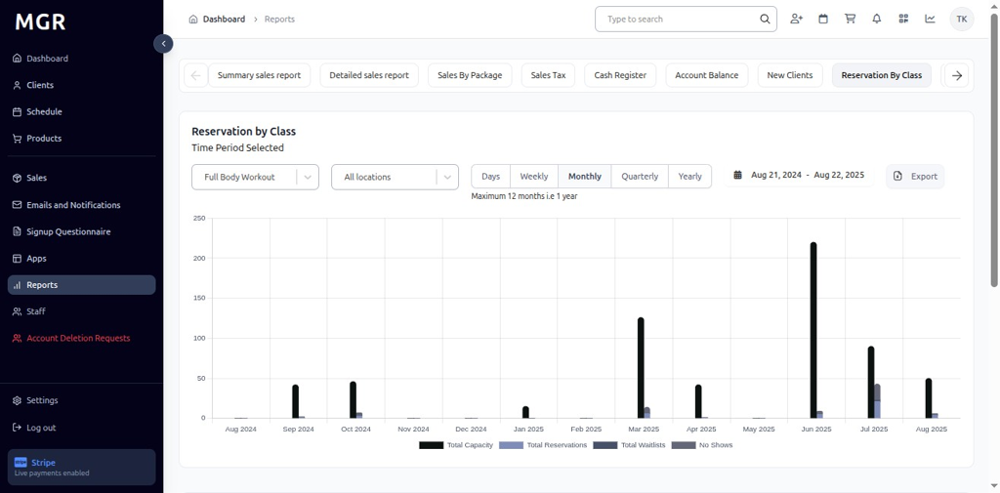

#### 6.4 Quarterly View
- Click **"Quarterly"** to switch to quarter-wise intervals
- Report aggregates data by quarter across the chosen period
- Long-term class reservation trend analysis becomes visible

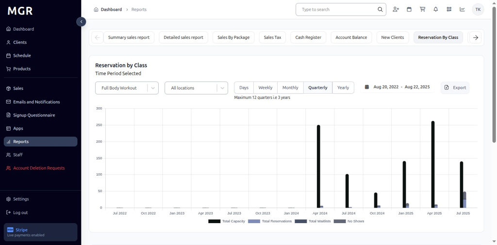

#### 6.5 Yearly View
- Click **"Yearly"** to switch to year-wise intervals
- Dashboard summarizes class reservation totals by year
- Provides long-range class reservation metrics and annual comparisons

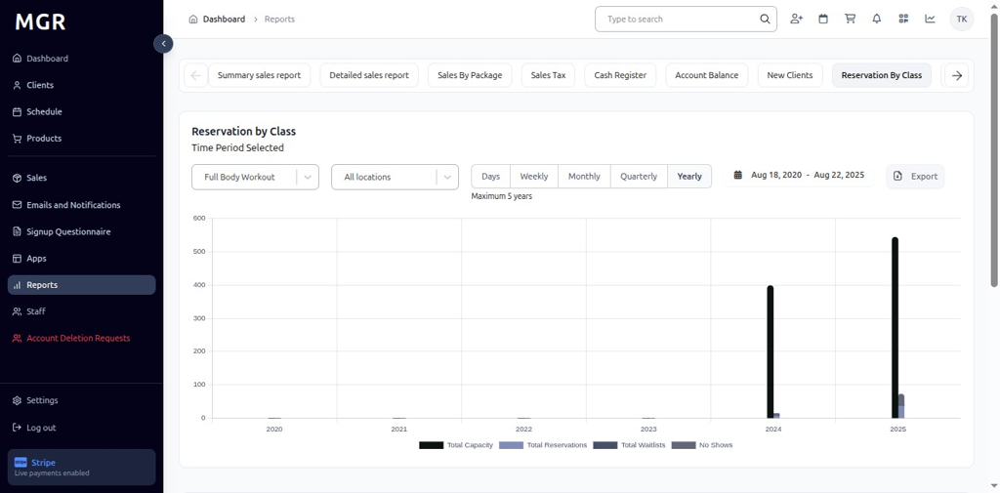

### 7. Access Export Options

Click the **"Export"** button in the top-right of the Reservation By Class Report to open download options.

### 8. Export as CSV

a. Click **"Export as CSV"** from the export menu
b. File downloads in .csv format
c. Compatible with spreadsheet applications

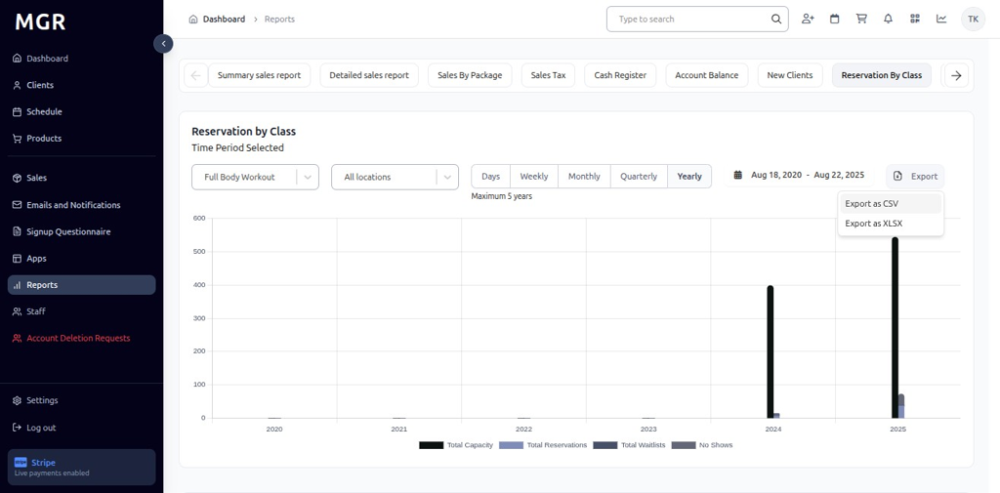

### 9. Export as Excel

a. Click **"Export as XLSX"** from the export menu
b. File downloads in Excel (.xlsx) format
c. Maintains formatting and chart data

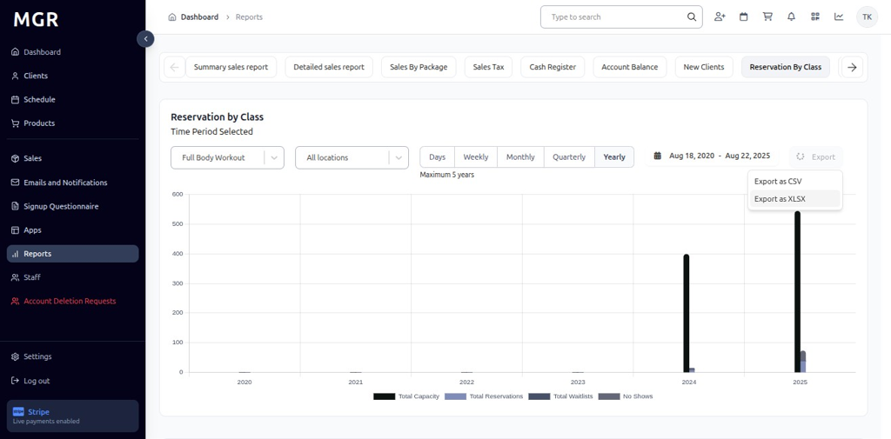

## Troubleshooting

**Common Issues:**
- **Report Not Loading:** Check internet connection and refresh the page
- **Data Not Updating:** Verify class selection and date range filters
- **Export Failures:** Ensure sufficient permissions and try smaller date ranges

**Need Help?** Contact system administrator or technical support for assistance with report access or data issues.
