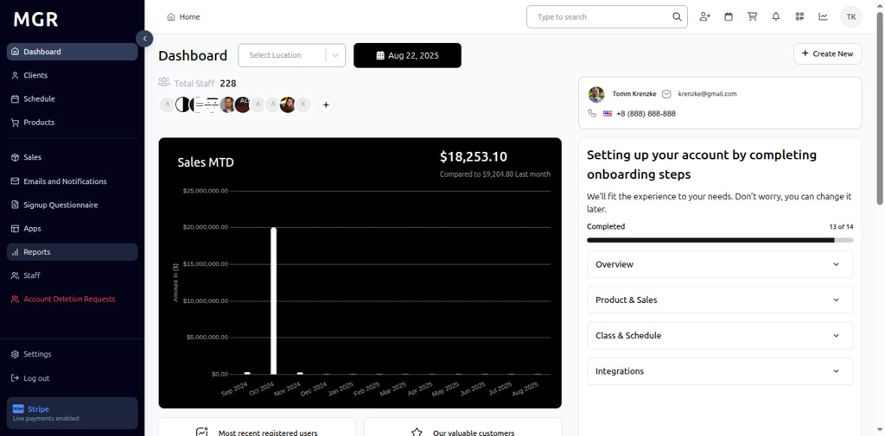

# Reservation By Instructor Report Guide

This guide provides step-by-step instructions for accessing and using the Reservation By Instructor Report in the admin dashboard.

## Overview

The Reservation By Instructor Report displays comprehensive reservation data for different fitness instructors including Ajeet 5, Eugene, and other instructors. The report provides detailed charts and KPIs for instructor performance analysis over selected time periods, allowing users to analyze instructor popularity and class booking performance.

## Accessing the Reservation By Instructor Report

### 1. Navigate to Dashboard

a. Go to the admin dashboard

**URL:** `https://coreology.staging.mgrapp.com/next/admin`

### 2. Open Reports Section

a. In the left sidebar, click **"Reports"** to open the reporting area

**URL:** `https://coreology.staging.mgrapp.com/admin/reports`

### 3. Access Reservation By Instructor Report

The Reservation By Instructor Report loads showing charts and KPIs data over the selected period.

**URL:** `https://coreology.staging.mgrapp.com/admin/reports?t=offerings_by_instructor`

### 4. View Instructor Performance

By default, the report shows data for all instructors. The report displays various instructor data including:

#### 4.1 Ajeet 5

- View chart and metrics for Ajeet 5 instructor reservations
- KPI shows Ajeet 5 totals for the selected date range and interval

#### 4.2 Eugene

- Select **"Eugene"** from the dropdown to filter the chart and metrics

- View chart and metrics for Eugene instructor reservations
- KPI updates to show Eugene Instructor totals reservation for the selected date range and interval

### 5. Filter by Location

a. Click **"All Locations"** dropdown beside the filter
b. Select the desired **Location** to scope the report to that specific site
c. Report updates to show data for the selected location only

### 6. Time Period Options

#### 6.1 Daily View
- Click **"Days"** to switch to day-wise intervals
- View day-wise instructor reservation data for the selected date range
- Bars represent daily instructor reservation totals

#### 6.2 Weekly View
- Click **"Weekly"** to switch to week-wise intervals
- Report displays week-wise bars and KPIs
- Data aggregated by week across the selected date range

#### 6.3 Monthly View
- Click **"Monthly"** to switch to month-wise intervals
- View month-wise totals and chart representation
- Bars show monthly instructor reservation summaries

#### 6.4 Quarterly View
- Click **"Quarterly"** to switch to quarter-wise intervals
- Report aggregates data by quarter across the chosen period
- Long-term instructor performance trend analysis becomes visible

#### 6.5 Yearly View
- Click **"Yearly"** to switch to year-wise intervals
- Dashboard summarizes instructor reservation totals by year
- Provides long-range instructor performance metrics and annual comparisons

### 7. Access Export Options

Click the **"Export"** button in the top-right of the Reservation By Instructor Report to open download options.

### 8. Export as CSV

a. Click **"Export as CSV"** from the export menu
b. File downloads in .csv format
c. Compatible with spreadsheet applications

### 9. Export as Excel

a. Click **"Export as XLSX"** from the export menu
b. File downloads in Excel (.xlsx) format
c. Maintains formatting and chart data

## Troubleshooting

**Common Issues:**
- **Report Not Loading:** Check internet connection and refresh the page
- **Data Not Updating:** Verify instructor selection and date range filters
- **Export Failures:** Ensure sufficient permissions and try smaller date ranges

**Need Help?** Contact system administrator or technical support for assistance with report access or data issues.
