# Sales By Packages Report Guide

This guide provides step-by-step instructions for accessing and using the Sales By Packages Report in the admin dashboard.

## Overview

The Sales By Packages Report displays comprehensive sales data for specific packages including 5 Classes, Test, ABL, and other existing packages. The report provides detailed charts and KPIs for business analysis over selected time periods, allowing users to analyze performance of individual packages.

## Accessing the Sales By Packages Report

### 1. Navigate to Dashboard

a. Go to the admin dashboard

**URL:** `https://coreology.staging.mgrapp.com/next/admin`

### 2. Open Reports Section

a. In the left sidebar, click **"Reports"** to open the reporting area

**URL:** `https://coreology.staging.mgrapp.com/admin/reports`

### 3. Access Sales By Packages Report

The Sales By Packages Report loads showing charts and KPIs for all packages over the selected period.

**URL:** `https://coreology.staging.mgrapp.com/admin/reports?t=sales_by_package`

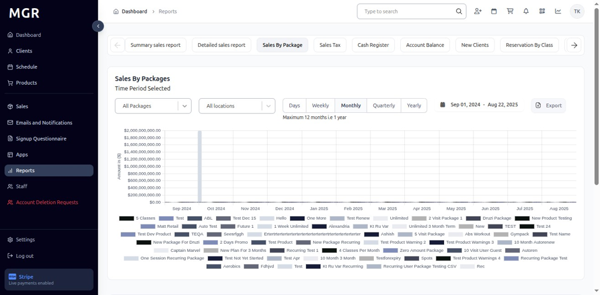

### 4. Select Package Types

By default, the report shows data for all existing packages as **"All Packages"**. Click the dropdown at the top-left of the report to filter and view data for specific packages among all existing packages.

### 5. 5 Classes Package

- Select **"5 Classes"** from the dropdown

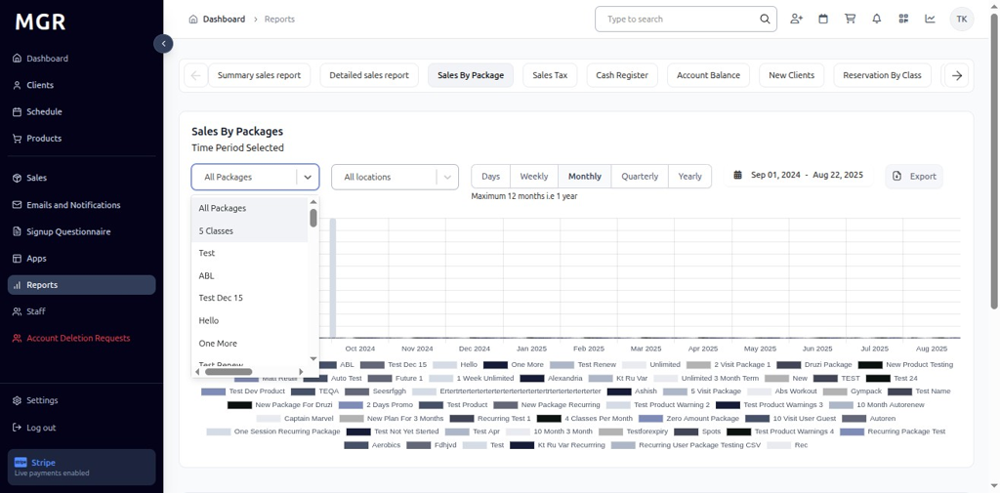
- View chart and metrics for 5 Classes sales only
- KPI updates to show Classes totals for the selected date range and interval

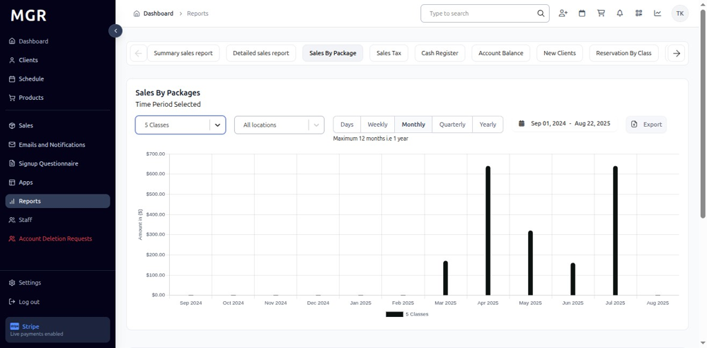

### 6. Test Package

- Select **"Test"** from the dropdown

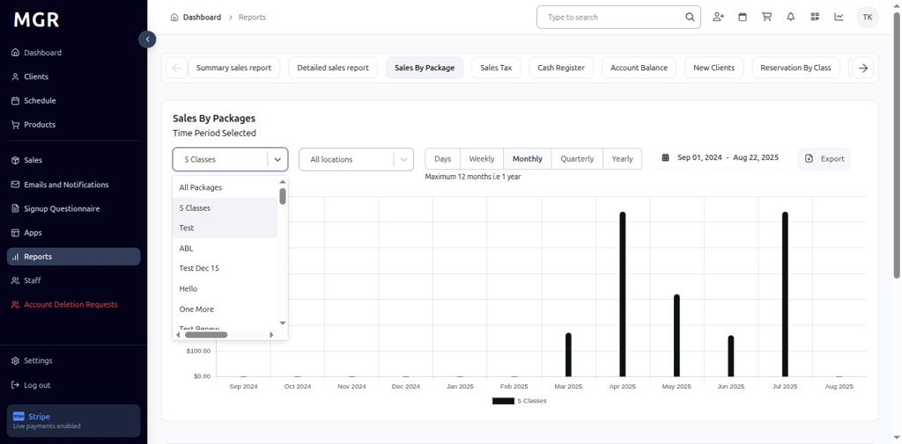

- View Test report with KPI and bars for each period
- Chart displays Test package transaction trends

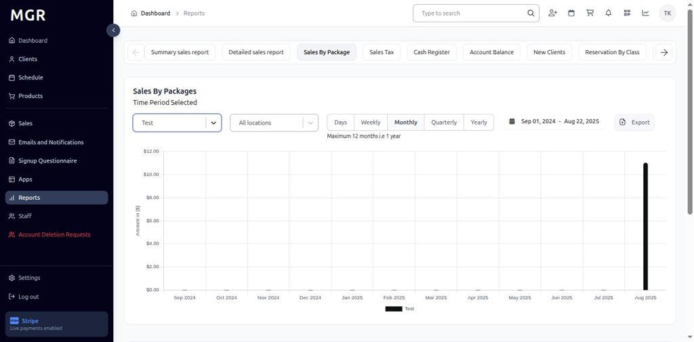

### 7. ABL Package

- Select **"ABL"** from the dropdown

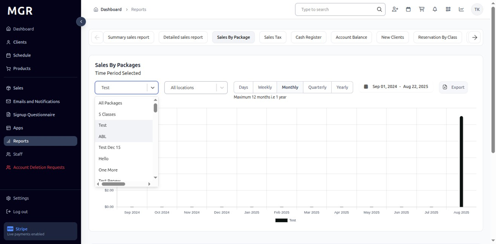

- Dashboard refreshes to display ABL report metrics
- KPI and chart switch to ABL totals for the chosen date range

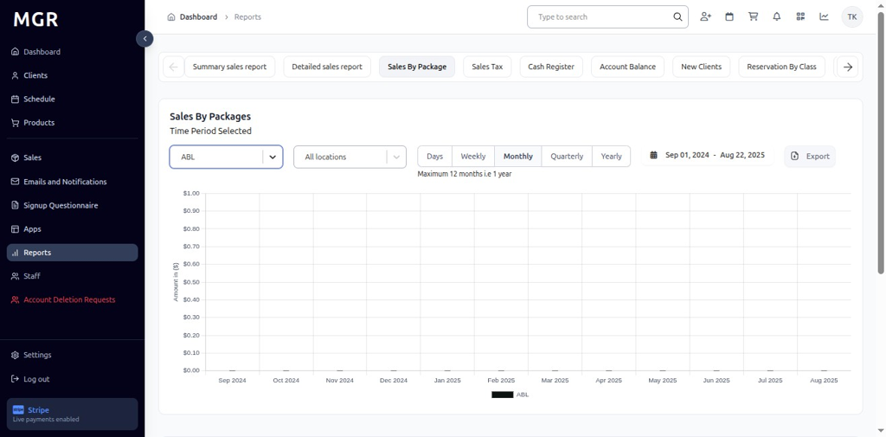

### 8. Filter by Location

a. Click **"All Locations"** dropdown beside the filter
b. Select the desired **Location** to scope the report to that specific site
c. Report updates to show data for the selected location only

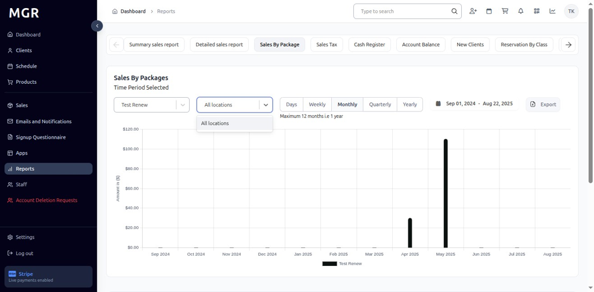

### 9. Time Period Options

#### 9.1 Daily View
- Click **"Days"** to switch to day-wise intervals
- View day-wise data for the selected date range
- Bars represent daily transaction totals

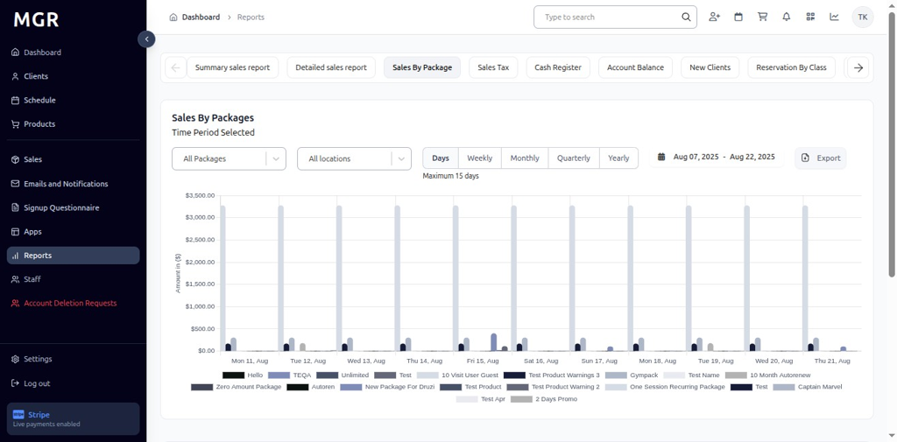

#### 9.2 Weekly View
- Click **"Weekly"** to switch to week-wise intervals
- Report displays week-wise bars and KPIs
- Data aggregated by week across the selected date range

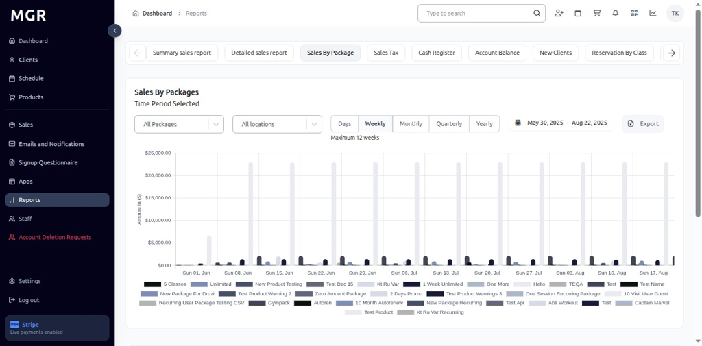

#### 9.3 Monthly View
- Click **"Monthly"** to switch to month-wise intervals
- View month-wise totals and chart representation
- Bars show monthly transaction summaries

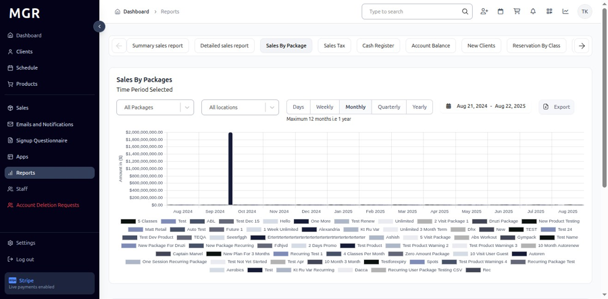

#### 9.4 Quarterly View
- Click **"Quarterly"** to switch to quarter-wise intervals
- Report aggregates data by quarter across the chosen period
- Long-term trend analysis becomes visible

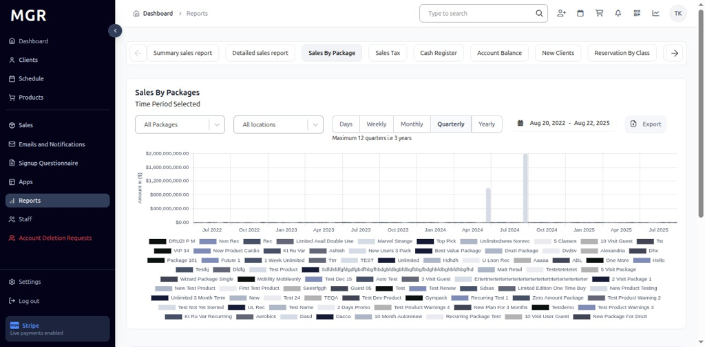

#### 9.5 Yearly View
- Click **"Yearly"** to switch to year-wise intervals
- Dashboard summarizes totals by year
- Provides long-range metrics and annual comparisons

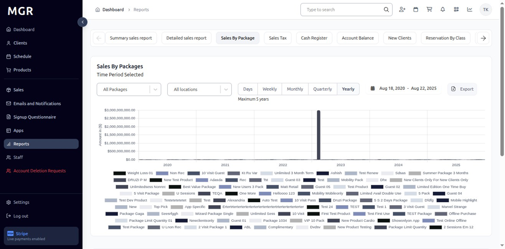

### 10. Access Export Options

Click the **"Export"** button in the top-right of the Sales By Packages Report to open download options.

### 11. Export as CSV

a. Click **"Export as CSV"** from the export menu
b. File downloads in .csv format
c. Compatible with spreadsheet applications

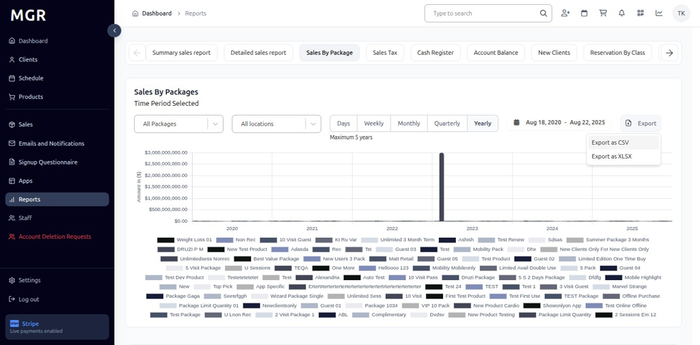

### 12. Export as Excel

a. Click **"Export as XLSX"** from the export menu
b. File downloads in Excel (.xlsx) format
c. Maintains formatting and chart data

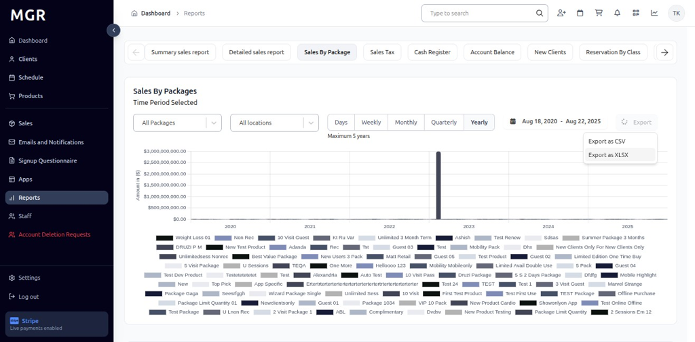

## Troubleshooting

**Common Issues:**
- **Report Not Loading:** Check internet connection and refresh the page
- **Data Not Updating:** Verify package selection and date range filters
- **Export Failures:** Ensure sufficient permissions and try smaller date ranges

**Need Help?** Contact system administrator or technical support for assistance with report access or data issues.
